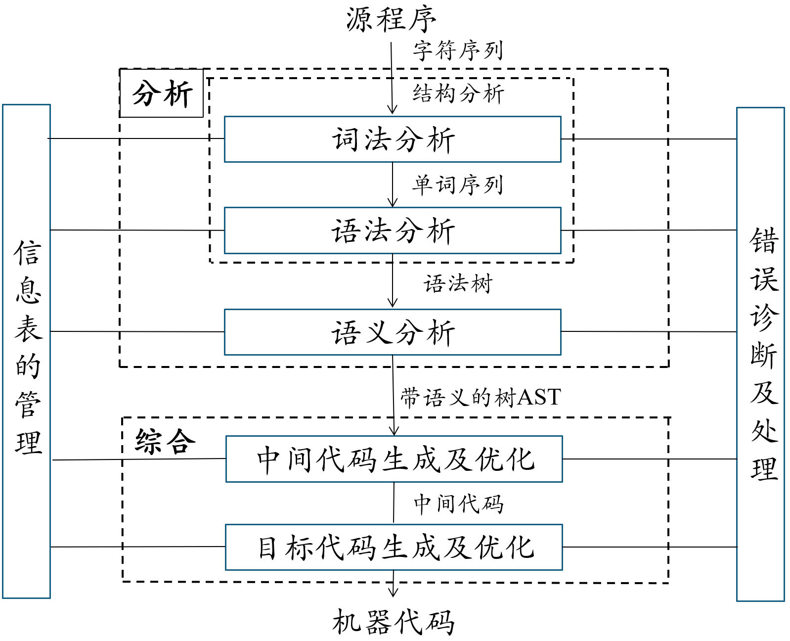

# 第1章 编译器概述



词法分析：编译器将源程序当作一个**字符串**，对它进行从左到右扫描，并分析，识别出符合词法规则的**单词符号**


语法分析：对词法分析输出的字符单元，按照**语法规则**进行判断，对能构成正确**句子**的单词流，给出相应的语法树；对不能构成正确句子的单词流，判定其出现了语法错误，并作出适当处理

根据**语法规则**，将单词符号构成各类语法单位，进行语法检查，生成**语法树**


语义分析：审查源程序有无**语义错误**，为代码生成阶段**收集信息**

根据**语义规则**，对语法正确的语法单位进行**初步翻译**


中间代码生成：在**静态语义正确**的前提下翻译成**中间代码**或者**目标代码**

目的：

1. 便于优化

   生成的目标代码效率更高

   优化不等同于对代码的精简和算法的优化

2. 便于移植

   前端：与目标机无关

   后端：与目标机相关


中间代码优化：为提高目标程序的效率，对程序进行合理变换，在保持功能不变的前提下，**对中间、目标代码进行等价变换**，使目标代码具有更高的时间、空间效率（贯穿整个编译过程）


目标代码生成：将中间代码转换成等价的、具有较高质量的**目标代码**，以充分利用**目标机器**的资源


语法制导翻译：将**静态检查**和**中间代码生成**结合到**语法分析**中进行的技术

在语法分析时不建立抽象语法树，而是直接生成中间代码

在语法分析的同时，执行语义子程序：

- 检查静态语义
- 翻译（生成）中间（目标）代码


中间代码：经过语法分析/语义检查之后得到的中间表示

源程序的内部表示，复杂性介于源语言和目标语言之间


符号表：用来保存**已收集信息**的**数据结构**，将信息从声明的地方**传递**到实际使用的地方

每个名字对应一个表项，一个表项包括名字域、属性域

名字域：名字长度、存储方式

属性域：

- 多个子域、标志位
- 类型、初值、存储大小、相对地址、参数个数、形参标志、说明标志、赋值标志


编译：将一种高级语言程序（源程序）转换成另一种语言的等价程序（目标程序），然后执行目标程序

解释：将源程序的某一条语句**翻译后立即执行**这一条语句


二义文法：即使严格使用最左推导或者最右推导，对于一个句子或者句型，可能存在两个不同的推导，即对应两棵不同的语法树

预测分析算法：预测分析器的控制程序根据**下推栈栈顶符号**和**当前输入符号**决定下一步应采取的动作

前端：分析（词法分析、语法分析、语义分析）与源语言密切相关

后端：综合（优化、代码生成）与目标语言相关

上下文无关文法（2型文法）：$P$中每个产生式$A \rightarrow \beta$，其中$A\in V_N$、$\beta \in (V_T\cup V_N)^*$，（产生式左部没有终结符）

推导：从文法的**开始符号**出发，通过应用产生式规则逐步生成**句子**

归约：**从句子出发**，通过**反向**应用产生式规则还原到文法**开始符号**

递归下降：不含左递归的文法G中，为每个终结符构造一个子程序，每个子程序的函数体按**非终结符**的产生式分情况展开，遇到终结符则进行匹配，遇到非终结符则调用相应的子程序

出错处理：报告错误的性质，发生错误的位置……

运行时环境：程序存储空间，数据存储空间

# 第3章 词法分析

正规式→有限自动机→NFA→DFA→最简DFA

有限状态自动机（FA）：
$$
M=(Q,\Sigma,\sigma,q_0,F)
$$
$Q$：状态集合

$\Sigma$：输入字母表

$\sigma$：状态转移函数

$q_0$：$M$开始状态

$F$：$M$终止状态集合

非确定的有限状态自动机（NFA）：允许空转换，初态可以有**多个**

确定有限状态自动机（DFA）：转换状态唯一，初态只能**一个**

## 由正规式构造DFA

1. 由画NFA图

2. 根据Next(A, c)函数来构造闭包

   由A经c可以跳转到的所有状态，初始不包含A的状态

3. 画状态转移矩阵

   | 状态 | a    | b    |
   | ---- | ---- | ---- |
   | A    | B    | C    |
   | B    | A    | -    |
   | C    | -    | C    |

4. 根据包含初状态、末状态划分状态集

   将经同一符号转化所得到的状态不同的状态集划分（**不能转换**也是一种特殊的状态形式）

5. 画出DFA


# 第4章 语法分析-自上而下

文法：一种描述语言的语法的形式规则
$$
G=(V_T,V_N,S,P)
$$
$V_T $：终结符

$ V_N $：变量

$ S $：开始符号

$ P$：产生式

0型文法：$P$中每个产生式$\alpha \rightarrow \beta$左部$\alpha$中至少有一个非终结文法

1型文法：在0型文法基础上，$P$中每个产生式$\alpha \rightarrow \beta$满足$|\alpha|\le|\beta|$

2型文法：$P$中每个产生式$A \rightarrow \beta$，其中$A\in V_N$、$\beta \in (V_T\cup V_N)^*$

3型文法：$P$中每个产生式$A \rightarrow \alpha B$、$A \rightarrow \alpha $，其中$A、B\in V_N$，$\alpha\in {V_T}^*$

最左推导 & 最右归约

最右推导（**规范推导**）& 最左归约        产生**规范句型**

回溯分析法：自上而下的某一步推导过程中，存在多个可采用的产生式，通过尝试选定一个，若推导结果不能匹配，则回溯继续尝试

**语法分析**：

- 回溯分析
- 自上而下
  - 递归下降分析程序
  - 预测分析程序→LL(1)分析算法
- 自下而上
  - 算符优先算法
  - LR分析法

## LL(1)预测分析表

1. 提取公共左因子、消除左递归（直接、间接）

2. 计算**右式**的FIRST()集

3. 对**右式FIRST()集包含空**的**左式**计算FOLLOW()集

   - 文法起始符号的FOLLOW()有**#**

4. 画预测分析表

   |      | !     | *    | #    |
   | ---- | ----- | ---- | ---- |
   | E    | E→TA  |      | A→ε  |
   | A    | A→+TA | A→ε  |      |

   最后一行有**#**！！！


## 使用分析表进行分析

| 步骤 | 下推栈     | 输入串          | 产生式 |
| --- | ------- | --------------- | ---- |
| 0    | **# S** | i + i * i **#** | S→TS   |

1. 开始时下推栈为**# S**，输入串末尾为**#**
2. 若栈顶与当前字符相同则同时弹出
3. 若为产生式，则将栈中左部替换为逆序的右部（逆序压栈）
4. 直到均为**#**号分析成功


# 第4章 语法分析-自下而上

冲突：

- 归约与归约冲突
- 移进与归约冲突

短语：以非终结符为根，将子树末端节点从左到右排列

直接短语：子树只有两代的短语

句柄：最左直接短语

活前缀：规范句型中不含句柄之后任何符号的一个前缀（含$\epsilon$）

## LR(0)、SLR(1)分析表

1. 若初始状态不唯一（S有多个候选），则先对文法进行拓广

2. 对有多个右部的产生式进行**拆分**

3. 画活前缀的有限自动机（构造项目集规范簇）

   对A→ε添加为A→·

   对一条路画到底再画另一条路

4. 构造**LR(0)**分析表

   | 状态 | ACTION |      |       | GOTO |      |      |
   | ---- | ------ | ---- | ----- | ---- | ---- | ---- |
   |      | a      | (    | **#** | A    | E    | L    |
   | 0    | r1     | r1   | r1    | 1    |      |      |
   | 1    | s3     | s1   | acc   |      | 0    | 1    |

   归约时无条件

   包含**·**在末尾的项目（非S）进行归约，对终结符跳转填移进，对非终结符跳转填GOTO

   若状态包含类似S→E·的项目集，则在该状态行，**#**列添加acc

5. 构造**SLR(1)**分析表

   对于P→α·，只对FOLLOW(P)进行归约


## 使用分析表进行分析

| 步骤 | 状态栈 | 符号栈 | 输入串          | 动作 |
| ---- | ------ | ------ | --------------- | ---- |
| 1    | **0**  | **#**  | i + i * i **#** | S5   |
| 2    | 05     | # i    | + i * i **#**   | R6   |

1. 初始时状态栈为初始状态，符号栈为#，剩余串末尾加#

2. 动作：下一个步骤需要进行的操作

3. 移进：将状态、符号同时压栈

4. 归约：用产生式对状态栈、符号栈弹出**右部个数**个状态、符号，符号栈压入左部，补缺失的状态

   弹出→压左部→补状态

# 第5章 语义分析和中间代码生成

语义分析：审查源程序有无**语义错误**，为代码生成阶段**收集信息**

类型审查：审查每个算符是否具有语言规范允许的运算对象

- 静态语义：对程序约束的描述
- 动态语义：程序单位描述计算

属性：

- 综合属性：**分析树**节点N上的非终结符**A（左部）**的综合属性由**N上**的产生式所关联的语义规则来定义
- 继承属性：分析树节点N上的非终结符**B（右部）**的继承属性是由**N上的父节点上**产生式所关联的语义规则来定义


- S-属性文法：只含有综合属性的属性文法

  自下而上进行计算（可借助LR）

- L-属性文法：对于每个产生式$A\rightarrow X_1X_2\dots X_n$，每个语义规则中每个属性**或是** **综合属性**，**或是**$X_j$的一个**继承属性**且该属性仅依赖于：

  1. 产生式$X_j$左边$ X_1X_2\dots X_{j-1}$的属性
  2. A的继承属性

  允许一次遍历计算出所有属性值（可借助LL(1)）


语义子程序：产生式对应的翻译工作

在语法分析过程中，当产生式用于匹配或归约时，调用对应语义子程序

核心：生成中间代码


中间代码：经过语法分析/语义检查之后得到的中间表示

源程序的内部表示，复杂性介于源语言和目标语言之间


抽象语法树：在**语法树中**去除对翻译**不必要**的信息，获得更为高效的**中间代码**表示


# 第6章 代码优化与目标代码生成

## 代码优化

中间代码优化：

- 局部优化（基本块优化）
  - 常数合并与传播
  - 删除公共子表达式
  - 复制传播
  - 削弱计算强度
  - 改变计算次序
- 循环优化
  - 循环展开
  - 代码外提
  - 削弱计算强度
  - 删除归纳变量
- 全局优化
  - 在非线性程序段上进行的优化


### 划分基本块

1. 入口语句：
   - 第一条语句
   - 能转移到的语句
   - 紧随**条件转移**语句后面的语句
2. - （入口语句，下一条入口语句)
   - （入口语句，转移语句 ]
   - （入口语句，停顿语句 ]
3. 删除未出现在任何基本块中的语句


### 基本块优化

**删除公共子表达式：**第一次对E求值后，如果E的运算对象都没有变，再次对E求值（除第一次求值，其余都是冗余的公共表达式）

**复写传播：**进行`a = b`赋值后，若a、b都没变化，则对a的引用可**用b**来代替

**删除无用代码：**删除不可到达代码、删除死变量、删除死代码（可执行，但执行结果无作用）、删除死块

**代数恒等变换：**

- 合并已知量：编译时可计算出的表达式直接用值代替
- 常数传播：用编译时已知的变量值来代替对这些变量的引用
- 削弱计算强度：用代数上等价的形式代替求值计算
- 改变计算次序：两个语句不相互依赖，可改变计算次序（寄存器分配时可能减少读取内存单元的次数）
- 代数化简：`i = -(-i)`
- 变量重新组合：利用交换律、结合律、分配律改写，充分利用已定值的变量


### DAG在局部优化中的应用

- 每个结点外标号，节点内标运算符
- 子节点为右值
- 父节点为左值

常用三地址语句的DAG：

| 表达式             | 节点                                                         |
| ------------------ | ------------------------------------------------------------ |
| x = y (y不存在)    |  |
| x = y (y已存在)    |  |
| x = op y           |  |
| x= y op z          |  |
| x = y[z]           |  |
| x[y] = z           |  |
| if x op y goto (s) |  |
| goto(s)            |  |

依据DAG对每个基本块进行优化：

https://www.bilibili.com/video/BV12w411x7R4/?vd_source=34434845634afda5bf9ba0178b313230

1. 优化语句
2. 画DAG
3. 写四元式


### 循环优化

循环查找：看局部强连通外是否有大于一个箭头指向其节点（多个入口)，只有一个入口的为循环

#### 代码外提

条件：

- 循环所有出口的必经结点
- 不变运算：结果不变
- 对`X = Y op Z`循环中其他地方不能对X再定值，且对X的所有引用值均为该运算确定的X的值
- 代码外提：将不变运算的代码放到循环外执行

#### 强度削弱

将中高强度的运算用强度低的运算替代

```python
T = K * I ± D 
T’= K * (I ± C) ± D
T ’= K*I ± K*C ± D

#得到
T ’= T + K*C
```

#### 删除归纳变量

基本归纳变量：变量I仅有I = I ± C形式的赋值，I为基本归纳变量

若I为基本归纳变量，J可化为与I统一线性函数的形式：J = C1 * I ± C2，则称J与I同族

在同族归纳变量中用其中一个来代替基本归纳变量进行循环控制，去掉其余的归纳变量

## 目标代码生成

### 寄存器分配

将程序中数量几乎无限的虚拟寄存器映射到数量有限的物理寄存器中，尽量将活跃的变量放在寄存器中

#### 图着色算法

图着色：将生存期看成顶点，冲突定义为边

K-着色：最多由K个寄存器

1. 找到邻居节点数**小于**K的节点，临时删除它
2. 重复1，直到空图或无法删除
3. - 若空图，则通过与2相反步骤着色
   - 若无法删除，可引入保存，将某个节点溢出

#### 线性扫描

生存周期：变量从被赋值到最后一次被引用

1. 计算生存期
2. 根据开始时间排序写入表Live_intervals
3. 根据结束时间排序写入表Active

将生存周期长的变量可考虑**一直**溢出到`Spill = { }`中

将每一时间段小于寄存器数的活跃变量放在`active = { }`中


# 第7章 运行时存储空间组织

## 活动记录

函数的活动：函数的一次执行称为函数的一次活动

活动记录：过程一次执行所需的信息用一块连续的存储区来管理，存放所需信息的存储空间称为活动记录

返回地址：**返回调用单元**的位置

动态链接（控制链）：指向**调用单元**最新的**活动记录**

静态链接（访问链）：指向**非局部变量**所在的**活动记录** // 指向直接外层过程的最新活动记录的首地址

元素i的地址：
$$
D+offset(i)
$$
$D$：活动记录首地址

$offset(i)$：i在活动记录中的位移

| 变量类型   | 编译时确定   | 运行时确定   |
| ---------- | ------------ | ------------ |
| 静态变量   | offset(i)、D |              |
| 半静态变量 | offset(i)    | D            |
| 半动态变量 |              | offset(i)、D |
| 动态变量   |              |              |

静态链接：D[free + 2] = f(d + 1)


## 参数传递

### 传值调用

调用时将值复制进形式单元中，像使用局部变量使用形式单元，无法改变实际参数值


### 得结果

每个形式参数对应两个单元：

1. 存放实参的**地址**
2. 存放实参的**值**

调用时，看成对2进行直接访问，返回时，将2中的内容放回到1所指的实参单元


### 按引用传递

将实际参数的地址传递给相应的形式参数（若为常数或表达式，先计算出值并存放在临时单元，再传递该临时单元的地址）

通过形参间接引用实参，形参看成实参的别名


### 按名传递

相当于将被调用段的过程体**抄写**到调用出现的位置，将形式参数用文字替换实际参数


- 正则**文法**≠正则式
- 短语、直接短语、句柄P17

第一章：词法分析、语法分析（功能、作用，去年）、中间代码生成、代码优化、代码生成、符号表管理内容、编译器、解释器

第二章：二义性、分析树、预测分析算法

第三章：词法分析器作用、正则表达（c语言正整数、二进制、十六进制、变量名）、DFA、NFA（最小化不重要）

第四章：语法分析作用、上下文无关文法（产生式左边没有终结符）、左递归、右递归、推导、语法分析树、文法二义性、first、follow、ll1、预测分析表、lr0、slr

第五章：语法制导翻译、SL属性、中间代码生成（DAG）、三地址代码、四元式、三元式、表达式翻译、布尔翻译

第六章：寄存器分配、优化、基本块、基本块流图

第七章：活动记录、栈的变换、嵌套深度、非局部变量访问、display表

上下文无关比正则强（正则可转换为上下无关文法）