# 第9章 存储系统

## 9.1 概述

### 9.1.1 存储系统的层次结构

典型结构：高速缓存（Cache）- 主存 - 外存

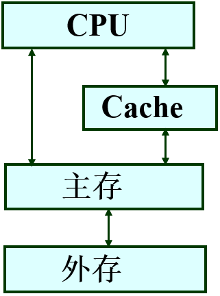

| 类型  | 容量 | 速度 |
| ----- | ---- | ---- |
| Cache | 小   | 高   |
| 主存  | 较大 | 较高 |
| 外存  | 大   | 慢   |

CPU工作流程：

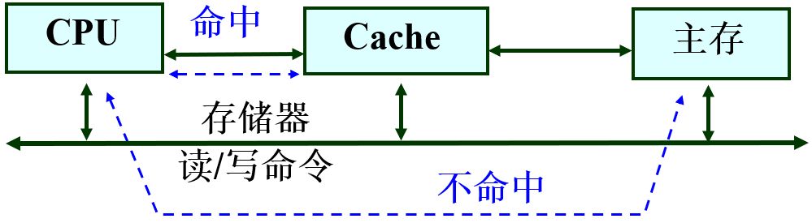

### 9.1.2 存储器分类

#### 1. 按存储介质

| 分类                       | 存储方式                                                     | 特点                                                       | 应用场合             |
| -------------------------- | ------------------------------------------------------------ | ---------------------------------------------------------- | -------------------- |
| 静态存储器（半导体存储器） | 用**双稳态触发器**存储信息                                   | 速度快、有源器件、非破坏性读出、集成度低、功耗大、信息易失 | 高速缓存、小容量主存 |
| 动态存储器（半导体存储器） | 用**电容存储的电荷**存储信息                                 | 速度低、需要刷新、集成度高、功耗小                         | 大容量主存           |
| 磁表面存储器               | 磁层上不同**方向**的**磁化区域**表示信息                     | 速度慢、容量大、非破坏性读出、长期保存信息                 | 外部存储器           |
| 光盘存储器（只读光盘）     | 用激光对光盘表面的**记录膜**进行照射后是否出现**融坑**表示信息 | 速度慢、容量大、非破坏性读出、长期保存信息                 | 外部存储器           |

#### 2. 存取方式分类

1. 随机访问存储器（RAM）

   随机存取：按地址访问存储器中的任一单元，访问时间与地址单元位置无关

   - RWM可执行操作：读/写，SRAM、DRAM

   - ROM存储器：只读不写
     - 固存：用户不能编程
     - PROM：用户可一次编程
     - EPROM：用户可多次编程（紫外线擦除）
     - EEPROM：用户可多次编程（电擦除）

   eg. 主存、高速缓存 Cache

2. 顺序访问存储器（SAM）

   读/写部件按顺序查找目标地址，访问时间与数据位置有关

   eg. 磁带（外部辅助存储）

3. 直接访问存储器（DAM）

   读/写部件先直接指向一个小区域，再在该区域内顺序查找，访问时间与数据位置有关

   eg. 磁盘、光盘（外存）

#### 3. 存储器的技术指标

1. 存取时间($T_A$) ：从存储器收到读写命令到读出（写入）信息所需时间

2. 存取周期($T_M$)：存储器做连续访问操作过程中一次完整的存取操作所需的全部时间

   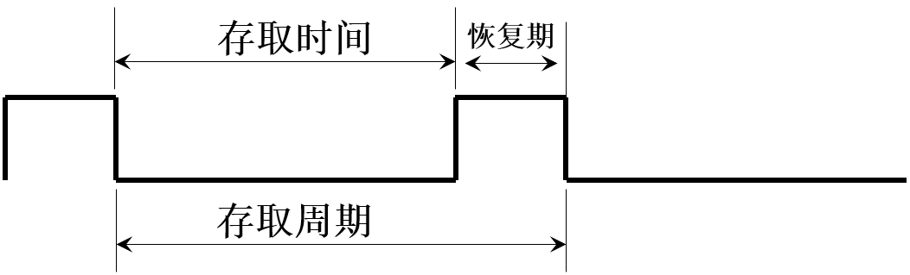

3. 数据传输率($R$)：单位时间内存取的**信息数量**（带宽）
   $$
   数据传输率=\frac{存储器数据位宽}{存取周期}bps
   $$

## 9.2 半导体存储器

RWM（可读可写）：

- 双极性存储单元
- 静态MOS存储单元——SRAM
- 动态MOS存储单元——DRAM

### 9.2.1 静态MOS存储单元与存储芯片

#### 1.  六管静态单元

静态易失存储单元：电源正常，维持存储信息不变；**掉电后，信息不存在**

静态单元是**非破坏读出**，读出后不需重写

一个位单元：存放1位二进制信息的存储电路

#### 2. 存储芯片举例

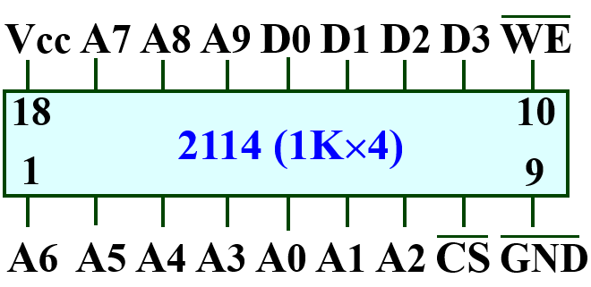

- 地址引脚：$A_9\sim A_0$
- 数据引脚：$D_3 \sim D_0$
- 电源、地
- 控制端：
  - 片选$\overline{CS}$
    - 0：选中芯片
    - 1：未选中芯片
  - 写使能$\overline{WE}$
    - 0：写
    - 1：读

**一维地址译码方式：**

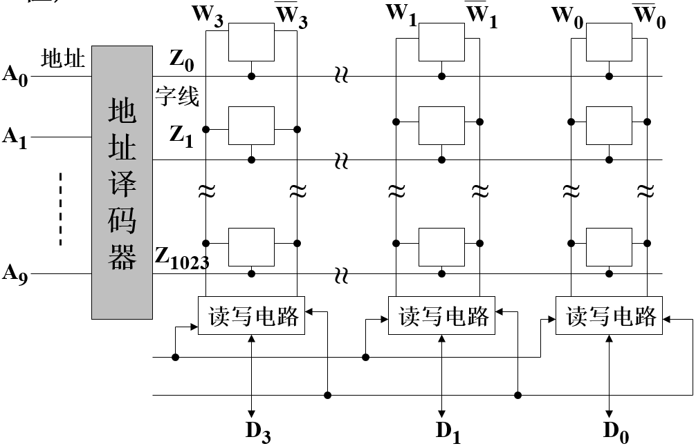

存储阵列的每一行对应一个字，共用一根字线

缺点：地址线增加时，译码器的复杂度以$2^n$增加

**二维地址译码的位选方式：**

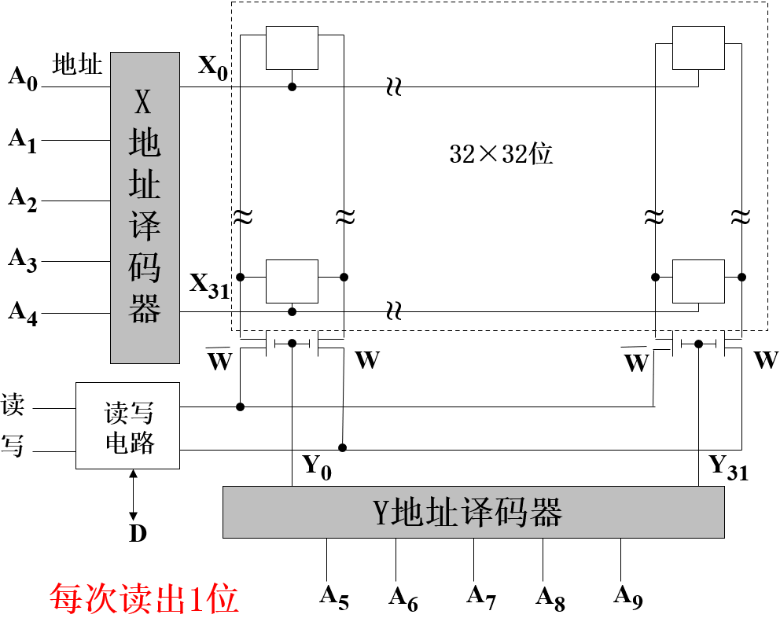

优点：译码线少

缺点：需要多片构成字

**内部寻址逻辑：**

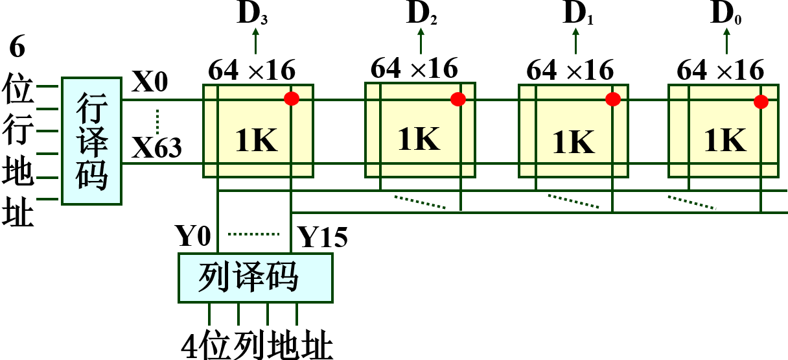

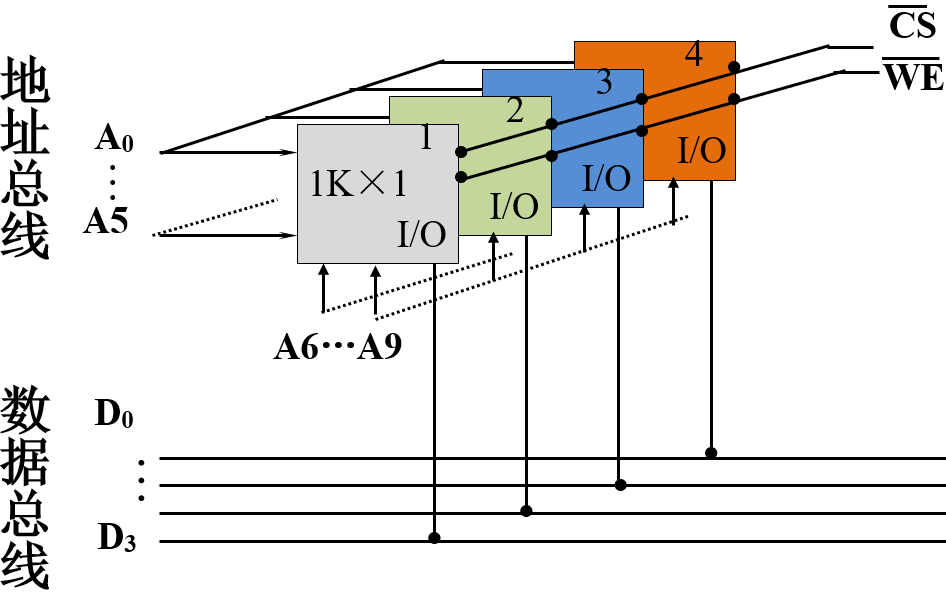

寻址空间1K，共1K×4个位单元，分成4个位平面，每个平面1K×1位

### 9.2.2 动态MOS存储单元与存储芯片

#### 1. 四管单元

动态：保持原状态需定期向电容**补充电荷**（动态刷新）

四管单元是**非破坏性读出**，**读出过程实现刷新**

#### 2. 单管单元

单管单元是**破坏性读出**，读出后**需重写**

### 9.2.3 动态存储器的刷新

刷新原因：动态存储器依靠电容电荷存储信息。电容电荷随时间推移将缓慢释放（泄露），需要定期对原存储信息为1的电容补充电荷

- 刷新：动态存储器，需定期**向电容补充电荷**以保持原来信息
- 重写：破坏性读出后**重写**，以恢复原来的信息

最大刷新间隔：大多数DRAM要求，2-64ms内对所有单元刷新一遍

刷新方法：各动态芯片**可同时刷新**，**片内按行**刷新（按行读）

（注：单管动态存储器，读出时能自动重写补充电荷）

基本概念：

- 刷新周期（存取周期）：刷新**一行**所用的时间
- 刷新周期数：刷新一片芯片所需的周期数由芯片矩阵的**行数**决定
- 对主存访问：
  - CPU访存：由**CPU提供**行、列地址随机访问
  - 芯片刷新：由**刷新地址计数器提供**地址定时刷新

刷新周期的安排方式：

- 集中刷新：**规定时间内**集中安排所有刷新周期

  用于实时要求不高的场合，在死区的期间不能使用存储器

  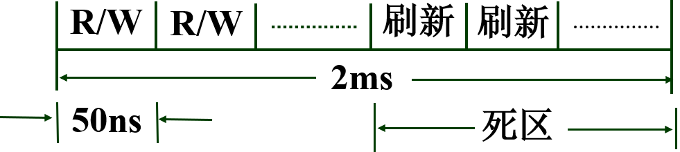

- 分散刷新：各刷新周期分散安排在**存取周期**中

  造成主存利用率降低，用在低速系统中

  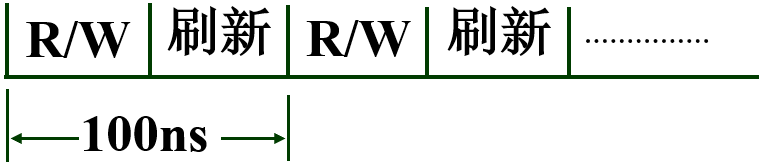

- 异步刷新：刷新周期分散安排在**规定周期**内

  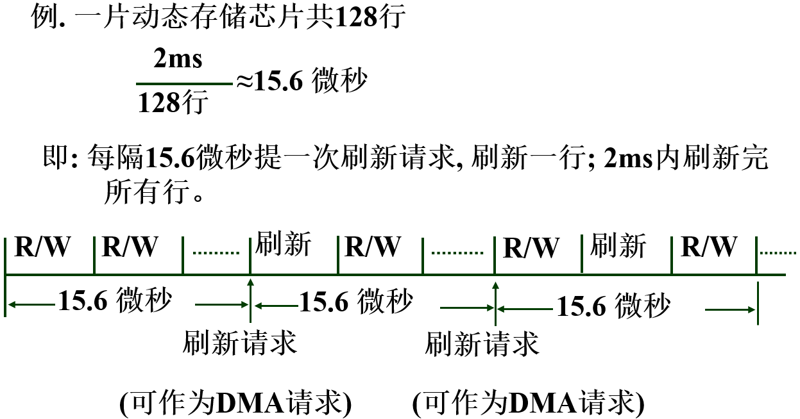

# 第10章 输入输出系统

## 10.1 总线

总线：一组为多个部件**分时共享**信息的**传送路线**

特点：分时共享（特定时刻只允许一个部件**送出**数据到总线上）

分类：

1. 按传输信号的类型

   - 数据总线：传输数据信息，决定总线宽度
   - 地址总线：传输地址信息，决定寻址能力
   - 控制总线：传输控制信息和状态信息

2. 按数据传送格式划分

   - 并行总线：**多条**数据线，**并行**传送各位信息
   - 串行总线：**一条**数据线，**分时逐位**传送各位消息

3. 按时序控制方式划分

   - 同步总线：由**统一时序信号**控制总线传送操作在固定时钟周期内（一个、多个）完成数据传输，由**同步脉冲**定时打入

     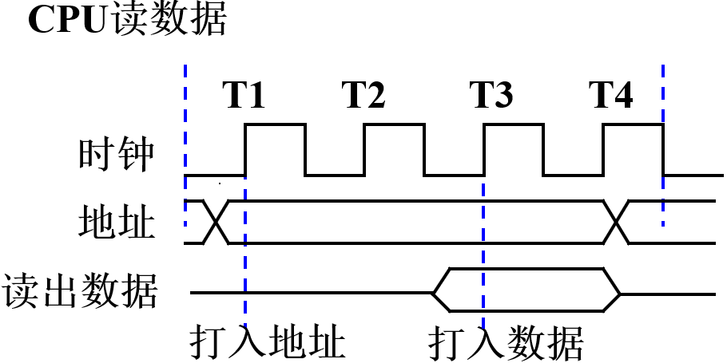

   - 异步总线：无固定时钟周期划分，以**异步应答**方式控制传送

     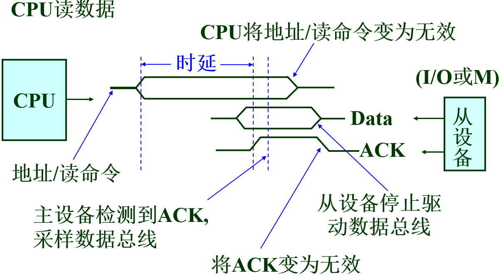

   - 扩展同步总线：以时钟周期为基础，允许总线周期中的**时钟周期数**可变（既有统一时序同步时钟，又有应答信号）

     总线周期：完成一次主存或IO端口访问的时间

     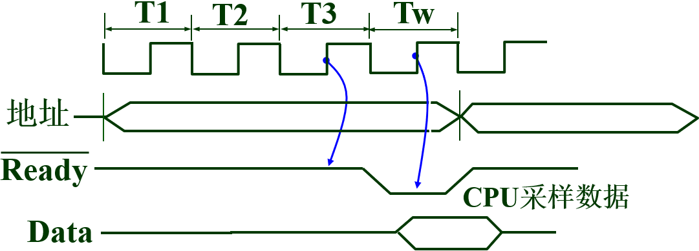

4. 按功能划分

   - 内总线
   - 局部总线
   - 系统总线
   - 外总线

   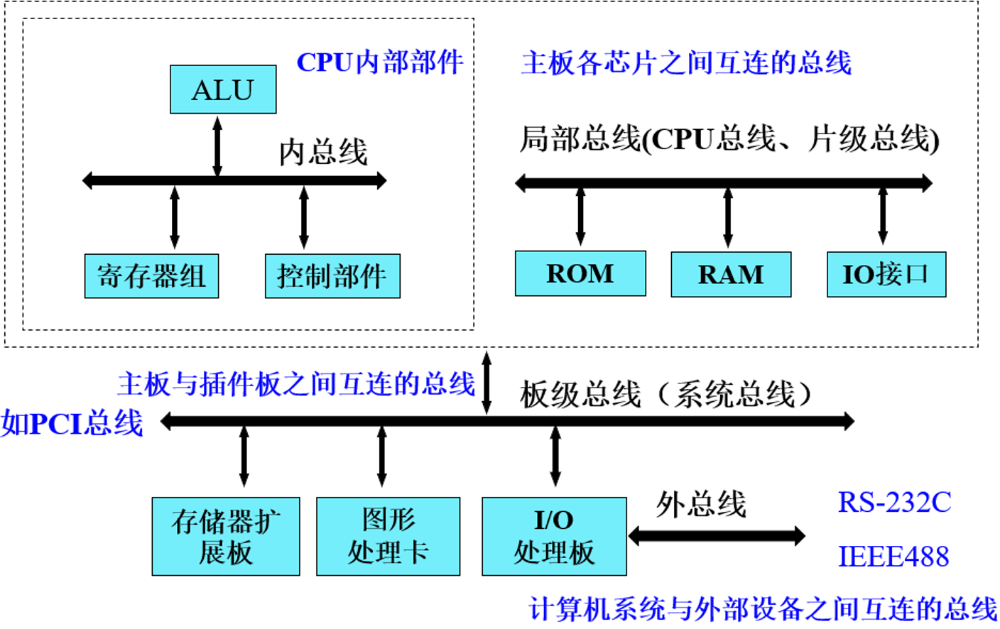

5. 按方向划分

   - 单向总线
   - 双向总线

总线标准：针对**系统总线**和**外总线**，对总线所作统一的规范

物理特征、功能特征、电气特征、时间特征

总线仲裁：多个部件**同时提出总线控制请求**时，采用优先级或公平策略进行仲裁

根据总裁电路的位置不同，分为：

- 分布式仲裁

  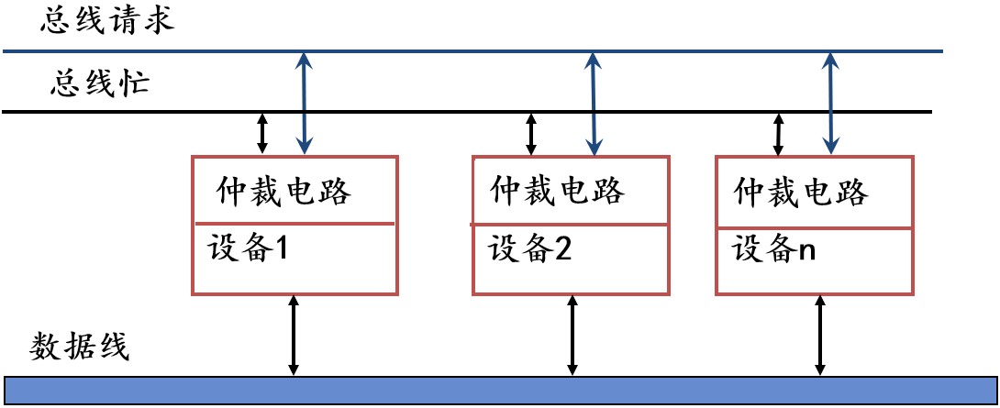

  设备需控制总线时，**发**请求信号，并**监听**其他请求信号，各设备能**判别**自己的优先级，以及**能否**在下一周期控制总线

  缺点：信号线复杂

  优点：防止总线时间浪费

- 集中式仲裁

  1. 链式查询方式

     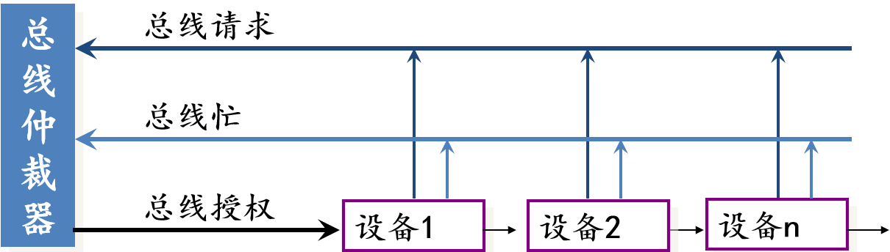

     总线**授权信号**依次**串行地传送**到所连接的外围设备上进行比较

     离总线控制器的**逻辑距离**决定，越近优先级越高

  2. 计数器定时查询方式

     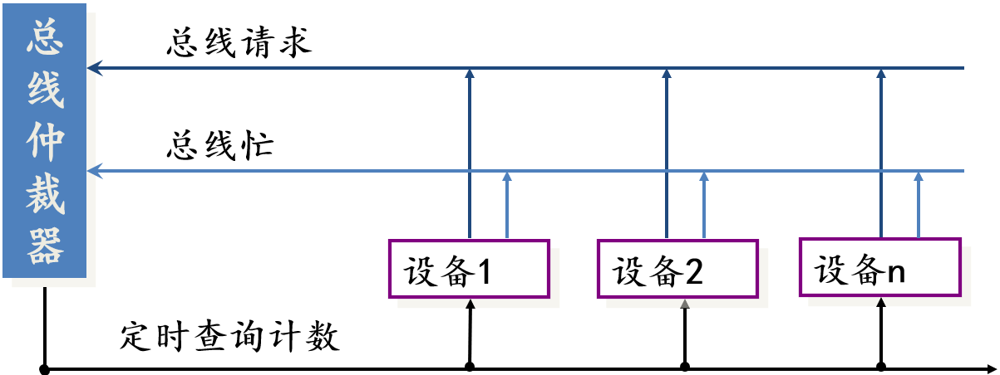

     **查询计数器数值**与发出请求的**设备编号**一致时，中止查询，该设备或总线控制权

     优先级灵活：计数器初值、设备编号可通过程序设定，优先次序可用程序控制

  3. 独立请求方式

     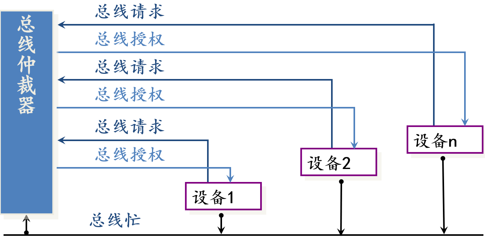

     各设备均通过**专用请求信号线**与仲裁器连接，且通过**独立的授权信号线**接收总线批准信号

## 10.2 接口

输入输出设备↔外部设备↔外设

输入输出接口（I/O接口）：外设与系统总线之间的逻辑电路

I/O接口作用：

- 工作速度

  不同速度外设与CPU连接

- 数据格式转换

  外设与CPU的数据格式可能不同

- 一次数据传送量的控制

- 其他因素（电平转换……）

接口模型：

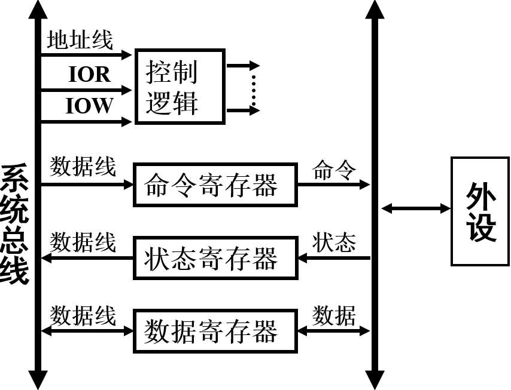

### I/O接口主要功能

1. 寻址

   接收CPU送来的地址码，选择接口中的寄存器提供CPU访问

2. 数据缓冲

   主机与外设的速度匹配

   缓冲深度与传送的数据量有关

3. 预处理

   串-并格式转换（串口）

   数据通路宽度转换（并口）

   电平转换

4. 控制功能

   传送控制命令与状态信息，实现I/O传送

### 接口编址

- 统一编址：为每个端口分配总线地址通用的传送类指令
- 单独编址：编址到设备端口，有专门的I/O指令

### 接口分类

1. 按数据传送格式划分

   - 并行接口：接口与系统总线、接口与外设均按并行方式传送数据，数据各位同时传送

     适合：设备本身并行工作、距主机较近的场合

   - 串行接口：接口与系统总线并行传送，接口与外设串行传送，数据逐位分时传送

     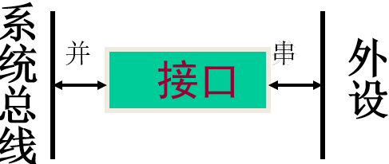

2. 按时序控制方式划分

   - 同步接口：连接同步总线，接口与系统总线的信息传送由统一时序信号控制
   - 异步接口：连接异步总线，接口与系统总线的信息传送采用异步应答方式

3. 按主机与外设的信息交换方式

   - 直接程序传送：依靠CPU直接执行**相关的I/O程序**来实现数据的输入、输出控制
   - 中断方式：设备提出中断请求，主机响应后与设备交换信息，接口中包含中断控制逻辑
   - DMA方式：支持高速外设与主存之间进行DMA方式交换数据

## 10.3 程序直接传送及接口

执行I/O指令之前，先**查询设备状态**，等待外设**准备好**或**完成一次操作**，CPU再执行指令与外设交换信息

执行I/O操作时，CPU直接访问I/O接口，输入或输出数据

1. 设备状态

   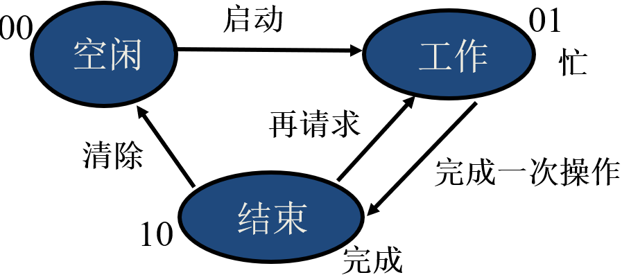

2. 查询方式的程序流程

   1. 输出指令设置启动信号
   2. 输入指令读取状态信息并判断
   3. I/O指令读/写数据

3. 优缺点

   - 优：硬件开销小
   - 缺：并行程度低

4. 应用场合

   - 对CPU效率要求不高的场合
   - 诊断、调试过程

## 10.4 程序中断方式与接口

### 10.4.1 基本概念

中断：CPU暂时**中止现行程序**的执行，转去执行为某个**随机事件**服务的**中断处理程序**。处理完后**自动恢复**原程序的执行

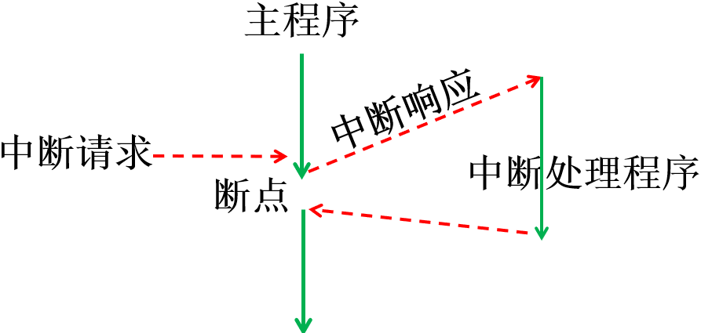

实质：程序切换

- 方法：保存断点、保护现场、恢复现场、返回断点
- 时间：一条指令结束时切换，保证程序的完整性

特点：随机性

- 随机发生的事态（按键、故障）
- 有意调用，随机请求与处理的事态（调用打印机）
- 随机插入的事态（软中断指令可插入程序任何位置）

中断与转子程序区别：

| 子程序                             | 中断服务程序                              |
| ---------------------------------- | ----------------------------------------- |
| 其执行由程序员事先安排             | 其执行由随机中断事件触发                  |
| 其执行受主程序或上层程序控制       | 一般与被中断的现行程序无关                |
| 一般不存在同时调用多个子程序的情况 | 可能发生多个外设同时向CPU发出中断服务请求 |

中断源：引起中断的原因或事件

中断分类：

1. 硬中断、软中断

   - 硬中断：由硬件请求信号引发中断
   - 软中断：由软中断指令（INT）引发中断

2. 内中断、外中断

   - 内中断：中断源来自主机内部（eg. 除法错、溢出）
   - 外中断：中断源来自主机外部（eg. 打印机、键盘等外设）

3. 可屏蔽中断与非屏蔽中断

   中断允许**标志位**：IF（= 0：开中断；= 1：关中断）

   - 可屏蔽中断：通过**屏蔽字**屏蔽请求；关中断时不响应请求
   - 非屏蔽中断：与屏蔽字无关；请求的响应与开/关中断无关

4. 向量中断与非向量中断

   根据中断源获取服务程序入口地址

   - 非向量中断：由**软件查询**提供服务程序入口地址
   - 向量中断：由**硬件直接**提供服务程序入口地址

中断类型码：每个中断源对应的编号

中断向量：中断服务程序入口地址

中断向量表：存放各中断服务程序的入口地址的单元

向量地址：访问中断向量表的地址码，可通过中断类型码计算得到

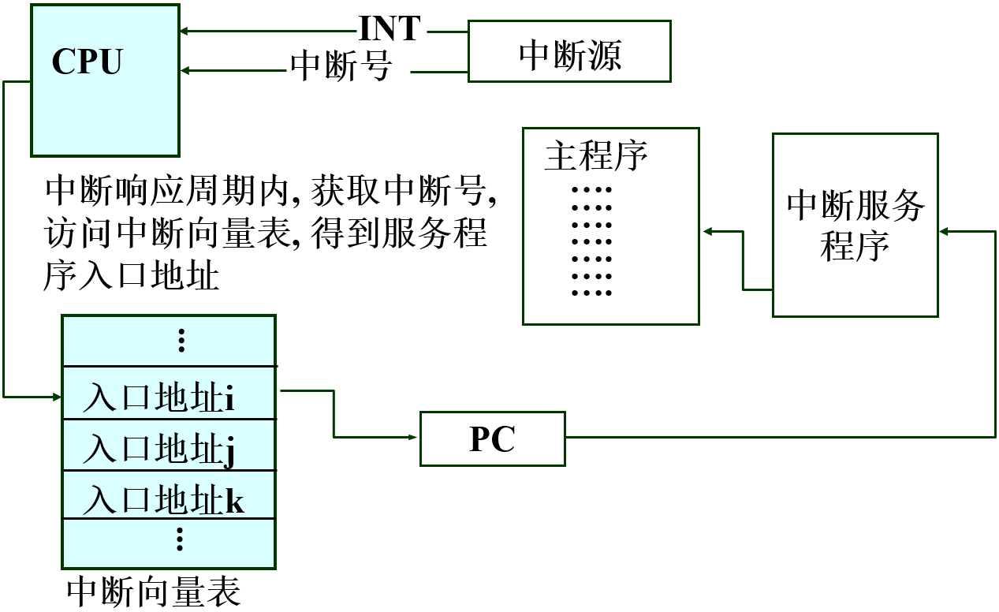

### 10.4.2 外中断全过程

#### 1.中断请求的提出与传递

1. 中断请求的产生：

   条件：

   - 外设中断请求：“请求”标志为1
   - CPU允许请求，且未被屏蔽，如屏蔽信号为1

   eg. 有多个中断源时设置屏蔽寄存器

   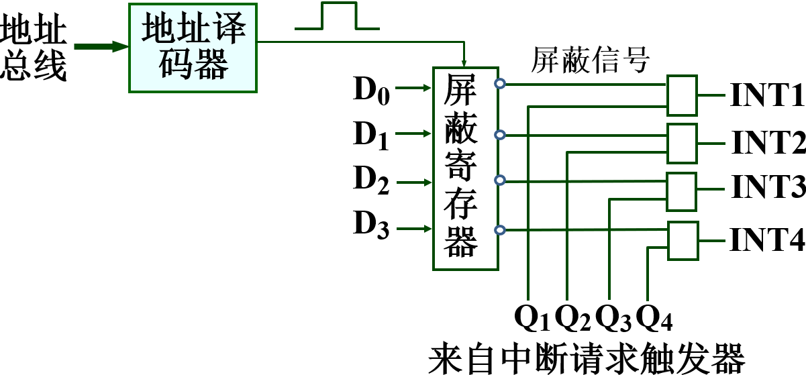

2. 中断请求的传送：

   | 请求方式           | 示意                                                         |
   | ------------------ | ------------------------------------------------------------ |
   | 使用单独**请求线** | 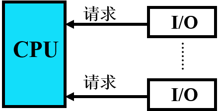 |
   | 使用公共**请求线** | 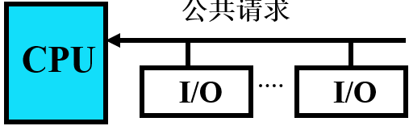 |
   | 混合传送方式       | 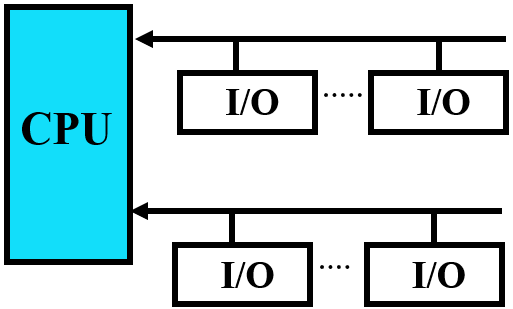 |

#### 2.中断请求优先级判断

1. 优先顺序：故障、内中断、DMA、外中断

   基本原则：高速操作优于低速操作，输入优于输出

2. CPU现行程序与外设请求的判优

   1. CPU设置允许中断标志（= 0：开中断；= 1：关中断）

   2. CPU设置程序状态字的优先级字段

      为现行程序赋予优先级：

      - ＜外设请求优先级，响应
      - ≥ 外设请求优先级，不响应

3. 各外设请求的判优

   1. 软件判优：由**程序查询**顺序确定优先级

   2. 硬件判优：

      - 一种采用**独立请求线**的并行判优逻辑

        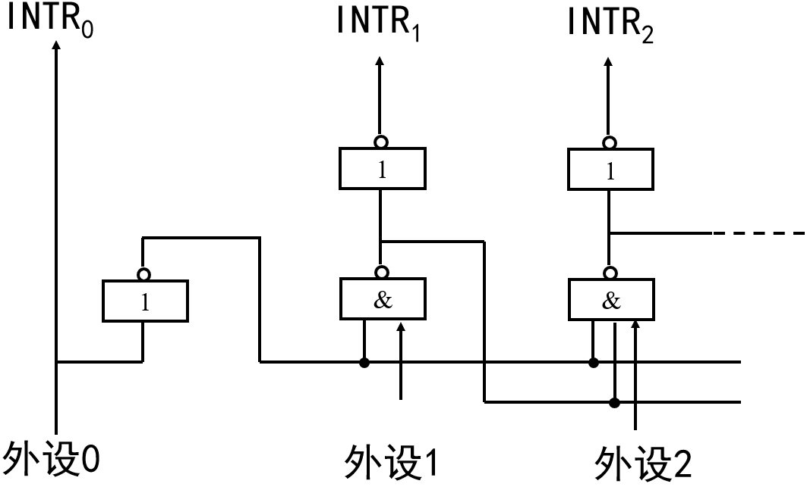

      - **链式优先权**判优逻辑

        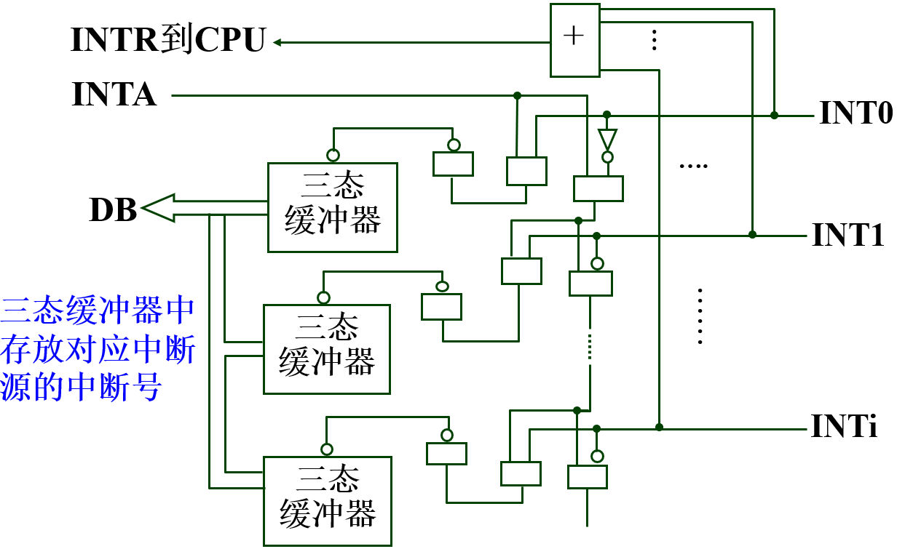

      - **专用芯片硬件**判优——中断控制器（8259）

        集中解决请求信号的接收、屏蔽、判优、编码

#### 3. 中断响应

1. 响应条件：

   - 外设有请求，且未被屏蔽
   - CPU开中断
   - 中断源优先级高于当前程序的优先级
   - 一条指令（非停机）结束，即ET之后

2. 进入中断周期

   安排一个**过度周期**，位于主程序与中断服务程序之间，为转到中断服务程序**做准备**

3. 响应过程（**硬件自动完成**）

   以向量中断方式（单级中断）为例：

   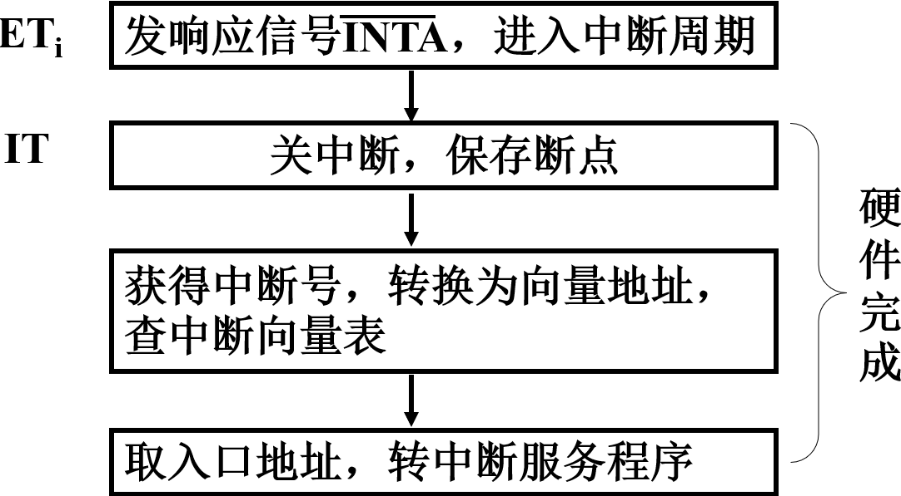

   中断周期IT（过渡周期依靠硬件实现）

   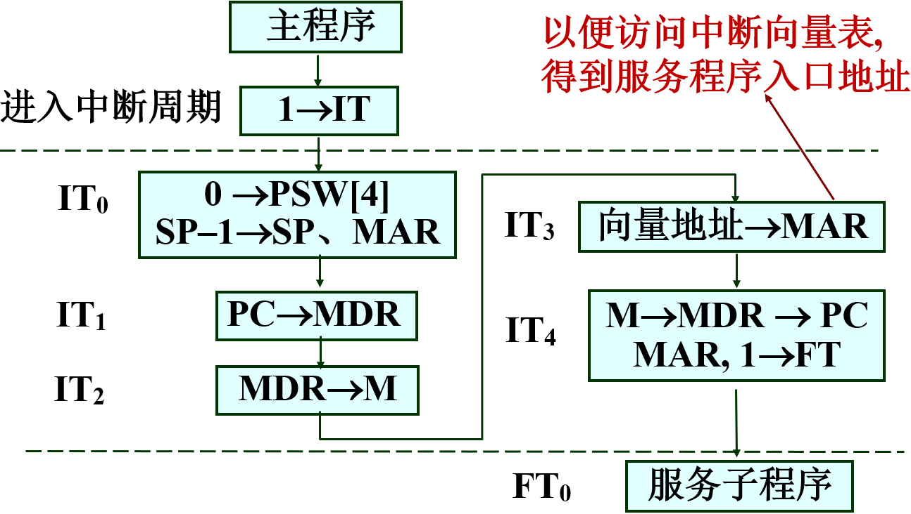

#### 4. 中断处理

主要任务：CPU执行中断服务程序

单级中断流程：保护现场 → 中断服务处理 → 恢复现场 → 开中断 → 返回

多重中断流程：保护现场 → 送新屏蔽字、开中断 → 中断服务处理 → 关中断 → 恢复现场及原屏蔽字 → 开中断 → 返回

送新屏蔽字、开中断：禁止**同级**或**更低**级别的请求，开放更高级别的请求

### 10.4.3 中断接口模型

1. 组成（寄存器级）

   1. 寄存器选择电路

      对接口寄存器寻址

   2. 命令字寄存器

      接收CPU发向外设的命令字，转换为相应操作命令送外设

      命令字格式的拟定：用代码表示各种命令

   3. 状态字寄存器

      反应设备和接口的运行状态

   4. 数据缓冲器

      **传送数据**，实现缓冲

   5. 控制逻辑

      请求信号产生逻辑

      电平转换逻辑

      串-并转换逻辑（串口）

      扩展中断源

   6. 公共中断控制器

      接收外设请求，判优，送出公共请求INT

      接收中断批准INTA，送出中断号（中断类型码）

2. 工作过程（外中断）

   1. 初始化：设置工作方式、**屏蔽字**、**分配中断类型码**等
   2. 启动设备（送命令字）
   3. 设备请求中断
   4. 中断控制器汇集各请求，向CPU送INT
   5. CPU响应，发INTA
   6. 中断控制器送出中断号
   7. CPU执行**中断隐指令**，转**中断服务程序**

## 10.5 DMA方式与接口

中断方式消除程序查询方式CPU空闲等待现象，在**没有中断处理任务时**，CPU和外设可以并行工作。但在中断响应和执行中断服务程序时，仍需依靠CPU。为解决高速设备与主存间的大数据量传输问题，采用DMA方式

### 10.5.1 基本概念

1. DMA定义：直接依靠**硬件系统**来控制主存与设备之间的数据传送，**<u>*传送期间*</u>无需CPU干预**，传送结束后通常用**中断方式**通知CPU

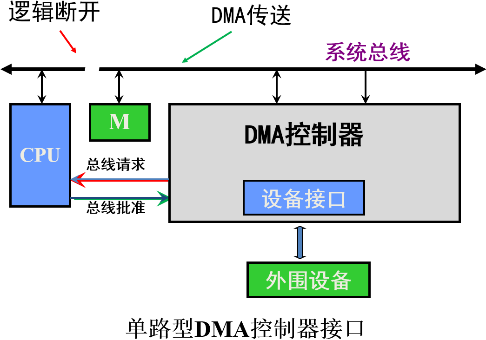

2. 特点：

   - 响应随机请求
   - 不影响CPU程序的执行，仅占用总线、无程序切换
   - 大批量数据简单传送

3. 典型应用

   - 主存与高速I/O设备之间的简单数据传送
   - 大批量数据采集系统
   - 动态存储器（DRAM）的自动刷新
   
4. DMA的数据传送模式

   - 单字传送

     DMA请求获得批准后，CPU让出**一个**总线周期用于字或字节的传送，再回收并重新判断下一个周期的总线控制权（周期挪用或窃取）

   - 块传送（成组连续传送）

     DMA被批准后，连续占用**若干**总线周期，连续批量地传送数据，结束后将总线控制权交回给CPU

### 10.5.2 DMA控制器与接口功能

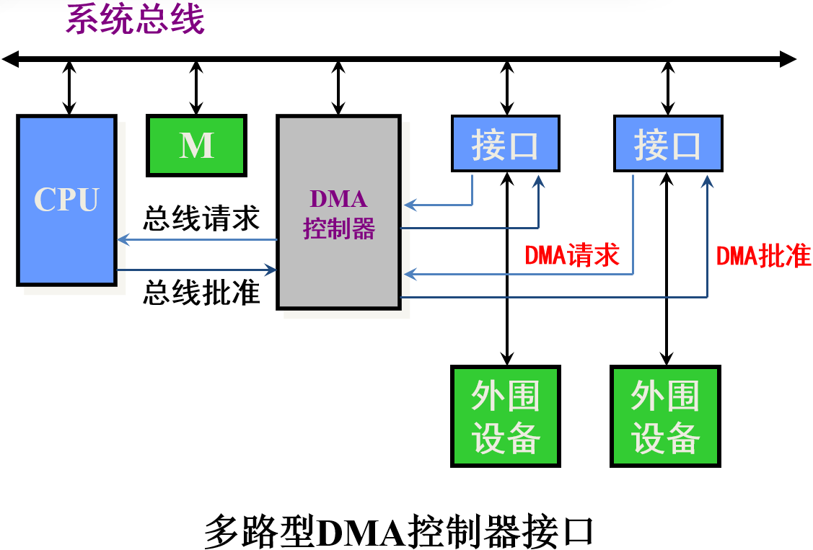

**DMA控制器的功能**：

1. 初始化：接收CPU初始化信息（传送方向、主存首地址、交换量）
2. 传送前：接收外设DMA请求，判优，向CPU申请总线
3. 传送期间：接管总线权，发送**总线地址**、读/写命令，向I/O接口发出响应信号
4. 传送结束：向CPU撤销请求，向I/O发结束信号

**接口功能**：

1. 初始化：接收CPU初始化信息（外设寻址信息）
2. 传送前（外设准备好）：向DMA控制器发请求
3. 传送期间：向总线传送/接收数据
4. 传送结束：向CPU发送中断

### 10.5.3 DMA传送过程

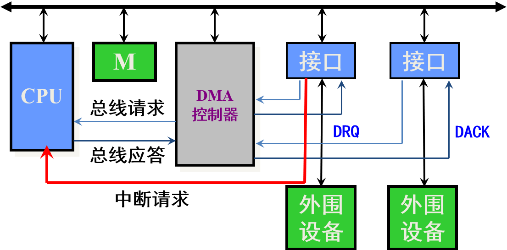

四个阶段：

1. 程序准备：主程序实现初始化（对DMA控制器、接口）
2. 传送请求：DRQ→HRQ→HLDA→DACK
3. DMA传送：存储器与I/O之间直传（**硬件实现**）
4. 善后处理：执行中断处理程序

- 存储大题ROM与数据总线之间只有**单向**箭头
- 选ROM、RAM片时尽量选每需要相同寻址数量的片（不增加器件）
- FT0两步操作只有结束时**一个**时序切换
- 同步控制的统一时序信号可由软件产生
- 并行加法器的进位信号不一定同时产生：串行进位
- 移位不一定使用移位线路：软件模拟，对ALU扩展
- 中断周期结束后，CPU进入中断服务程序
- 中断方式中数据传送由数据缓冲器实现
- 保护现场：保护中断服务子程序中要用到的寄存器内容

- 中断响应：一条指令结束后
- DMA响应：一个总线周期结束之后

奇（偶）校验：**加完1后**1的个数变为奇（偶）数个