# 13.软件工程概述

## 13.1软件的概念和特点

软件 = 程序 + 数据 + 文档

程序：按实现设计的**功能和性能需**求执行的**指令序列**

数据：程序能正常操纵信息的**数据结构**

文档：与程序开发、维护和使用有关的**图文材料**

软件的特征

## 13.2软件危机的产生

提出软件工程→解决软件危机

软件危机：计算机软件**开发和维护**过程中所遇到的一系列**严重问题**

软件危机产生的原因：

- 客观：软件本身的特点
  - 逻辑部件
  - 规模庞大
- 主观：不正确的开发方法
  - 忽视需求分析
  - 错误认为：软件开发 = 程序编写
  - 轻视软件维护

## 13.3软件工程的概念与发展过程

软件工程的定义：将**系统化的、规范的、可量化**的方法应用到软件的**开发、运行及维护**中，即将**工程化**的方法应用于软件

软件工程定义为三元组(工程要素)：<目标，原则，活动>

目标：生产具有**正确性**、**可用性**以及**开销合宜**的**产品**

原则：**使用**阶段性生命周期计划的**管理**……

活动：生产一个最终**满足需求**且达到**工程目标**的软件产品所需要的**步骤**

软件工程三要素：方法、工具、过程

- 工具：为软件工程的**过程和方法**提供自动化或半自动化的工具支持
- 方法：完成软件工程项目的**技术手段**，分为结构化方法、面向对象方法

- 过程：贯穿软件开发的各个环节，各环节里建立里程碑；**管理者**在过程中对软件开发进行**管理、控制**；**技术人员**采用相应的方法和工具生成软件**工程产品**

应用软件工程的原因：提高软件开发效率，保证软件质量，提高可维护性和可扩展性，降低成本，解决软件危机

# 14.软件过程

## 14.1软件过程概念

软件生命周期：软件产品或软件系统从**设计、投入使用到被淘汰**的**全过程**

软件过程：在工作**产品构建**过程中，所需完成的工作**活动、动作、任务**的**集合**

软件过程模型：软件开发的全部**过程、活动和任务**的**结构框架**

## 14.2瀑布模型

### 14.2.1瀑布模型

- 线性模型
- 顺序性、依赖性
- 推迟实现
- 以文档为驱动
- 每个阶段都有与其预期相关联的里程碑和**可交付的产品**
- 每个阶段结束前**完成文档审查**，及早改正错误

缺点：

1. 增加工作量
2. 开发风险大
3. 早期错误发现晚
4. 不适应需求变化

适用：系统需求明确、稳定、技术成熟（军工、航天、医疗）

### 14.2.2V模型（瀑布模型的变种）

分析设计、测试

## 14.3原型模型、增量模型

### 14.3.1原型模型

 原型：部分开发的产品

优点：减少**需求不明**带来的风险

缺点：

- 构造原型的技术、工具不一定主流
- 快速建立+连续修改可能导致原型质量低下
- 质量与原型折中
- 客户意识不到质量问题

适用：客户定义总体目标集，不清楚具体输入输出；开发者不确定算法的效率、软件与操作系统是否兼容、用户与计算机的交互方式

### 14.3.2增量模型

增量：满足需求的子集，完成一定功能、**小而可用**的软件

- 非整体开发，**进化式**
- 建立不完整系统，进一步**扩充**、**完善**
- 每个增量开发可用**瀑布或快速原型模型**

优点：

- 不需要提供完整需求，有一个增量出现开发就可以进行
- 可尽早**投入市场**
- 初始阶段不需要投入太多**人力资源**
- 逐步交付，适应**需求变化**
- 看到中间产品，**降低返工**，降低开发风险
- 开放式体系结构，**便于维护**

缺点：

- 难以根据需求给出大小合适的增量
- 开放式体系结构困难
- 对过程控制失去整体性

适用：软件**需求可能发生变化，有较大风险，希望尽早进入市场**

## 14.4螺旋模型、喷泉模型

### 14.4.1螺旋模型

把开发活动、风险管理结合起来控制风险

结合了瀑布模型、原型模型的特点

优点：

- 强调**原型**的**可扩展性、可修改性**
- 原型可看作需求规格说明，易于**双方共同理解**
- 及时调整管理决策，降低**开发风险**

缺点：

- 若迭代效率不高，迭代次数过多，成本增加，交付时间推迟
- 要求队伍水平较高

适用：需求不明确或可能发生变化的**大型复杂系统**

### 14.4.2喷泉模型

面向对象开发过程

早期**定义对象**，开发过程**充实、扩充**

各阶段用统一的概念和表示方法，生命周期无缝连接

各个步骤反复迭代

优点：各阶段没有明显界限，可**同步开发**，提高项目**开发效率**，节省开发时间

缺点：开发阶段重叠，不利于管理。审核管理文档难度大

适用：**面向对象开发**

**P64页！！！**

# 15.需求分析

## 15.1需求分析概述

需求分析概念：**确定**系统必须具有的**功能和性能**，系统要求的**运行环境**，预测系统**发展的前景**

需求分析过程：

- 需求**确认**
  1. 需求获取
  2. 需求提炼（核心：建立分析模型）
  3. 需求描述（需求分析完成的基本标志：形成规格说明书）
  4. 需求验证
- 需求**变更**

## 15.2需求分析模型概述

|          | 面向过程分析模型                       | 面向对象分析模型                 |
| -------- | -------------------------------------- | -------------------------------- |
| 数据模型 | 实体-联系图（ERD）<br />数据字典（DD） | 类图                             |
| 功能模型 | 数据流图（DFD）                        | 用例图                           |
| 行为模型 | 状态变迁图（STD）                      | 活动图（泳道图）、顺序图、状态图 |

## 15.3面向对象分析方法

UML：统一建模语言

UML图类型：结构图、行为图

### 15.3.1用例图

基本图形：

- 参与者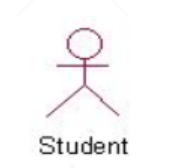
- 用例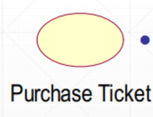
- 执行关联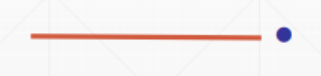
- **系统**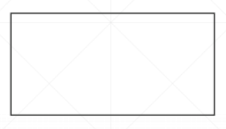

参与者（三种表示）：

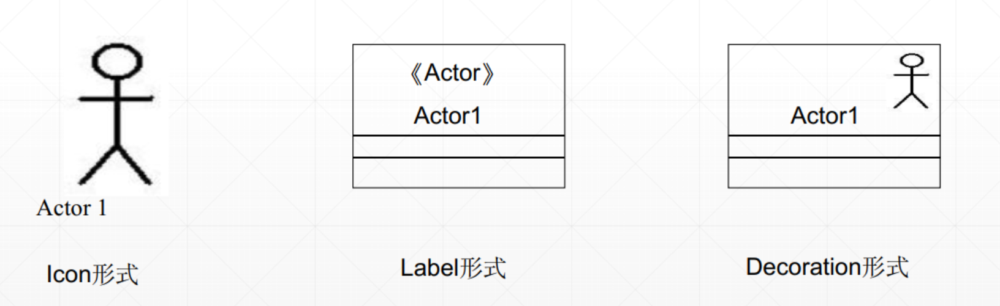

系统：将系统功能的用例置于其中，外部实体的参与者置于其外

用例之间的关系：

| 关系 | 功能                                       | 表示                                                         |
| ---- | ------------------------------------------ | ------------------------------------------------------------ |
| 关联 | 参与者与执行用例之间的通信                 |  |
| 扩展 | 基础用例插入基础用例**不能说明**的扩展部分 | 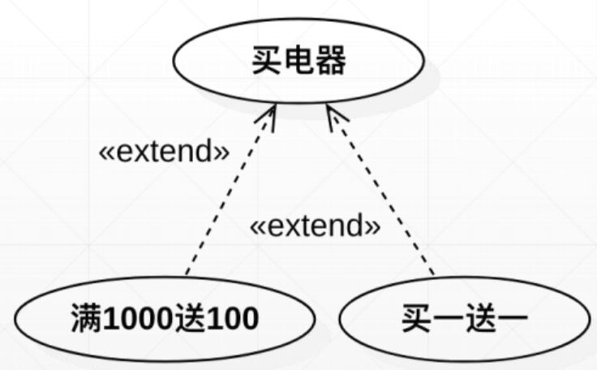 |
| 泛化 | 特殊用例泛化为一般用例                     | 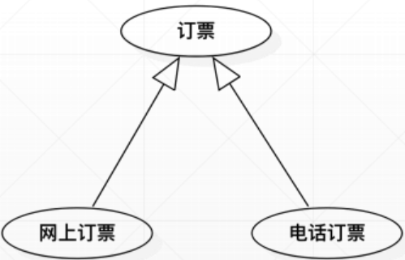 |
| 包含 | 基础用例插入附加行为                       | 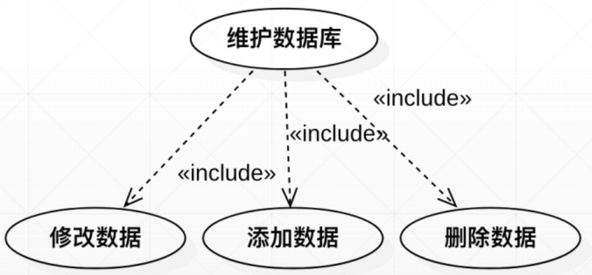 |

eg：

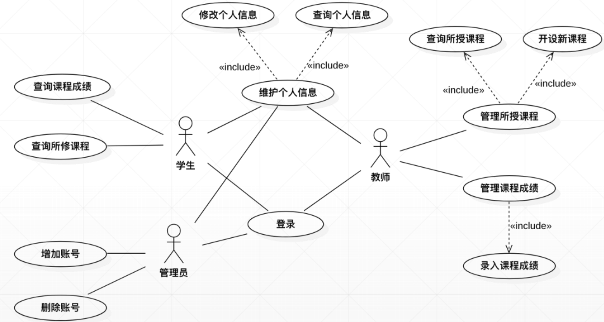

### 15.3.2活动图

图形化显示用例的事件流

动作间转换：

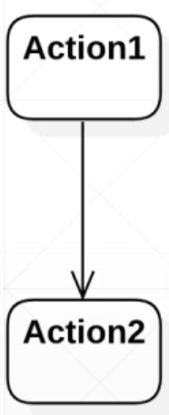

一次活动的开始：

活动的结束：

**控制节点：**分支及合并、分叉及汇合

**分支及合并（可选计算线程）**：

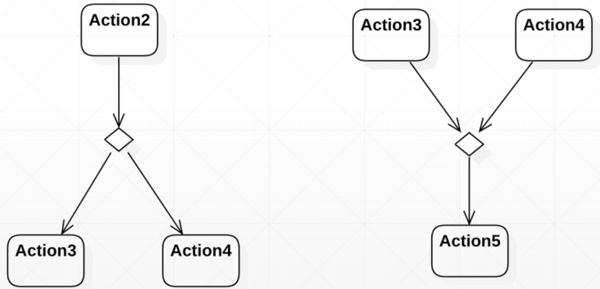

**分叉及汇合（并发计算线程）**：

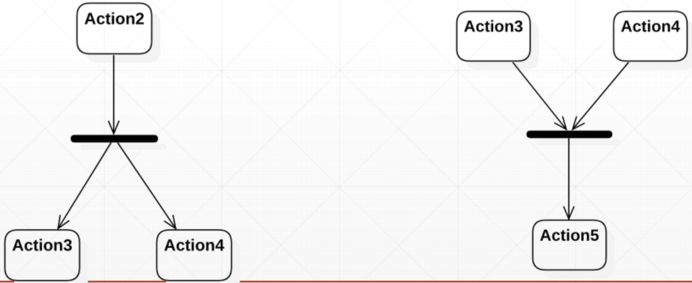

eg：

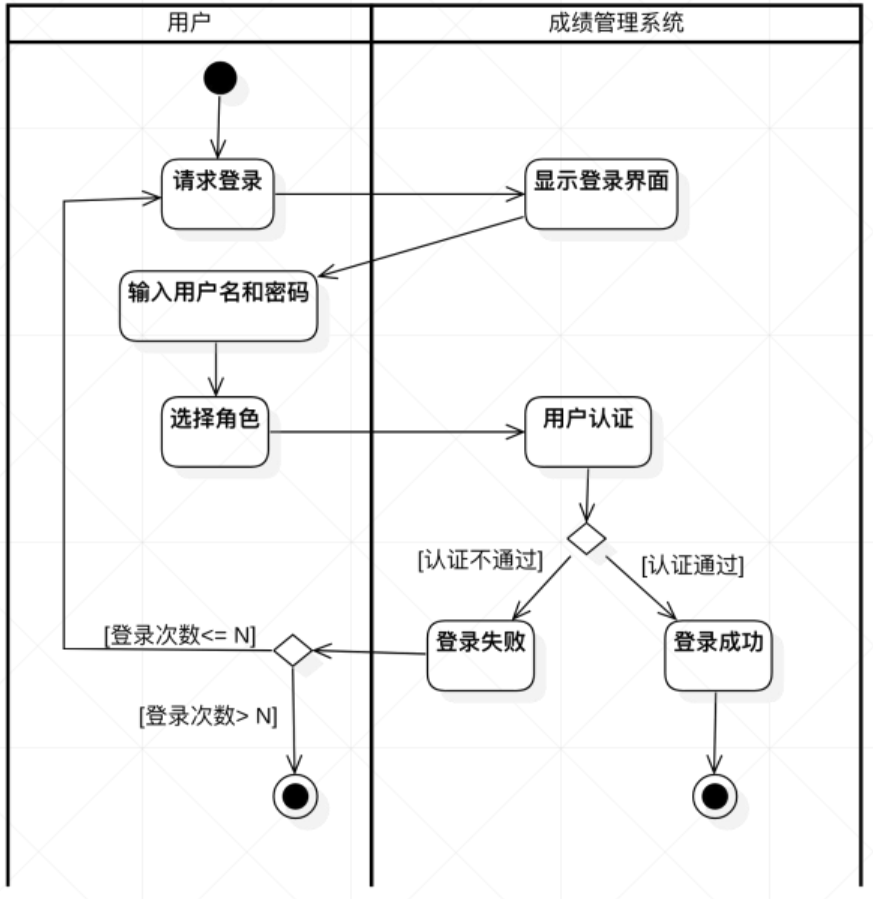

# 16.软件设计

## 16.1软件设计概念

系统设计：概要设计、详细设计

- 概要设计：确定系统**设计方案**、软件的**体系结构**。确定软件由哪些**模块**组成以及这些模块之间的**相互关系**
- 详细设计：描述应该如何具体的**实现系统**。详细设计的每个模块应该确定实现模块所需要的**算法**和**数据结构**

软件工程中设计分类（软件设计涉及的四类技术）：数据设计、架构设计、接口设计、组件设计

- **数据**设计：构建高层**抽象**的**数据模型**、**信息模型**。包括：类图、数据结构设计
- **架构**设计：勾画出系统的**总体结构**。包括：物理结构、子系统及其接口、概要的设计类
- **接口**设计：组件**对外提供访问**的设计，以及**用户接口**的设计
- **组件**设计：对**数据**和**方法**的简单**封装**。包括：类与操作的设计 

设计相关概念：<u>抽象</u>、<u>体系结构</u>、<u>设计模式</u>、<u>模块化</u>、<u>信息隐藏</u>、<u>功能独立</u>、<u>精化</u>、<u>重构</u>

软件设计的**定义**：**软件系统**或**组件**的**架构、构件、接口**和其他特性的**定义过程**及该过程的**结果**

软件设计**是什么**：软件设计是**软件生命期中的一个活动**，是进行软件**编码的基础**，是连接**用户需求**和**软件技术**的**桥梁**。通过它，主要从软件外部视角提出的需求分析才能被转化为软件内部的结构

抽象：忽略具体的信息将**不同事物**看成**相同事物**的过程

软件体系结构：指系统的**一个或多个结构**，它包括**软件构件、构件的外部可见属性**以及他们之间的**相互关系**

设计模式：在给定**上下文环境**中一类**共同问题**的**共同解决方案**

模块化：软件被划分为命名和功能相对独立的多个组件，通过这些组件的集成来满足问题的需求

信息隐藏：定义和隐藏了模块内的**过程细节**和模块内的本地**数据结构**

功能独立：每个模块只负责特定的子功能，从其他部分看只有简单的接口

精化：逐步求精的过程

重构：不改变组件功能、行为下，简化组件设计的技术

## 16.2面向对象的设计

面向对象设计活动：系统架构设计、用例设计、类设计、数据库设计、用户界面设计

### 16.2.1类图

描述类之间的关系

类：包含类名、属性、操作（后两个有时可省略）

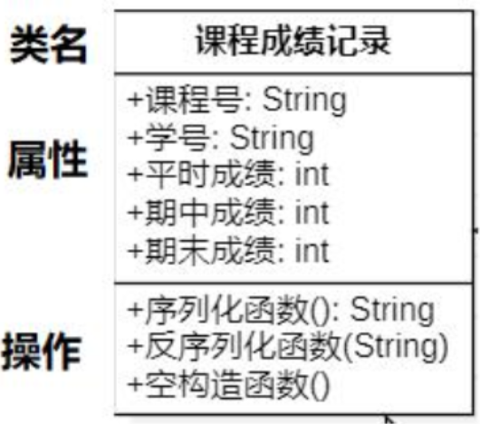

| 类间关系     | 说明                                   | 示例                                                         |
| ------------ | -------------------------------------- | ------------------------------------------------------------ |
| 关联关系     | 单向、双向（都持有对方类型的成员变量） | 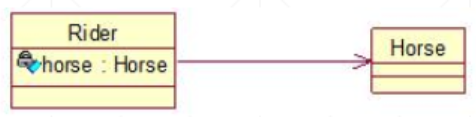 |
| 聚合关系     | 部分可以脱离整体独立存在               | 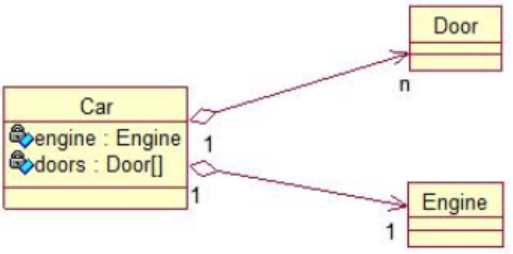 |
| 组合关系     | 部分无法脱离整体存在（无父类就无子类） | 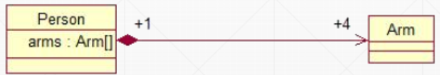 |
| **依赖**关系 |                                        | 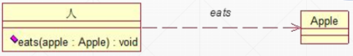 |
| 泛化关系     | 父类的属性不用再写到子类中             | 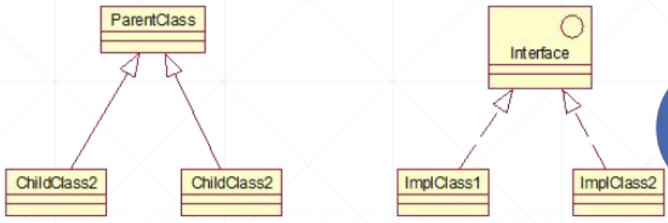 |

注：

- 线上标的数量为靠近的一方类可能有的数量

eg：

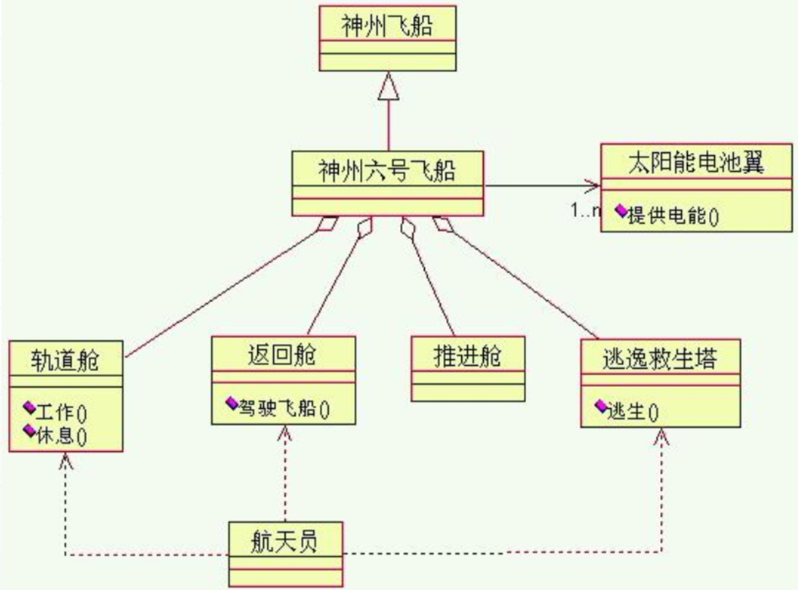

### 16.2.2顺序图

强调消息时间顺序的交互图

顺序图元素：对象、生命线、消息、激活

**对象**

置于顶部说明交互开始就存在，反之在交互中创建

参与者和对象从左到右排列

最多2个参与者，分列两端，左端为启动用例的参与者，右端为接收消息的参与者

| 对象命名方式       | 示例                                                         |
| ------------------ | ------------------------------------------------------------ |
| 对象名+类名        |  |
| 类名（匿名对象）   | 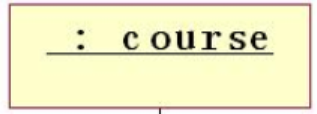 |
| 对象名（不关心类） | 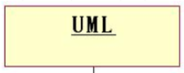 |

**生命线**

用垂直的虚线表示，若生命周期结束，则用注销符号表示

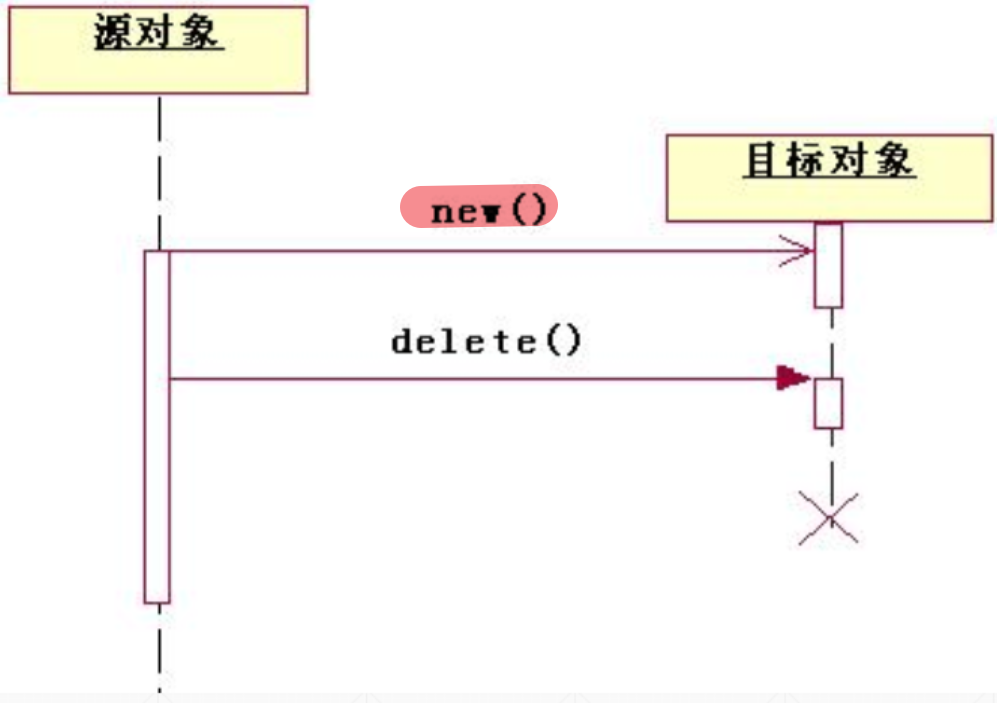

**激活期**

用宽矩形表示


**消息**

**消息编号可以不显示，**消息次序由他们在垂直轴上的相对位置决定

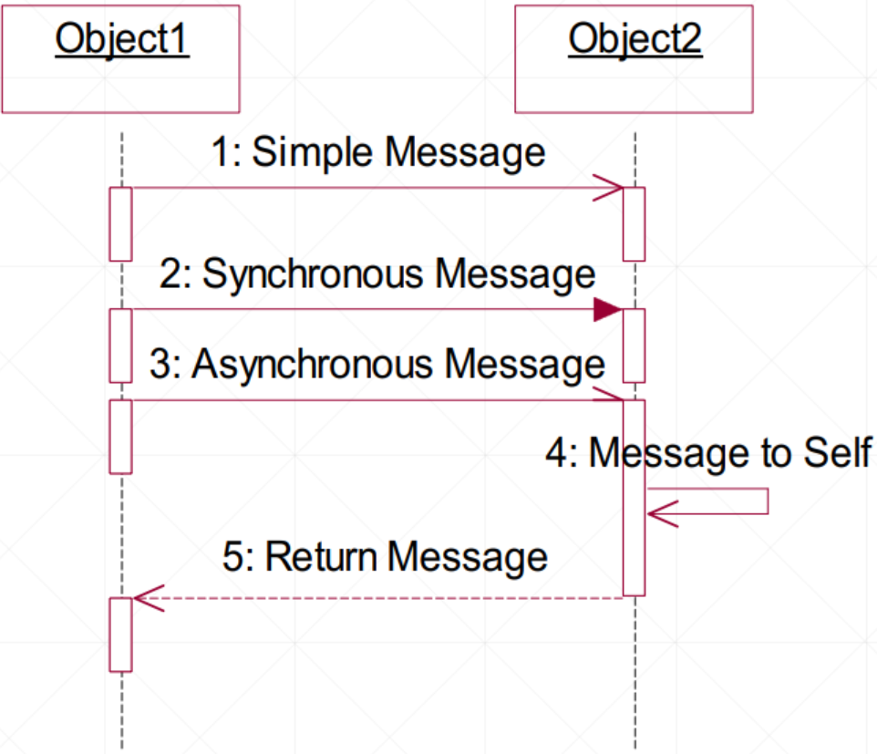

类型：

- 简单消息
- 同步消息：可回送简单消息或隐含返回
- 异步消息：发送消息的对象不用等待放回消息即可开始另一个活动
- 反身消息：对象讲消息发送给自己，操作为private
- 返回消息：可选择部分，**可以缺省**

**对象创建**

创建的对象应在图中间部分

创建两种方法（**<<`creat>>**）：

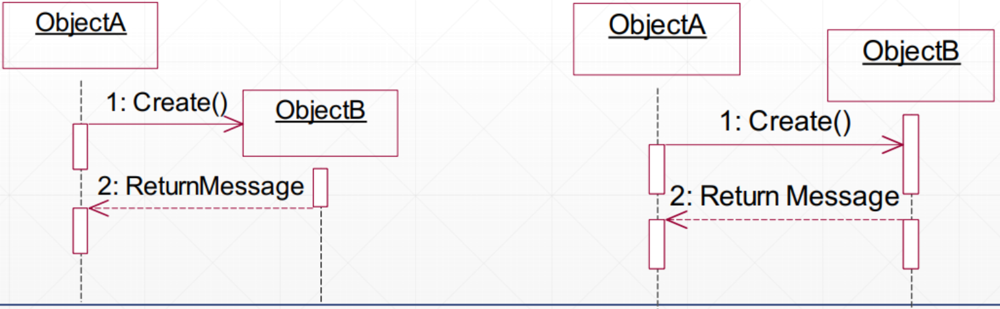

**对象撤销**

- 用destroy消息撤销对象
- 生命线末端用$\times$进行标识
- **<<`destory>>**

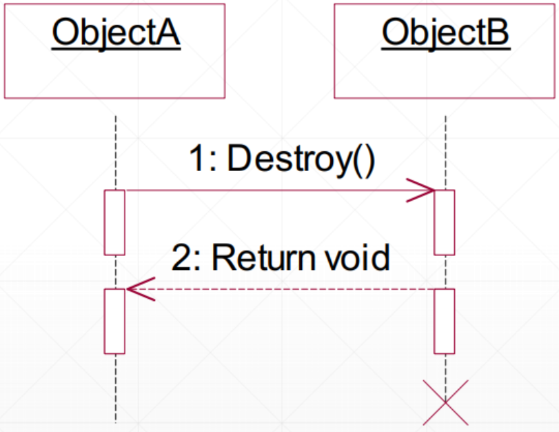

注：

- 信息可逐级传递
- “打开”**<<·creat>>**；“关闭”**<<·destory>>**

eg：


# 17.质量保证

## 17.1软件质量保证

软件质量概念：明确标识是否符合**功能**和**性能**要求，明确地记载**开发标准**和所有专业开发软件的**期望**的**隐性特点**

关键点：

- 符合明确规定的功能和性能要求
- 符合明确的开发标准
- 符合所有软件开发专业的共性、隐性标准，如易用性、可维护性等

## 17.2软件测试策略

### 17.2.1测试策略V模型

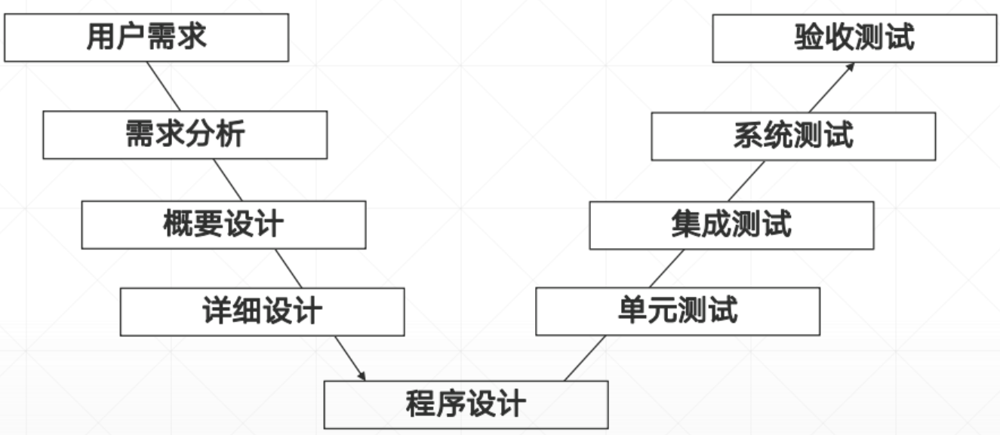

V模型明确表明测试过程中存在的不同级别，清楚描述了这些测试阶段和开发过程期间**各阶段对应关系**

### 17.2.2软件测试策略

#### 单元测试

单元测试：针对软件设计的最小单位-程序模块，进行正确性检验的测试工作

主要内容：模块接口、局部数据结构、边界条件、独立路径、出错处理

手段：白盒测试（主试）、黑盒测试（辅试）

驱动模块：模拟被测试模块的上一级模块，相当于被测模块的主程序

桩模块：模拟被测试的模块所调用的模块，不是软件产品的组成部分

#### 集成测试

集成测试：将软件集成起来进行测试

分类：自顶向下的集成方法、自底向上的集成方法、SMOKE方法

#### 系统测试

系统测试：从用户使用的角度进行测试，将完成了集成测试的系统放在真实的运行环境下进行（使用黑盒测试）

分类：功能测试、性能测试、压力测试、恢复测试、安全性测试

#### 验收测试

验收测试形式分类：

- 根据合同的验收测试
  - 系统测试子集再测试
- 用户验收测试
  - 客户
  - 最终用户
- 现场测试
  - $\alpha$测试
  - $\beta$测试

### 17.2.3软件测试技术

回归测试：有选择的重新测试系统或其组件，以验证对软件的修改没有导致不希望出现的影响，以及系统或组件仍然符合其指定要求

软件缺陷：软件未实现产品说明书要求的功能、出现指明不能出现的错误、实现未提到的功能、未实现未明确提及但应该实现的目标、难以理解、不易使用、运行缓慢

验证：保证软件特定**开发阶段的输出**已经正确完整地实现了**规格说明**

确认：对于每个**测试级别**，都要检查开**发活动的输出**是否满足具体的要求或与这些特定级别**相关的需求**

软件测试：找出软件**缺陷**并确保**修复**

软件质量保证：创建、执行**改进过程**并**防止缺陷**的标准和方法

质量与可靠性：可靠性、可维护性、可用性、功能性、可移植性、效率

软件测试：目标是**发现**软件**缺陷**的存在

软件调试：目标是**定位**与**修复**缺陷

测试用例：测试输入、执行条件、预期结果的**集合**，是为**特定的目的**开发的，例如执行特定的程序路径或验证与指定的需求相符合

## 17.3软件测试

### 17.3.1白盒测试

#### 逻辑覆盖

- 语句覆盖：使得每一可执行语句至少执行一次

  1. 标记**路径**：

     exp：L1（a→c→e）

  2. **输入|输出**|路径

- 分支覆盖：使每个判断的取真分支和取假分支至少一次

  1. 标记**路径**：

     exp：L1（a→c→e）

  2. **输入|输出**|路径

- 条件覆盖：使每个判断的每个条件的可能取值至少执行一次

  1. 标记条件：

     exp：条件：~~ ；取真：$T_1$；取假：$\overline{ T_1}$

  2. **输入|输出**|路径|条件取值

- 条件组合覆盖：使**每个判断**的所有可能的条件取值组合至少执行一次

  1. 标记组合：
  
     exp：①<条件1>、<条件2>，$T_1\overline{ T_2}$(条件1、2**在一个判断中**)
  
  2. 输入|输出|覆盖条件组合|覆盖路径

#### 控制流程图覆盖测试 

控制流程图：

| 结构           | 示例                                                         |
| -------------- | ------------------------------------------------------------ |
| 顺序结构       | 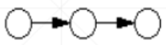 |
| IF选择结构     | 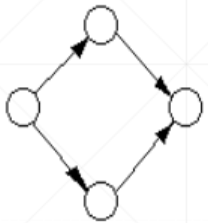 |
| WHILE重复结构  | 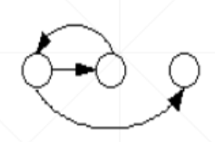 |
| UNTIL重复结构  | 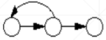 |
| CASE多分支结构 | 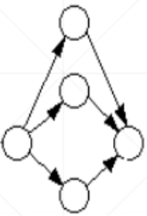 |

区域：**图形外**的区域也应记为一个区域

单条件嵌套：判断中表达式由一个或多个逻辑运算符，改为一系列只有单个条件的嵌套的判断

eg：

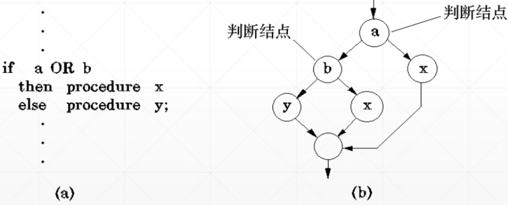

节点覆盖=语句覆盖

边覆盖：对图中每一个可到达的长度小于等于1的路径中至少存在一条测试路径覆盖

**路径覆盖测试：**覆盖所有可能的路径

**基本路径测试：**程序中的循环体最多只执行一次

程序的环路复杂性：
$$
V(G)=e-n+2
$$

- $e$：边的数目
- $n$：节点数目

### 17.3.2黑盒测试

#### 等价类划分

全部二分有效等价类、无效等价类

布尔量：是为有效等价类，否为无效等价类

1. 确定等价类
2. 建立等价类表
3. 等价类唯一编号
4. 覆盖有效等价类（每个用例尽量多覆盖）
5. 覆盖无效等价类（每个用例只覆盖一个）

#### 边界值分析

- 单侧边界

  - 闭区间：边界点、边界点+1、边界点-1
  - 开区间：边界点、边界內移1的点

- 区间范围

  - 闭区间：上点a、b，内点c，离点a-1、b+1
  - 开区间：上点a、b，内点c，离点a+1，b-1
  - 区间范围：规律同上

- 二元函数

  任一个变量的内点与另一变量其他点组合，加上两个变量内点组合

- 三元函数

  任两个变量的内点与另一变量其他点组合，加上三个变量内点组合

上点：边界上的点

内点：上点范围内的任意一点

**离点**：离上点最近的点。开区间向内一步，闭区间向外一步

划分等价类：

| 输入项 | 有效等价类          | 无效等价类       |
| ------ | ------------------- | ---------------- |
| 年龄   | 1.               2. | 3.            4. |
| 性别   |                     |                  |

测试用例：

| 测试输入           | 预期结果 | 覆盖有/无效等价类 |
| ------------------ | -------- | ----------------- |
| 年龄：    ，性别： |          | 1、4              |

**无效只能一个一个覆盖，有效可以一次性覆盖多个**

# 18.软件项目管理

## 18.1  4P

- 人员（People）：招聘、选拔、绩效管理、培训、薪酬、职业发展、组织和工作设计、团队/文化的发展
- 过程（Process）：软件过程提供**框架**，在此框架下制定项目开发的**综合计划**（根据**项目特征**选择合适的过程模型，根据过程模型进行**项目分解**）
- 产品（Product）：策划一个项目以前，建立产品的**目标**和**范围**，考虑可选的**解决方案**（进行功能分解）
- 项目（Project）：理解**成功项目管理**的关键因素，掌握项目**计划**、**监控**和**控制**的一般方法（采用确保软件团队能够成功的方式来组织项目）

## 18.2面向规模的度量

通过对质量和生产率的测量进行规范化而得到的，这些测量是根据开发过的软件的规模得到的

- 千行代码（KLOC）：指源代码，通过源代码的行数度量一个软件的规模
- 生产率（PM）：$PM=L/E$，$L$：代码总量（单位：KLOC），$E$：软件工作量（单位：人月）
- 每千行代码的平均成本（CKL）：$CKL=S/L$，$S$：项目总开销，$L$：代码总量（单位：KLOC）
- 代码出错率（EQRI）：$EQRI=Ne/L$，$Ne$：代码出错行数，$L$：代码总量
- 文档与代码比（DI）：$DI=Pd/L$，$Pd$：文档页数，$L$：代码总量（单位：KLOC）


等价类划分：

| 输入条件     | 有效等价类   | 无效等价类          |
| ------------ | ------------ | ------------------- |
| 年龄为数字型 | 数字型       | 非数字型            |
| 年龄范围     | 18<=年龄<=39 | 年龄<18；年龄>=39； |


1. {20}
2. {1}
3. {100}
4. {ch}


边界值分析法：

1. {17}
2. {40}
3. {20}
4. {18}
5. {39}

状态测试、静态测试不考


4P

只考面向规模的度量（概念+公式）

KLOC(项目规模)

PM

EQRI

……

度量方法


MOOC软件测试

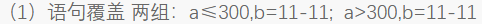

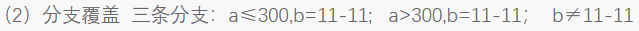

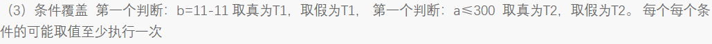


EQRI=300/L=10

0.5=L/60  L=30

CKL=440/L=44/3


JAVA

1-8章

软工

- 接口中的常量是默认`public static final`类型（不能有**private**类型成员）

- 抽象类中可以有**private**成员、方法

- 创建内部类

  ```java
  public class OuterClass {
      private String message = "OuterClass";
      public class InnerClass {
          public void displayMessage() {
              System.out.println("这是InnerClass");
          }
      }
      public static void main(String[] args) {
          OuterClass outer = new OuterClass();
          OuterClass.InnerClass inner = outer.new InnerClass();
          inner.displayMessage();
      }
  }
  ```

- `wait()` 、`notify()` 、`notifyAll()` 需要再`synchronized`方法或代码块中使用，否则会报`IllegalMonitorStateException`

- 实现抽象方法、方法覆盖加`@Override`

- 异常：

  ```java
  class InvalidAgeException extends Exception {
      public InvalidAgeException(String message) {
          super(message);
      }
  }
  
  class User {
      private int age;
  
      public User(int age) throws InvalidAgeException {
          checkAge(age);
          this.age = age;
      }
  
      private void checkAge(int age) throws InvalidAgeException {
          if (age < 18) {
              throw new InvalidAgeException("小屁孩！");
          }
      }
  }
  
  class Main {
      public static void main(String[] args) {
          try {
              User p = new User(17);
          } catch (InvalidAgeException e) {
              System.out.println(e.getMessage());
          }
      }
  
  ```

  - 异常捕获可用更宽泛的异常来捕获精细化异常
  - 子类重写方法可比父类throws**更精细化**、**更少**的异常
  - 一个方法中：throws的异常 > throw的异常
  
- ```java
  float a = 12;
  float a = 0.12f;
  float a = 0.12F;
  ```

  float型小数变量需要加**F**或**f**

- 通过~打印：考虑多态

- 代码块执行顺序：

  - 类加载时执行：
    1. 父类static变量、static代码块
    2. 子类static变量、static代码块
  - 创建对象时执行：
    1. 父类实例变量、实例代码块
    2. 父类构造方法
    3. 子类实例变量、实例代码块
    4. 子类构造方法

- **static**方法无多态

- - static、final可在构造方法中赋初值
  - static final需立即赋值（否则在类加载时会与final的定义冲突）


大作业报告文档

系统说明

软件工程
软件危机
这几个的题我是瞎说的啊↓
对吧你肯定要清楚↓
增量模型适合干嘛的
螺旋模型适合干嘛的
圆形模型适合干嘛的