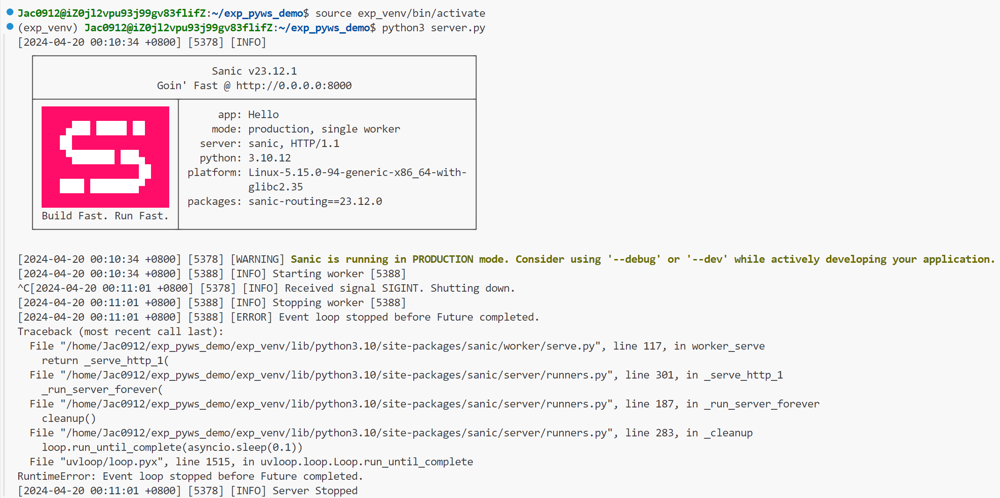

# Flow

**敏捷开发：**应对快速变化需求的软件开发模式

**DevOps:**Development(开发)、QA(质保)、Operations(运维)，一整套敏捷开发方法论&生态工具集

**DevOps自动化：CI/CD**

持续集成(Continuous Integration)、持续交付(Continuous Delivery)、持续部署(Continuous Deployment)

**DevOps平台：**用于支持DevOps流程的工具和集成的组合。帮助团队协作、自动化、监控和部署应用程序以加速交付和改进软件质量。

## 在虚拟环境中部署范例服务

## 以容器形式部署范例服务

## 配置云效Flow以支持ECS虚拟环境部署

## 基于阿里云云效Flow以容器形式部署范例服务

