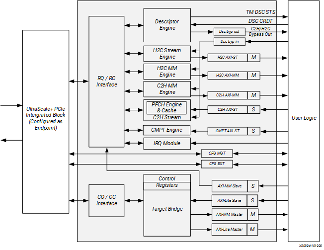

- DMA（Direct Memory Access）：外部设备去读 CPU
	- 每次传输前，CPU 需要亲自写寄存器告诉 DMA 地址和长度
	- 线性，无法处理多用户、多队列需求
	- 不支持虚拟化
- MM（Memory-Mapped）：把设备的寄存器映射到内存中，直接在地址上读写数据
- QDMA
	- 引入生产者、消费者
		- 软件（生产者）：CPU 维护描述符队列（任务列表），CPU 可以不断往里面扔任务
		- 硬件（消费者）：QDMA 引擎去内存中抓取任务执行
	- 支持多个队列数量：每个虚拟机或者应用程序都可以有自己的传输通道
	- 描述符预取：把任务清单放到硬件内部缓存
	- 支持虚拟化（SR-IOV）

# 1. DMA Engines
## 1.1. Descriptor Engine
- 作用：维护每个 queue 的上下文
	- SW：软件
	- PIDX：生产者索引（host）
	- CIDX：使用者索引（fpga）
	- BADDR：队列基址
	- 队列配置
- 使用 RR 算法提取描述符
- 对于 H2C / C2H 有两个独立的 buffer（保证不溢出）
- 每次尽可能读更多的描述符（取决于 MRRS[^1]可以包含的描述符数量）
- 可以去对乱序的描述符排序
- 生成对应 DMA 操作完成的状态描述符（CIDX 实现）：使软件收回描述符并清空缓存器
- 对描述符数量限制（限制缓冲量）：
	- 开 credit 进行节流，提取描述符的总数上限不超过 credit
	- 用户逻辑通过 `dsc_crdt` 返回 credit
	- 依据描述符大小粒度来设置
- 用户开发工作负载优先顺序排序：
	- PIDX 的增量会发送到 `tm_dsc_sts` 接口

## 1.2. H2C MM Engine
- 通过 H2C AXI-MM 接口实现 H2C
- 在 PCIe 上生成读取，基于 MRRS / (PCIe 读取不超 4KB) 要求，拆分描述符
- 收到读取请求的数据完成后，在 H2C AXI-MM 接口上生成 AXI 写入
- 自动处理：数据移位（地址未对齐的情况）/ 4KB 边界保证
- 用户逻辑可以通过旁路接口将描述符注入

## 1.3. C2H MM Engine
- 通过 C2H AXI-MM 接口实现 C2H
- 在 C2H AXI-MM 上生成 AXI 读取，基于 4KB 边界将描述符拆分为多个请求
- AXI4 接口上接收到读取请求的数据完成，使用 AXI 读取的数据生成 PCIe 写入
- 自动处理：数据移位 / MPS[^2] / 4KB
- 用户逻辑可以通过旁路接口将描述符注入
- 支持多功能配置：
	- 在 AXI-MM 接口总线的 `aruser` 位中提供 PCIe 功能编号信息
	- 通过用户逻辑实现对卡的虚拟化
	- 奇偶总线提供端到端验证

## 1.4. H2C Stream Engine
- 两个模式：
	- internal mode：描述符直接送入 H2C Stream Engine
		- 每个描述符定义一个 AXI4-Stream 包传送到 H2C AXI-ST 接口
		- 跨描述符的包不允许（缺少对于每一个队列的存储）
	- bypass mode：描述符重新格式化送入 bypass input interface
		- 可以实现跨描述符的包
		- 引擎等待直到用户逻辑有足够的描述符来形成一个包
		- 属于同一个包的描述符需要连续发送到旁路接口
- 功能：
	- 拆开 DMA 读到 MRRS 大小
	- 保证空间是足够的
	- 排序，保证 stream 按顺序交付
- 有足够的缓冲：256 读描述符、32KB 数据，总描述符需要小于 64KB
- 主机数据包可以随机偏移：硬件自动对齐 AXI

## 1.5. C2H Stream Engine
- 作用：传输用户逻辑，写入 Host 内存，供特定队列使用
- 两个模块：
	- Descriptor Prefetch Cache (PFCH)：具有每个队列的上下文
		- 三种模式：
			- Simple Bypass Mode：引擎不追踪队列，用户逻辑自定义描述符的接收方法，用户逻辑需要保证传送包和关联描述符，提取描述符的顺序保持不变
			- Internal Cache Mode / Cached Bypass Mode
				- 可以存储 512 个描述符，供 64 个队列使用
				- 对 C2H 描述符的 credit 来控制提取的描述符
				- 该模式可以使描述符在数据包可用之前可用
	- C2H-ST DMA Write Engine

## 1.6. Completion Engine
- 作用：写入完成队列
- C2H Stream DMA engine 被设计用来与其紧密配合
- 向完成环中写入数据，确定每个包有多少字节的数据，然后使驱动收回描述符
- 维护完成上下文，由驱动进行编程，按队列维护：完成基址、PIDX、CIDX
- 有 64 条目的高速缓存，对于小的 CMPT 合并成 64B 写入（提高 PCIe 效率）

# 2. Bridge Interfaces
## 2.1. AXI Memory Mapped Bridge Master Interface
- 作用：CPU 主动通过 PCIe 访问 FPGA
- CPU 可以连续发起请求
- 可以将 PCIe 的某个 BAR 映射到 AXI-MM 接口（编译前决定 PF / VF）
- 虚拟化：
	- PF：物理组
	- VF：虚拟组（指示所对应的物理组）
	- FIRST_VF_OFFSET：第一个 VF 相对于 PF 的绝对偏移

## 2.2. AXI Memory Mapped Bridge Slave Interface
- 用于用户逻辑与主机之间的传输
- AXI 到 PCIe 转换通过对应的 BAR 完成

## 2.3. PCIe to AXI BARs
- 每个 PF：PCIe 配置 6 个 32 位 BAR 和一个 32 位扩展 ROM BAR
- SR-IOV 启用时：为每个 VF 增加额外 6 个 32 位 BAR
- 上述 BAR 提供地址转换到 AXI4

# 3. Interrupt Module
- 三类中断：
	- 基于队列的中断
	- 用户中断
	- 错误中断（仅限 PF 使用）
- Interrupt Aggregation：最多支持 2048 个队列，PCIe 标准分配给每个 F 的中断向量只有 8 个，如果每个队列完成任务都发中断，CPU 会频繁切换上下文
	- 使多个队列映射到同一个中断向量
	- 当队列完成时，不直接向 CPU 发中断，先把信息写入聚合环，积累过后发送一个总的中断信号

# 4. General Design of Queues
## 4.1. H2C and C2H Queues
- H2C、C2H 由软件/驱动来写，硬件读这些队列
	- H2C：从 Host 搬运 DMA 读描述符
	- C2H：向 Host 搬运 DMA 写描述符
- 除 C2H stream mode：通过状态描述符（描述符环的最后一个条目）回收主机的缓存器
- C2H stream mode：根据 CMPT 队列条目进行回收，驱动根据 CMPT 末端状态描述符检测硬件写入环中的 CMPT 条目

- H2C 提取操作：
	1. 对于 H2C，驱动将 pyload 写入 host buffer，形成 H2C 描述符并放入 PIDX 位于的 H2C 队列；对于 C2H，驱动程序保留可用缓冲器空间接收描述符的写入
	2. 驱动发送 posted write 给描述符引擎中的 PIDX 寄存器，写 QID 和当前 PIDX 
	3. PIDX 一更新，引擎计算绝对 QID 指针，取出上下文
	4. 依据上下文：引擎计算可取出的描述符数量，然后计算描述符地址
	5. 取描述符：描述符引擎从主机存储器接受到读取完成后，交付给 H2C 或 C2H 引擎进行数据搬运
	6. 完全处理完提取的描述符后，引擎将 CIDX 值写入状态描述符
- C2H 提取操作：通过 CMPT 环隐式提取

## 4.2. Completion Queue
- CMPT 队列 host 内存中的环
- 消费者是软件，生产者是 CMPT 引擎
- 软件：维护 CIDX 和 HD PIDX 的副本，避免读取未写入的完成
- 硬件：维护 PIDX 和 SW CIDX 的副本，确保引擎不会覆盖未读取的完成
- status descriptor：记录基地址、SW CIDX、PIDX、queue 深度

C2H stream 使用 CMPT 队列将完成传输到主机
1. CMPT 引擎通过 CMPT 接口接受完成信号，但是 QID 来自于 C2H stream 接口，引擎读取 CMPT 上下文 RAM 来查找 QID 索引
2. DMA 将 CMPT 条目写入地址 BASE+PIDX
3. 满足条件时就用颜色位写 PIDX 到 status descriptor
4. 如果中断模式启用，CMPT 引擎产生中断消息给中断模块
5. 驱动可以采用轮询或中断模式识别新的 CMPT entry
6. 驱动回写 CIDX：允许硬件重用描述符，在软件结束操作 CMPT 之后，驱动向 CIDX update 寄存器写入新的 CIDX

[^1]: Max Read Request Size（最大读 Host 内存请求大小）
	- QDMA 向内存抓数据时，需要发送存储器读请求 TLP（Transaction Layer Packet）
	- MRRS 规定了TLP 请求的数据字节上限

[^2]: PCIe 写请求和读完成报文数据字段的最大长度
	
