# 深度学习

## 张量

```python
#创建行向量(包含从0开始的前end个整数)
x=torch.arange(end)

#访问张量的形状
x.shape

#当张量中只含一个元素时，提取该元素
x,item()

#张量中元素的总数，即形状的所有元素乘积
x.numel()

#改变张量的形状，输入参数-1自动计算维度
x=x.reshape(a,b,c……)

#创建全1，全0，随机的张量
#可加参数:requires_grad=True
torch.ones((2,3,4))
torch.zeros((2,3,4))
torch.randn(3,4)

#通过list创建张量
torch.tensor(list)

#按元素运算(+、-、*、/、**)

#沿轴n连接张量x,y
torch.cat((x,y),dim=n)

#逻辑运算,对x,y每一个位置上的元素进行判别，放回元素为bool的张量
x==y

#对张量中所有元素进行求和
x.sum()
#沿特定轴求和,axis也可为list
x.sum(axis=n)
#保持轴数不变
x.sum(axis=n,keepdims=True)
#沿某个轴计算元素的累积总和
x.cumsum(axis=n)

#计算平均值,也可指定轴方向
x.mean()

#广播机制

#切片可多层(对多个维度进行操作)
x[0:2, :]

#tensor转ndarray
x.numpy()
#ndarray转tensor
torch.tensor(x)
```


## pandas

```python
#读取csv文件
pd.read_csv(file)

#位置索引iloc
data.iloc[:, 0:2]

#处理连续数据的缺失值，以平均值补全
inputs = inputs.fillna(inputs.mean())

#对离散数据进行处理(将NaN视为类别，含有NaN转为两类)
inputs = pd.get_dummies(inputs, dummy_na=True)

#转为张量格式，并指定数据类型
torch.tensor(inputs.to_numpy(dtype=float))

#将a,b两个数据集合并
pd.concat((a,b))

#将两个属性进行合并
#属性需具有索引，若没有则需用Series创建
pd.concat([test_data['Id'], test_data['SalePrice']], axis=1)

#为数据创建索引
x = pd.Series(data)
```


## 线性代数

```python
#转置
x.T

# 通过分配新内存进行拷贝
y = x.clone()  

#点积
torch.dot(x,y)

#矩阵向量积(矩阵*向量)
#matrix-vector product
torch.mv(x,y)

#矩阵*矩阵
torch.mm(x,y)

#替代dot,mv,mm
torch.matmul(x,y)

#求Ln范数
torch.norm(x,p=n)
```


## 自动微分

~~~python
#表明要求解微分(自动构建计算图)
x=torch.arange(4,requires_grad=True)

#y是标量
y = 2 * torch.dot(x, x)
#反向传播
y.backward()
#求解y关于x每个分量的梯度
x.grad

#y为非标量
y = x * x
#反向传播,参数为y对自身的导数
y.backward(torch.ones(len(x)))

#清除之前的梯度
x.grad.zero_()

#分离计算，将y视为常数(移除计算图)
u = y.detach()
~~~


## 线性神经网络

### 线性回归

梯度下降：在**损失函数**递减方向更新参数

```python
#打乱list顺序(原地洗牌)
random.shuffle(list)

#逐个返回值
yield x

#正态分布抽取随机数
#mean：平均值
#std：标准差
#size：张量形状
#是否自动微分
torch.normal(mean, std, size, requires_grad=True)

#在以下阶段禁用梯度计算
with torch.no_grad():
    
#创建数据集对象(x:特征,y:标签)
from torch.utils import data
dataset = data.TensorDataset(x, y)
#创建数据加载器
#batch_size:每一批加载数据的多少
#shuffle:是否在每个迭代周期内打乱数据
data_loader = data.DataLoader(dataset, batch_size, shuffle=True)

#使用框架预定义的层
from torch import nn
#a:第一个输入特征的形状
#b:输出特征的形状
net = nn.Sequential(nn.Linear(a, b))
#初始化模型参数
#权重:从均值为a,标准差为b的正太分布上随机取样
net[0].weight.data.normal_(a, b)
#偏置(b):初始化为c
net[0].bias.data.fill_(c)

#定义损失函数:平方𝐿2范数
loss = nn.MSELoss()

#定义优化算法：随机梯度下降
#net.parameters():指定优化的参数
#lr:需要优化的超参数
trainer = torch.optim.SGD(net.parameters(), lr=0.03)

#训练
l = loss(net(X) ,y)
trainer.zero_grad()
l.backward()
#每一次迭代调用，根据当前计算出的梯度调用优化算法进行参数优化
trainer.step()

#读取权重
w = net[0].weight.data
#读取偏置
b = net[0].bias.data
```

### softmax回归

通过线性神经网络对目标实现分类(监督学习)

**softmax函数:**
$$
\mathrm{softmax}(\mathbf{X})_{ij} = \frac{\exp(\mathbf{X}_{ij})}{\sum_k \exp(\mathbf{X}_{ik})}
$$


分母称为规范化常数或配分函数

对于随机输入将每个元素变成一个非负数，并且每行总和为1

**交叉熵损失函数(最小化负对数似然)：**
$$
\begin{aligned}
l(\mathbf{y}, \hat{\mathbf{y}}) &=  - \sum_{j=1}^q y_j \log \hat{y}_j \\
                                &= \log \sum_{k=1}^q \exp(o_k) - \sum_{j=1}^q y_j o_j.
\end{aligned}
$$
$y_j$为1：实际概率为1


**导数:**
$$
\partial_{o_j} l(\mathbf{y}, \hat{\mathbf{y}}) = \frac{\exp(o_j)}{\sum_{k=1}^q \exp(o_k)} - y_j = \mathrm{softmax}(\mathbf{o})_j - y_j.
$$


**LSM**

防止数值上溢，先减去最大的值在求指数

此操作不改变最终的值
$$
\begin{aligned}
\hat y_j & =  \frac{\exp(o_j - \max(o_k))\exp(\max(o_k))}{\sum_k \exp(o_k - \max(o_k))\exp(\max(o_k))} \\
& = \frac{\exp(o_j - \max(o_k))}{\sum_k \exp(o_k - \max(o_k))}.
\end{aligned}
$$
防止取log使数值下溢，不将$\hat y_j $的值直接带入计算，用最后的推导结果进行计算
$$
\begin{aligned}
\log{(\hat y_j)} & = \log\left( \frac{\exp(o_j - \max(o_k))}{\sum_k \exp(o_k - \max(o_k))}\right) \\
& = \log{(\exp(o_j - \max(o_k)))}-\log{\left( \sum_k \exp(o_k - \max(o_k)) \right)} \\
& = o_j - \max(o_k) -\log{\left( \sum_k \exp(o_k - \max(o_k)) \right)}.
\end{aligned}
$$

~~~python
#获得最大元素的索引
#axis:可指定维度
x.argmax(axis)

#将x的数据类型转换为与y相同
x.type(y.dtype)

#判断object是否为某个特定类或类型的实例
isinstance(object, classinfo)

#将模型设置为评估模式
net.eval()
#将模式设置为训练模式
net.train()

#实用程序类，用于对多个变量进行累加
class Accumulator: 
    """在n个变量上累加"""
    def __init__(self, n):
        self.data = [0.0] * n

    def add(self, *args):
        self.data = [a + float(b) for a, b in zip(self.data, args)]

    def reset(self):
        self.data = [0.0] * len(self.data)

    def __getitem__(self, idx):
        return self.data[idx]
#n个变量
metric = Accumulator(n)
#对每个变量进行新的累加
metric.add(a, b, ……)

#############


#定义网络
#处理图片时pytorch不会隐式调整输入形状，用nn.Flatten()将图像的张量展平
net = nn.Sequential(nn.Flatten(), nn.Linear(784, 10))

#对nn.Linear模块进行初始化
#需判断m是否为nn.Linear模块
#std为学习率
def init_weights(m):
    if type(m) == nn.Linear:
        nn.init.normal_(m.weight, std=0.01)
#对net的每个模块应用目标函数
net.apply(init_weights);

#损失函数：结合了softmax函数与交叉熵损失
#reduction='none':计算每个样本的损失，返回一个形状为(batch_size,)的张量
loss = nn.CrossEntropyLoss(reduction='none')

#优化算法：随机梯度下降
trainer = torch.optim.SGD(net.parameters(), lr=0.1)

#训练
l = loss(y_hat, y)
trainer.zero_grad()
l.mean().backward()
trainer.step()
~~~


## 多层感知机

在神经网络中加入隐藏层，并加入激活函数，使模型由线性过度到非线性

通过**更深**的网络可以更容易的逼近许多函数

### 激活函数

**ReLU函数(修正线性单元)**
$$
\operatorname{ReLU}(x) = \max(x, 0)
$$
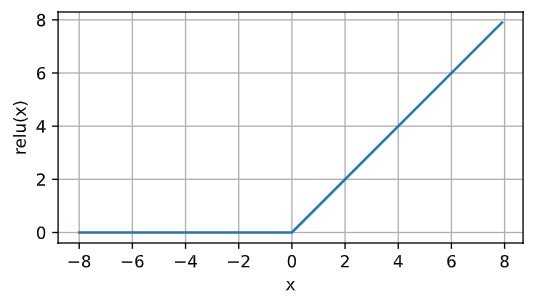

求导表现好：要么让参数消失，要么让参数通过

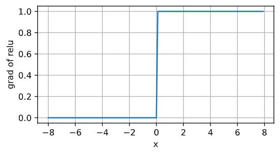

变体：*参数化ReLU*（添加线性项，即使参数是负的某些信息也可通过）$$\operatorname{pReLU}(x) = \max(0, x) + \alpha \min(0, x)$$

**sigmoid函数**
$$
\operatorname{sigmoid}(x) = \frac{1}{1 + \exp(-x)}
$$
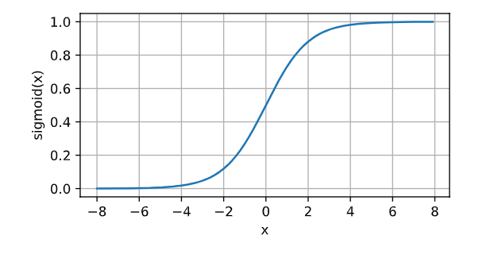

求导：
$$
\frac{d}{dx} \operatorname{sigmoid}(x) = \frac{\exp(-x)}{(1 + \exp(-x))^2} = \operatorname{sigmoid}(x)\left(1-\operatorname{sigmoid}(x)\right)
$$
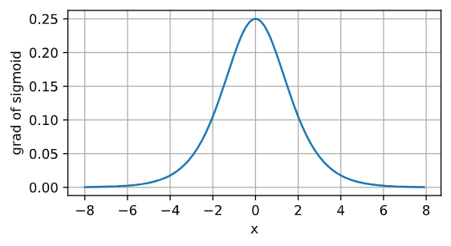

**tanh函数**
$$
\operatorname{tanh}(x) = \frac{1 - \exp(-2x)}{1 + \exp(-2x)}
$$
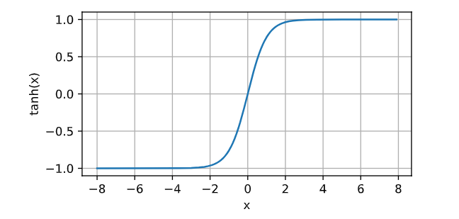

导数：
$$
\frac{d}{dx} \operatorname{tanh}(x) = 1 - \operatorname{tanh}^2(x)
$$
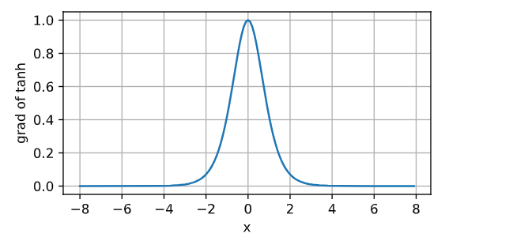

```python
#初始化张量参数
w = nn.Parameter(tenser)

#优化算法：随机梯度下降
#params为参数list，list中每个元素为nn.Parameter(tenser)
updater = torch.optim.SGD(params, lr)

######

#创建单隐层网络
net = nn.Sequential(nn.Flatten(),
                    nn.Linear(784, 256),
                    nn.ReLU(),
                    nn.Linear(256, 10))

#初始化权重
def init_weights(m):
    if type(m) == nn.Linear:
        nn.init.normal_(m.weight, std=0.01)

net.apply(init_weights)

#定义损失函数与优化函数
loss = nn.CrossEntropyLoss(reduction='none')
trainer = torch.optim.SGD(net.parameters(), lr=lr)

#训练
```

### K折叠交叉验证

**用来帮助选择模型和进行超参数调整**

**并不是**用来训练模型的！！

训练数据稀缺时无法提供足够的数据构成一个合适的验证集

可以将原始训练数据被分成$K$个不重叠的子集，每次在$K-1$个子集上进行训练，在剩余的一个子集上进行验证，对$K$次实验的结果取平均来估计训练和验证的误差

如果一组超参数的训练误差可能非常低，但是$K$折叠交叉验证的误差要高很多，这表明模型过拟合了

同时监控训练误差与验证误差，较少的过拟合说明现有数据可支撑更加强大的模型，较大的过拟合说明可通过正则化来获益


### 正则化技术

防止过拟合

#### 权重衰减：

在损失函数中添加$\| \mathbf{w} \|^2$

$L(\mathbf{w}, b) + \frac{\lambda}{2} \|\mathbf{w}\|^2$

$\lambda$:正则化常数(超参数)

在损失函数添加权重的$L_2$范数，相当于添加一个关于权重的惩罚，在每次优化时同时尽量降低权重的复杂度

```python
#分参数设置权重衰减
trainer = torch.optim.SGD([
        {"params":net[0].weight,'weight_decay': wd},
        {"params":net[0].bias}], lr=lr)
#对所有参数设置权重衰减
trainer = optim.SGD(model.parameters(), lr=0.01, weight_decay=wd)
```


#### 暂退法：

对后续层之前的网络的每一层注入噪声

为了缩小训练和测试性能之间的差距，应以简单的模型为目标，简单性的一个角度平滑性，即函数不应对其输入的微小变化敏感，函数对输入的噪音具有适应性

*无偏向*的方式注入噪声：在固定住其他层后，每一层的期望都等于没有噪声时的值

每个中间活性值$h$以*暂退概率*$p$由随机变量$h'$替换：
$$
\begin{aligned}
h' =
\begin{cases}
    0 & \text{ 概率为 } p \\
    \frac{h}{1-p} & \text{ 其他情况}
\end{cases}
\end{aligned}
$$

根据此模型的设计，其期望值保持不变，即$E[h'] = h$

通常，在测试时不用暂退法，但在测试时使用暂退法可用于估计神经网络的“不确定性”

**实现时**只需在每一个隐藏层之后添加一个`Dropout`层，将暂退概率作为唯一参数传给他的构造函数，训练时该层根据指定的暂退概率随机丢弃上一层的输出

~~~python
net = nn.Sequential(nn.Flatten(),
        nn.Linear(784, 256),
        nn.ReLU(),  #使用ReLU作为激活函数
        # 在第一个全连接层之后添加一个dropout层
        nn.Dropout(dropout1),  #传入暂退概率
        nn.Linear(256, 256),
        nn.ReLU(),
        # 在第二个全连接层之后添加一个dropout层
        nn.Dropout(dropout2),
        nn.Linear(256, 10))
~~~


### 初始化

**Xavier初始化**

为在正向传播与反向传播时梯度的方差不会增大，需使$n_\mathrm{in} \sigma^2 = 1$并且$n_\mathrm{out} \sigma^2 = 1$，虽然不可能同时满足两个条件，但只需满足：
$$
\begin{aligned}
\frac{1}{2} (n_\mathrm{in} + n_\mathrm{out}) \sigma^2 = 1 \text{ 或等价于 }
\sigma = \sqrt{\frac{2}{n_\mathrm{in} + n_\mathrm{out}}}.
\end{aligned}
$$
即该初始化方法从均值为0，方差$\sigma^2 = \frac{2}{n_\mathrm{in} + n_\mathrm{out}}$的高斯分布中采样权重


在深度网络中会出现梯度消失和梯度下降的问题

需要使用启发式的初始化方法确保初始梯度既不太大也不太小

随机初始化可在进行优化前打破对称性


**数据预处理**

将特征重新缩放到零均值和单位方差来标准化数据，即：
$$
x \leftarrow \frac{x - \mu}{\sigma}
$$
其中$\mu$和$\sigma$分别表示均值和标准差

证：
$$
\begin{aligned}
E[\frac{x-\mu}{\sigma}] &= \frac{\mu - \mu}{\sigma} = 0  \\
E[(x-\mu)^2] &= (\sigma^2 + \mu^2) - 2\mu^2+\mu^2 = \sigma^2
\end{aligned}
$$


### 环境

模型的决策可能被引入环境，最终破坏模型


### 分布偏移

- 协变量偏移：训练数据的分布与测试数据的分布不同，但标签不变
- 标签偏移：训练数据与测试数据之间标签分布发生变化
- 概念偏移：随时间地区的不同产生的概念不同


## 深度学习计算

### 层与块

块：可以描述单个层、由多个层组成的组件或整个模型本身。

编程：块由类表示，任何子类都必须定义一个将输入转换为输出的向前传播函数，并且存储必须的参数(由于自动微分不需要再定义反向传播函数来求梯度)

可以子类化块以创建层、整个模型、中等复杂度的各种组件

一个块可以由许多层组成；一个块可以由许多块组成

层块的顺序连接由`Sequential`处理

多个块可以嵌套：通过生成块函数(块工厂)


### 参数管理

每个参数都是参数类实例

参数是复合的对象，包含值、梯度和额外信息

对于嵌套块，层是分层嵌套的，可以通过嵌套列表的索引访问参数

```python
#访问第n层的所有参数
net[n].state_dict()

#访问第n层参数(偏置)实例
net[n].bias

#访问第n层参数(偏置)实例的值
net[n].bias.data

#访问所有参数
net.state_dict()
```


`nn.init`模块提供了许多预置的初始化方法

参数可以直接通过索引进行访问并设置

```python
def init_normal(m):
    if type(m) == nn.Linear:
        nn.init.constant_(m.weight, 1) #初始化为常数
        nn.init.normal_(m.weight, mean=0, std=0.01) #按高斯分布初始化
        nn.init.xavier_uniform_(m.weight) #使用Xavier初始化
        nn.init.uniform_(m.weight, low, high) #从区间low到high之间的均匀分布中随机取样
        nn.init.zeros_(m.bias) #初始化为0
        
#对所有层调用初始化函数
net.apply(init_normal)

#对第n层调用初始化函数
net[n].apply(init_normal)
```


通过将共享层用变量标记，可以再创建神经网络时将共享层多次复用，此时共享层的参数是绑定的


### 延后初始化

定义框架与添加层时没有指定输入、输出维度，框架使用延后初始化，当数据第一次通过模型时，框架自动地推断出每个层的大小


### 自定义层

可自定义带/不带参数的层，层可以有局部参数，用来进行参数的初始化


### 读写文件

```python
#将张量x写入file中
torch.save(x,'file')

#将file中的张量读到x中
x = torch.load('file')

#可以对 字符串-张量 的字典读写
```


可将整个模型的参数写入到文件中，从文件加载参数后需要指定模型

```python
#将模型的参数写入到file.params中
torch.save(net.state_dict(),'file.params')

#指定模型MLP()
clo = MLP()
#加载参数到模型中
clo.load_state_dict(torch.load('file.params'))
```


## CNN

有效处理空间信息

1. 平移不变性：不管图像出现在哪，神经网络的前面几层都应该有相似的反应
2. 局部性：神经网络前面几层应该只探索局部区域

 

卷积神经网络是包含多个卷积层的一类特殊的神经网络

一个卷积层：
$$
[\mathbf{H}]_{i, j} = u + \sum_{a = -\Delta}^{\Delta} \sum_{b = -\Delta}^{\Delta} [\mathbf{V}]_{a, b}  [\mathbf{X}]_{i+a, j+b}
$$

$\mathbf{V}$被称为卷积核、滤波器、该卷积层的权重

卷积是当把一个函数“反转”并位移$x$时，测量$f$和$g$之间的重叠


通道：特征，多个通道表示图像的多个特征

输入图像是三维的：高度$\times$宽度$\times$颜色，因此，将$\mathsf{X}$索引为$[\mathsf{X}]_{i, j, k}$。由此卷积相应地调整为$[\mathsf{V}]_{a,b,c}$，而不是$[\mathbf{V}]_{a,b}$

对于每个空间位置，应该采用一组隐藏表示(相互堆叠的二维网格)。因此，可将隐藏想象为一系列具有二维张量的通道，每个通道都向后续层提供一组空间化的学习特征

为了支持输入$\mathsf{X}$和隐藏表示$\mathsf{H}$中的多个通道，在$\mathsf{V}$中添加第四个坐标，即$[\mathsf{V}]_{a, b, c, d}$

所以**一个卷积层**：
$$
[\mathsf{H}]_{i,j,d} = \sum_{a = -\Delta}^{\Delta} \sum_{b = -\Delta}^{\Delta} \sum_c [\mathsf{V}]_{a, b, c, d} [\mathsf{X}]_{i+a, j+b, c}
$$
$d$表示输出通道，随后的输出将继续以三维张量$\mathsf{H}$作为输入进入下一个卷积层。

卷积核张量上的元素称为元素

特征映射：卷积层

感受野：向前传播时可能影响$x$计算的所有元素

当需要检测输入特征中更广的区域时可以构建更深的卷积网络


### 填充与步幅

**填充：**多层卷积时，会丢失边缘像素，通过在输入图像的边界填充0来解决

如果添加$p_h$行填充（大约一半在顶部，一半在底部）和$p_w$列填充（左侧大约一半，右侧一半），则输出形状将为：

$$
(n_h-k_h+p_h+1)\times(n_w-k_w+p_w+1)
$$
**步幅：**每次滑动元素的数量称为步幅

当垂直步幅为$s_h$、水平步幅为$s_w$时，输出形状为：
$$
\lfloor(n_h-k_h+p_h+s_h)/s_h\rfloor \times \lfloor(n_w-k_w+p_w+s_w)/s_w\rfloor
$$


在填充设置为$p_h=k_h-1$和$p_w=k_w-1$，步长设置为$s_h$和$s_w$时，输出形状将为$(n_h/s_h) \times (n_w/s_w)$


### 多输入与多输出通道

多个输入通道：

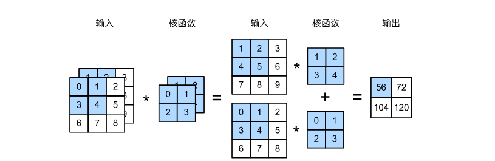

输入的通道数与和函数的通道数保持一致


多个输出通道：每个通道看作对不同特征的响应，通道不是独立学习的，而是为了共同使用而优化的，在互相关运算时，每个输出通道先获取所有输入通道，再以对应该输出通道的卷积核计算结果

```python
#二维卷积层
#in_channels:输入图像通道数(通常为3,对应RGB3个通道)
#out_channel:输出通道数(卷积核数)
#kernel_size:卷积核大小(单个整数或表示高和宽的元组)
#stride:步长(单个整数或表示高和宽的元组)
#padding:填充(单个整数或表示高和宽的元组)
#bias:是否包含偏置顶
conv_layer = nn.Conv2d(in_channels, out_channels, kernel_size, stride, padding)
```


### $1\times 1$ 卷积层

可以看多每个像素位置引用的全连接层，以$c_i$个输入值转换为$c_o$个输出值

可以将$1\times 1$ 卷积层看作再每个像素位置应用的全连接层

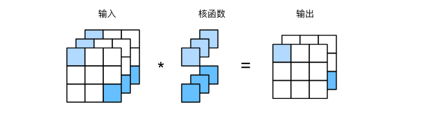

常用来调整网络层的通道数量、控制模型复杂性


### 汇聚层(池化)

学习任务通常与全局图像问题有关，最后一层神经元应该对整个输入的全局敏感，通过聚合信息，生成越来越粗糙的映射，实现学习全局表示的目标

汇聚层：降低卷积层对位置的敏感性，降低对空间采样表示的敏感性

汇聚层运算符由固定形状的窗口组成，对输入区域滑动计算

-  最大汇聚层
- 平均汇聚层

处理多通道数据是，汇聚层在每个输入通道上单独运算(汇聚层的输出通道数与输入通道数相同)，不像卷积层一样在通道上对输入进行汇总

```python
#二维最大池化
#kernel_size:池化窗口大小(单个整数或表示高和宽的元组)
#stride:步幅(单个整数或表示高和宽的元组)，默认为kernel_size
#padding:填充(单个整数或表示高和宽的元组)
pool2d = nn.MaxPool2d(kernel_size, stride, padding)

#二维平均池化
pool2d = nn.AvgPool2d(kernel_size, stride, padding)
```


### 卷积神经网络（LeNet）

两部分组成：

- 卷积编码器：由两个卷积层组成
- 全连接层密集块：由三个全连接层组成


架构：

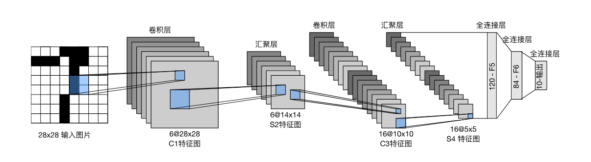

每个卷积块的基本单元是一个卷积层、一个sigmoid激活函数和平均汇聚层

每个卷积层：$5\times5$卷积核和一个sigmoid激活函数，同时增加通道的数量(第一卷积层有6个，第二卷积层有16个)

$2\times2$的池操作(步幅为2)：将维数减少4倍

为将卷积块的输出传递给稠密块，需在每个小批量中展平每个样本，将四维输入转换为全连接层所期望的二维输入，第一维为样本的索引，第二维为每个样本的平面向量表示

三个全连接层最后一个有10维(对应最后输出结果的数量)


## 现代CNN

### AlexNet

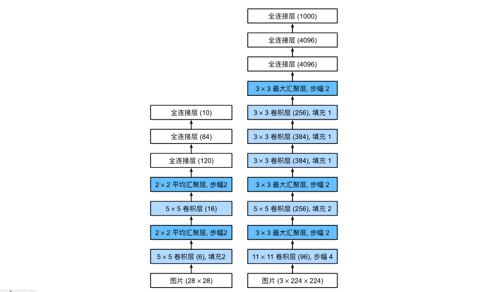

基于ImageNet数据集：100万个样本中训练模型，区分1000个不同类别的对象

图像的宽和高更大，需要更大的卷积窗口来捕获目标

激活函数：ReLU函数，计算更加简单，正区间梯度总是1，sigmoid函数在正区间得到几乎为0的梯度

容量控制和预处理：通过暂退法控制全连接层的复杂度，为进一步扩充数据，增加大量图像增强数据(翻转、裁切、变色)


### VGG

使用块的网络(visual geometry group)

经典卷积神经网络的基本组成部分：

1. 带填充以保持分辨率的卷积层
2. 非线性激活函数(如：ReLU)
3. 汇聚层

一个VGG块与之类似，由一系列卷积层组成，最后加上用于空间下采样的最大汇聚层

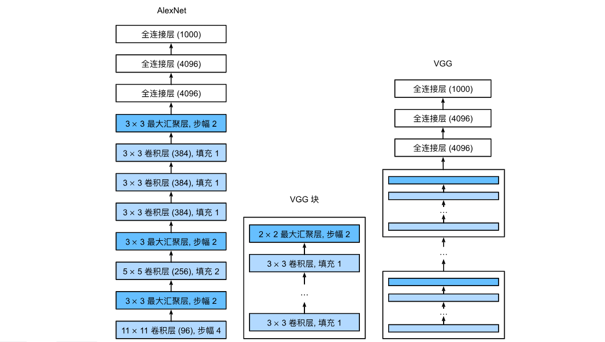

原始VGG网络(VGG-11：8个卷积层和3个全连接层)：5个卷积块，前两个块各有一个卷积层，后三个块各包含两个卷积层，第一个模块有64个输出通道，后续模块输出通道翻倍，直到达到512

块的使用使网络定义简洁

深层且窄的卷积($3\times3$)比浅层且宽的卷积更有效


### NiN

网络中的网络：在每个像素通道上分别使用多层感知机(过早使用全连接层会放弃表征的空间结构)

NiN在每个像素位置应用一个全连接层，将权重连接到每个空间位置，可视为$1\times1$卷积层，或在每个像素位置上独立作用的全连接层。(将空间维度中的每个像素视为单个样本，将通道维度视为不同特征)

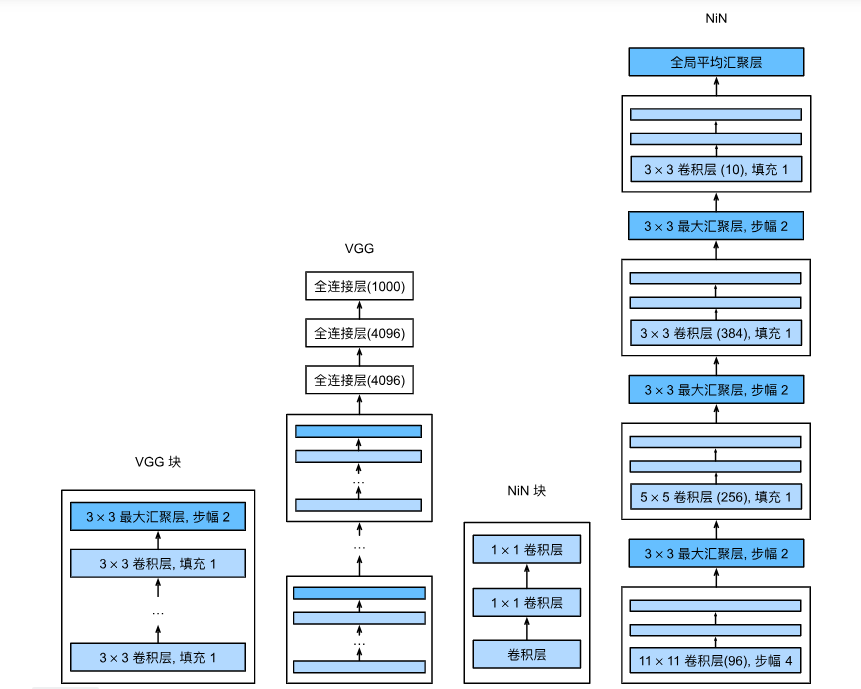

NiN块由一个普通卷积层开始，接两个$1\times1$的卷积层(充当带有ReLU激活函数的逐像素全连接层)

除去了容易造成过拟合的全连接层，将其替换为全局平均汇聚层

```python
#将特征图的空间尺寸调整到(1, 1),输出为每个通道的单一的平均值
nn.AdaptiveAvgPool2d((1, 1))
```


### GoogLeNet

含并行连接的网络

**Inception块：**基本的卷积块

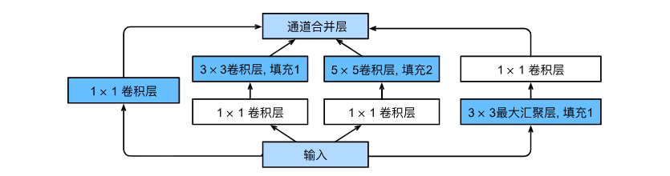

Inception块由四条并行路径组成，都使用合适的填充使输入与输出的高和宽一致，每条线路的输出在通道的维度上连接，构成Inception块的输出

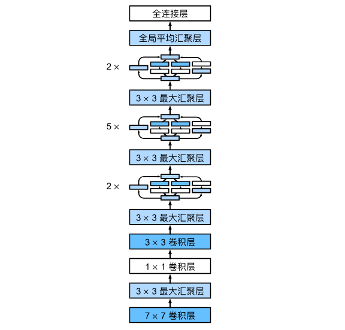

Inception块的通道数之比是在大量实验上得来的


### 批量规范化

批量规范化应用于单个可选层：每次迭代中，规范化输入(减去均值并除以标准差，都基于当前小批量处理)，再应用比例系数和比例偏移
$$
\mathrm{BN}(\mathbf{x}) = \boldsymbol{\gamma} \odot \frac{\mathbf{x} - \hat{\boldsymbol{\mu}}_\mathcal{B}}{\hat{\boldsymbol{\sigma}}_\mathcal{B}} + \boldsymbol{\beta}
$$
$\hat{\boldsymbol{\mu}}_\mathcal{B}$是小批量$\mathcal{B}$的样本均值，$\hat{\boldsymbol{\sigma}}_\mathcal{B}$是小批量$\mathcal{B}$的样本标准差

*拉伸参数*（scale）$\boldsymbol{\gamma}$和*偏移参数*（shift）$\boldsymbol{\beta}$，它们的形状与$\mathbf{x}$相同。$\boldsymbol{\gamma}$和$\boldsymbol{\beta}$需要与其他模型参数一起学习
$$
\begin{aligned} \hat{\boldsymbol{\mu}}_\mathcal{B} &= \frac{1}{|\mathcal{B}|} \sum_{\mathbf{x} \in \mathcal{B}} \mathbf{x},\\
\hat{\boldsymbol{\sigma}}_\mathcal{B}^2 &= \frac{1}{|\mathcal{B}|} \sum_{\mathbf{x} \in \mathcal{B}} (\mathbf{x} - \hat{\boldsymbol{\mu}}_{\mathcal{B}})^2 + \epsilon.\end{aligned}
$$
$\epsilon > 0$，确保不会除以零(即使经验方差估计值可能消失)。估计值$\hat{\boldsymbol{\mu}}_\mathcal{B}$和${\hat{\boldsymbol{\sigma}}_\mathcal{B}}$通过使用平均值和方差的噪声（noise）估计来抵消缩放问题

**全连接层：**将批量规范化层置于全连接层的仿射变换和激活函数之间

权重参数：$\mathbf{W}$、偏置参数：$\mathbf{b}$、激活函数：$\phi$、批量规范化的运算符：$\mathrm{BN}$

使用批量规范化的全连接层的输出：
$$
\mathbf{h} = \phi(\mathrm{BN}(\mathbf{W}\mathbf{x} + \mathbf{b}) )
$$
**卷积层：**在卷积层之后和非线性激活函数之前进行批量规范化，对所有输出通道的每个输出执行批量规范化(每个通道都有自己的拉伸、偏移参数(标量))

样本数：$m$、输出高度：$p$、输出宽度：$q$

对每个输出通道$m \cdot p \cdot q$个元素同时执行批量规范化

**预测过程中：**不再需要样本均值中的噪声以及样本方差，批量规范化层在训练模式和预测模式下的计算结果是不一样的

```python
#channle：输入通道数
nn.BatchNorm1d(channel)
```

不断调整神经网络的中间输出，使整个神经网络各层的中间输出值更加稳定


### 残差网络(ResNet)

讨论新添加的层如何提升神经网络的性能

残差块：

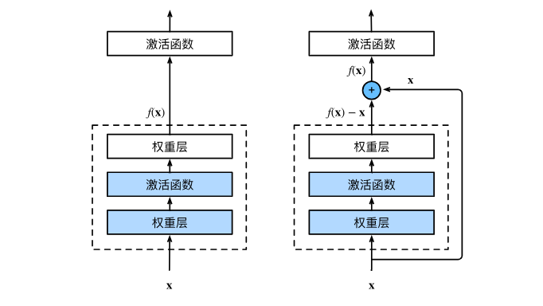

右侧残差映射更容易优化，恒等映射作为希望学出的理想映射，将虚线框上方加权运算的权重和偏置参数设为0，$f(\mathbf{x})$即为恒等映射，当接近恒等映射使，残差映射更易于捕获何等映射的细微波动，在残差块中输入可跨层更快的传播

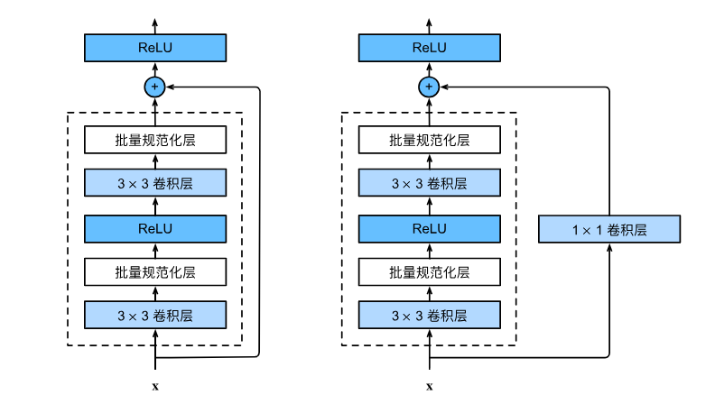

可通过$1\times1$卷积调整通道

**ResNet-18：**

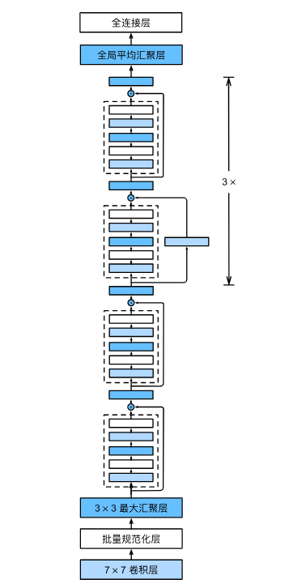

使用4个由残差块组成的模块，每个模块使用若干个同样输出通道数的残差块，第一个模块的通道数同输入通道数一致，之后每个模块在第一个残差块里将上一个模块的通道数翻倍


### 稠密连接网络(DenseNet)

是ResNet的逻辑扩展

类似于泰勒展开，ResNet将函数展开为：$f(\mathbf{x}) = \mathbf{x} + g(\mathbf{x})$

ResNet将$f$分解为：一个简单的线性项和一个复杂的非线性项

DenseNet更进一步：将$f$分解超过两部分信息

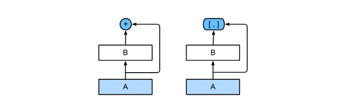
$$
\mathbf{x} \to \left[
\mathbf{x},
f_1(\mathbf{x}),
f_2([\mathbf{x}, f_1(\mathbf{x})]), f_3([\mathbf{x}, f_1(\mathbf{x}), f_2([\mathbf{x}, f_1(\mathbf{x})])]), \ldots\right]
$$
DenseNet输出是连接($[,]$)，将展开式结合到多层感知机，减少特征数量

变量之间稠密连接：

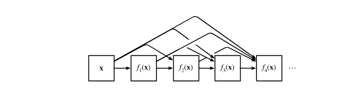

稠密网络由2部分组成：稠密块(定义如何连接输入与输出)、过渡层(控制通道数量)

一个稠密块由多个卷积块组成，每个卷积块输出通道数量相同。向前传播中，将每个卷积块的输入与输出在通道维上连接


## RNN

有效处理序列信息

### 序列模型

**自回归模型：**

策略：

1. 相当长的序列可能是不必要的(即使用观测序列$x_{t-1}, \ldots, x_{t-\tau}$)，使参数的总数不变，该模型总是对自己执行回归，所以称自回归模型
2. 保留对过去观测的总结$h_t$,同时更新预测$\hat{x}_t$和总结$h_t$，基于$\hat{x}_t = P(x_t \mid h_{t})$、$h_t = g(h_{t-1}, x_{t-1})$更新模型，由于$h_t$未被观测到，该模型被称为隐变量自回归模型


**马尔可夫模型：**使用$x_{t-1}, \ldots, x_{t-\tau}$近似$x_{t-1}, \ldots, x_1$来估计$x_t$使近似精确的，则满足马尔可夫条件

若$\tau = 1$，则为一阶马尔可夫模型，
$P(x)$为：
$$
P(x_1, \ldots, x_T) = \prod_{t=1}^T P(x_t \mid x_{t-1}) \text{ 当 } P(x_1 \mid x_0) = P(x_1)
$$
当假设$x_t$仅是离散值时，使用动态规划可以沿着马尔可夫链精确地计算结果
如可以高效地计算$P(x_{t+1} \mid x_{t-1})$：
$$
\begin{aligned}
P(x_{t+1} \mid x_{t-1})
&= \frac{\sum_{x_t} P(x_{t+1}, x_t, x_{t-1})}{P(x_{t-1})}\\
&= \frac{\sum_{x_t} P(x_{t+1} \mid x_t, x_{t-1}) P(x_t, x_{t-1})}{P(x_{t-1})}\\
&= \sum_{x_t} P(x_{t+1} \mid x_t) P(x_t \mid x_{t-1})
\end{aligned}
$$

只需要考虑过去观察中的一个非常短的历史：$P(x_{t+1} \mid x_t, x_{t-1}) = P(x_{t+1} \mid x_t)$。
对于直到$x_t$的观测序列，其在时间步$t+k$处的预测输出$\hat{x}_{t+k}$称为$k$*步预测*（$k$-step-ahead-prediction）


### 文本预处理

**词元：**每个文本行是一个文本序列，每个文本序列又被拆分为词元(文本的基本单位)

**词表：**将字符串类型的词元映射到从0开始的数字索引中(模型的输入是数字)

**语料：**对唯一词元得到的统计结果

根据唯一词元的出现频率分配数字索引，移除很少出现的词元以降低复杂性

可增加列表用于保存保留词元：

不存在或已删除的任何词元（“&lt;unk&gt;”）
填充词元（“&lt;pad&gt;”）
序列开始词元（“&lt;bos&gt;”）
序列结束词元（“&lt;eos&gt;”）


### 语言模型

涉及一个、两个、三个变量的概率公式分别称为一元语法、二元语法、三元语法

停用词：频率最高的单词(最流行的词)但看起来很无聊的词

词频以明确的方式迅速衰减，将前几个单词消除后，剩余的单词遵循双对数坐标下的一条直线，即满足**奇普夫定律**，第$i$个最常用单词的频率$n_i$为：

$$
n_i \propto \frac{1}{i^\alpha}
$$
等价于：
$$
\log n_i = -\alpha \log i + c
$$
$\alpha$是刻画分布的指数，$c$是常数

通过计数统计和平滑建模单词是不可行的，会大大高估尾部单词的频率

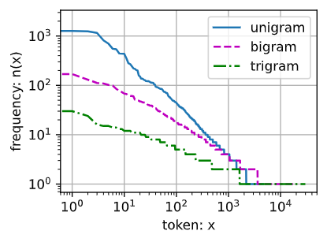

模型一次处理$n$个时间步的小批量序列：

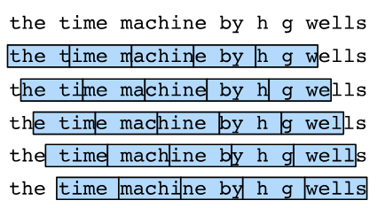

可从随机偏移量开始划分序列(同时获得覆盖性、随机性)

**随机采样：**在迭代过程中来自两个相邻的、随机的、小批量中的子序列不一定在原始序列上相邻

**顺序分区：**保证两个相邻的小批量中的子序列在原始序列上是相邻的

**目标：**基于到目前为止看到的词元来预测下一个词元，所以标签是移位了一个词元的原始序列


### RNN

为防止参数的数量呈指数增长，使用隐变量模型：
$$
P(x_t \mid x_{t-1}, \ldots, x_1) \approx P(x_t \mid h_{t-1})
$$
$h_{t-1}$：隐状态(也称隐藏变量)，存储了到时间步$t-1$的序列信息
$$
h_t = f(x_{t}, h_{t-1})
$$
RNN是具有隐藏状态的神经网络

**循环层：**

$\mathbf{X}_t \in \mathbb{R}^{n \times d}$：时间步$t$有小批量输入(对于$n$个序列样本的小批量，$\mathbf{X}_t$的每一行为该序列时间步$t$处的一个样本)
$\mathbf{H}_t  \in \mathbb{R}^{n \times h}$：时间步$t$的隐藏变量，保存前一个时间步的隐藏变量$\mathbf{H}_{t-1}$
$\mathbf{W}_{hh} \in \mathbb{R}^{h \times h}$：权重参数(描述如何在当前时间步中使用前一个时间步的隐藏变量)
$$
\mathbf{H}_t = \phi(\mathbf{X}_t \mathbf{W}_{xh} + \mathbf{H}_{t-1} \mathbf{W}_{hh}  + \mathbf{b}_h)
$$
这些变量捕获并保留了序列直到当前时间步的历史信息，所以隐藏变量$\mathbf{H}_t$被称为**隐伏态**。由于计算是循环的，于是基于循环计算的隐状态神经网络称为**循环神经网络**

**输出层：**
$$
\mathbf{O}_t = \mathbf{H}_t \mathbf{W}_{hq} + \mathbf{b}_q
$$
**参数：**

- 隐藏层的权重$\mathbf{W}_{xh} \in \mathbb{R}^{d \times h}, \mathbf{W}_{hh} \in \mathbb{R}^{h \times h}$和偏置$\mathbf{b}_h \in \mathbb{R}^{1 \times h}$
- 输出层的权重$\mathbf{W}_{hq} \in \mathbb{R}^{h \times q}$和偏置$\mathbf{b}_q \in \mathbb{R}^{1 \times q}$

参数开销不会随时间步的增加而增加

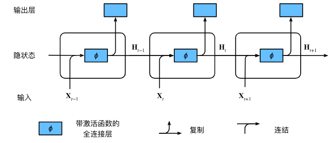

为简化训练，使用**字符级语言模型**(将文本词元化字符而不是单词)

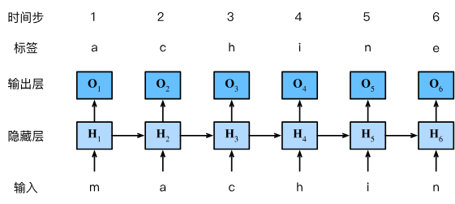

训练时，对每个时间步的输出层的输出进行softmax操作

**困惑度：**
$$
\exp\left(-\frac{1}{n} \sum_{t=1}^n \log P(x_t \mid x_{t-1}, \ldots, x_1)\right)
$$
下一个词元的实际选择数的调和平均数，使得不同长度的文档的性能有了可比性

- 最好情况：总能完美估计标签词元的概率为1(困惑度为1)
- 最差情况：预测标签词元的概率为0(困惑度为正无穷)
- 预测是词表所有词元的均匀分布：困惑度为词表唯一次元的数量

**预热期：**循环遍历用户提供的字符串，模型在此期间自我更新


目标函数$f$表现良好，即函数$f$在常数$L$下是**利普希茨连续的**：

对于任意$\mathbf{x}$和$\mathbf{y}$满足：$|f(\mathbf{x}) - f(\mathbf{y})| \leq L \|\mathbf{x} - \mathbf{y}\|$

在此情况下，如果通过$\eta \mathbf{g}$更新参数向量，则：

$$
|f(\mathbf{x}) - f(\mathbf{x} - \eta\mathbf{g})| \leq L \eta\|\mathbf{g}\|
$$
限制了发展速度(向正确、错误的方向)，在梯度$\mathbf{g}$较大时，可减小$\eta$来控制，但可能很少得到很大的梯度，通过将梯度$\mathbf{g}$投影回给定半径（例如$\theta$）的球来**裁剪梯度**$\mathbf{g}$：
$$
\mathbf{g} \leftarrow \min\left(1, \frac{\theta}{\|\mathbf{g}\|}\right) \mathbf{g}
$$
**训练：**

- 不同的采样方法导致隐状态初始化不同
- 在更新模型前裁剪梯度

```python
#单隐层神经网络层
#input_size：每个时间步的输入大小
#num_hiddens：隐藏单元的个数
rnn_layer = nn.RNN(input_size, num_hiddens)
```


### BPTT(通过时间反向传播)

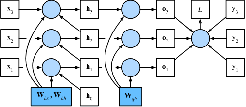

- 仅适用于反向传播具有隐状态的序列模型中
- 截断(随机截断、规则截断)是计算方便性和数值稳定性的需要


## 现代RNN

### 门控循环单元(GRU)

GRU较普通RNN可学习合适更新隐状态以及何时重置隐状态

**重置门：**控制“可能还想记住”的过去状态的数量

**更新门：**控制新状态中有多少个是旧状态的副本

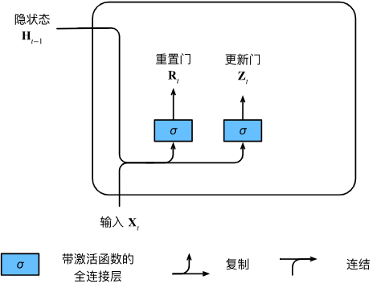

两个门设计为$(0,1)$区间中的向量(可进行凸组合)，两个门的输出是由以sigmoid为激活函数的全连接层给出的
$t$：时间步

$\mathbf{X}_t \in \mathbb{R}^{n \times d}$（样本个数$n$，输入个数$d$）：小批量输入

$\mathbf{H}_{t-1} \in \mathbb{R}^{n \times h}$（隐藏单元个数$h$）：上一个时间步的隐状态

$\mathbf{W}_{xr}, \mathbf{W}_{xz} \in \mathbb{R}^{d \times h}$和$\mathbf{W}_{hr}, \mathbf{W}_{hz} \in \mathbb{R}^{h \times h}$：权重参数，
$\mathbf{b}_r, \mathbf{b}_z \in \mathbb{R}^{1 \times h}$：偏置参数

重置门$\mathbf{R}_t \in \mathbb{R}^{n \times h}$和更新门$\mathbf{Z}_t \in \mathbb{R}^{n \times h}$的计算：
$$
\begin{aligned}
\mathbf{R}_t = \sigma(\mathbf{X}_t \mathbf{W}_{xr} + \mathbf{H}_{t-1} \mathbf{W}_{hr} + \mathbf{b}_r),\\
\mathbf{Z}_t = \sigma(\mathbf{X}_t \mathbf{W}_{xz} + \mathbf{H}_{t-1} \mathbf{W}_{hz} + \mathbf{b}_z),
\end{aligned}
$$


**候选隐状态($\tilde{\mathbf{H}}_t \in \mathbb{R}^{n \times h}$)：**
$$
\tilde{\mathbf{H}}_t = \tanh(\mathbf{X}_t \mathbf{W}_{xh} + \left(\mathbf{R}_t \odot \mathbf{H}_{t-1}\right) \mathbf{W}_{hh} + \mathbf{b}_h)
$$
$\mathbf{W}_{xh} \in \mathbb{R}^{d \times h}$和$\mathbf{W}_{hh} \in \mathbb{R}^{h \times h}$：权重参数

$\mathbf{b}_h \in \mathbb{R}^{1 \times h}$：偏置项

$\odot$：Hadamard积（按元素乘积）

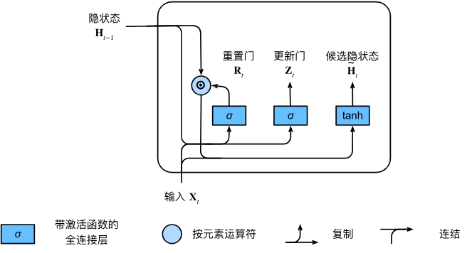

重置门$\mathbf{R}_t$中的项接近1时恢复普通RNN；接近0的项候选隐状态为$\mathbf{X}_t$作为输入的多层感知机的结果

以tanh为非线性激活函数，任何预先存在的隐状态都会被重置为默认值

结合更新门：
$$
\mathbf{H}_t = \mathbf{Z}_t \odot \mathbf{H}_{t-1}  + (1 - \mathbf{Z}_t) \odot \tilde{\mathbf{H}}_t
$$
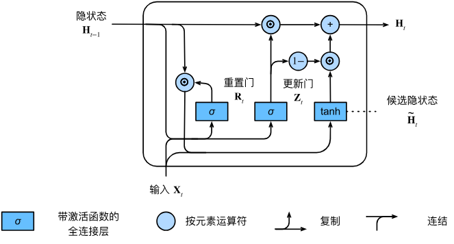

重置门捕获序列中的短期依赖关系；更新门捕获序列中长期依赖关系

```python
#GRU
#num_inputs：输入特征的维度
#num_hiddens：隐藏状态的维度
gru_layer = nn.GRU(num_inputs, num_hiddens)
```


### 长短期记忆网络(LSTM)

**输出门：**从单元中输出条目

**输入门：**决定何时将数据读入单元

**遗忘门：**重置单元内容

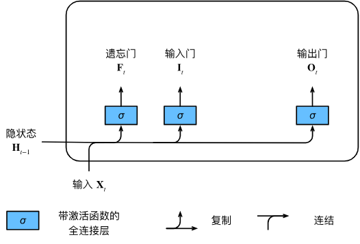

三个门都以sigmoid为激活函数，计算方法：
$$
\begin{aligned}
\mathbf{I}_t &= \sigma(\mathbf{X}_t \mathbf{W}_{xi} + \mathbf{H}_{t-1} \mathbf{W}_{hi} + \mathbf{b}_i),\\
\mathbf{F}_t &= \sigma(\mathbf{X}_t \mathbf{W}_{xf} + \mathbf{H}_{t-1} \mathbf{W}_{hf} + \mathbf{b}_f),\\
\mathbf{O}_t &= \sigma(\mathbf{X}_t \mathbf{W}_{xo} + \mathbf{H}_{t-1} \mathbf{W}_{ho} + \mathbf{b}_o),
\end{aligned}
$$
$\mathbf{X}_t \in \mathbb{R}^{n \times d}$（样本个数$n$，输入个数$d$）：小批量输入

$\mathbf{H}_{t-1} \in \mathbb{R}^{n \times h}$（隐藏单元个数$h$）：上一个时间步的隐状态

$\mathbf{W}_{xi}, \mathbf{W}_{xf}, \mathbf{W}_{xo} \in \mathbb{R}^{d \times h}$和$\mathbf{W}_{hi}, \mathbf{W}_{hf}, \mathbf{W}_{ho} \in \mathbb{R}^{h \times h}$：权重参数

$\mathbf{b}_i, \mathbf{b}_f, \mathbf{b}_o \in \mathbb{R}^{1 \times h}$：偏置参数


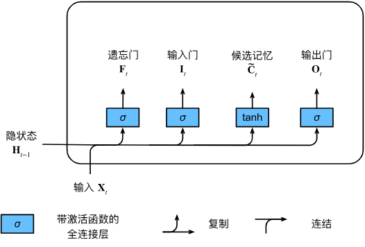

候选神经元$\tilde{\mathbf{C}}_t \in \mathbb{R}^{n \times h}$：
$$
\tilde{\mathbf{C}}_t = \text{tanh}(\mathbf{X}_t \mathbf{W}_{xc} + \mathbf{H}_{t-1} \mathbf{W}_{hc} + \mathbf{b}_c)
$$
$\mathbf{W}_{xc} \in \mathbb{R}^{d \times h}$和$\mathbf{W}_{hc} \in \mathbb{R}^{h \times h}$：权重参数，
$\mathbf{b}_c \in \mathbb{R}^{1 \times h}$：偏置参数


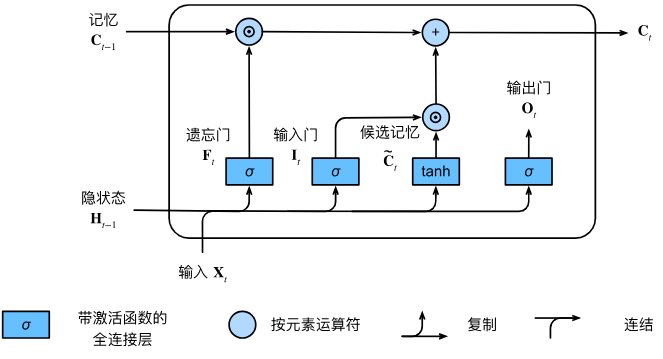

输入门$\mathbf{I}_t$控制采用多少来自$\tilde{\mathbf{C}}_t$的新数据，遗忘门$\mathbf{F}_t$控制保留多少过去的记忆元$\mathbf{C}_{t-1} \in \mathbb{R}^{n \times h}$的内容，由元素乘法得**记忆元**：
$$
\mathbf{C}_t = \mathbf{F}_t \odot \mathbf{C}_{t-1} + \mathbf{I}_t \odot \tilde{\mathbf{C}}_t
$$


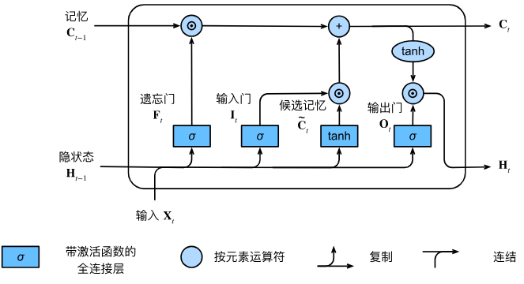

隐状态$\mathbf{H}_t \in \mathbb{R}^{n \times h}$：
$$
\mathbf{H}_t = \mathbf{O}_t \odot \tanh(\mathbf{C}_t)
$$
输出门接近1，能有效地将所有记忆信息传递给预测部分；对于输出门接近0，只保留记忆元内的所有信息，而不更新隐状态

```python
#LSTM
#num_inputs：输入特征的维度
#num_hiddens：隐藏状态的维度
#num_layers：隐藏层数
lstm_layer = nn.LSTM(num_inputs, num_hiddens, num_layers)
```


### 深度RNN

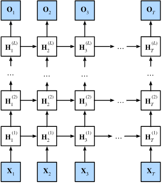

$l^\mathrm{th}$隐藏层（$l=1,\ldots,L$）的隐状态$\mathbf{H}_t^{(l)}  \in \mathbb{R}^{n \times h}$（隐藏单元数：$h$）
$$
\mathbf{H}_t^{(l)} = \phi_l(\mathbf{H}_t^{(l-1)} \mathbf{W}_{xh}^{(l)} + \mathbf{H}_{t-1}^{(l)} \mathbf{W}_{hh}^{(l)}  + \mathbf{b}_h^{(l)})
$$
设置$\mathbf{H}_t^{(0)} = \mathbf{X}_t$，第$l$个隐藏层的隐状态使用激活函数$\phi_l$

第$l$个隐藏层的模型参数：

$\mathbf{W}_{xh}^{(l)} \in \mathbb{R}^{h \times h}$，$\mathbf{W}_{hh}^{(l)} \in \mathbb{R}^{h \times h}$：权重

$\mathbf{b}_h^{(l)} \in \mathbb{R}^{1 \times h}$：偏置


$\mathbf{O}_t \in \mathbb{R}^{n \times q}$：输出层变量（输出数：$q$）：
$$
\mathbf{O}_t = \mathbf{H}_t^{(L)} \mathbf{W}_{hq} + \mathbf{b}_q
$$
$\mathbf{X}_t \in \mathbb{R}^{n \times d}$（样本个数$n$，输入个数$d$）：小批量输入

$\mathbf{W}_{hq} \in \mathbb{R}^{h \times q}$：权重

$\mathbf{b}_q \in \mathbb{R}^{1 \times q}$：偏置


### 双向循环神经网络

用来获取下文的信息

**隐马尔可夫模型：**

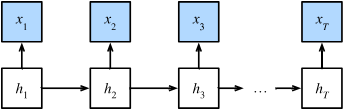

通过概率$P(x_t \mid h_t)$控制观测到的$x_t$，$h_t \to h_{t+1}$的转移都是由一些状态转移概率$P(h_{t+1} \mid h_{t})$给出的

对于有$T$个观测值的序列，在观测状态和隐状态上具有以下联合分布：
$$
P(x_1, \ldots, x_T, h_1, \ldots, h_T) = \prod_{t=1}^T P(h_t \mid h_{t-1}) P(x_t \mid h_t), \text{ where } P(h_1 \mid h_0) = P(h_1)
$$
假设观测到所有的$x_i$，除了$x_j$，目标是计算$P(x_j \mid x_{-j})$，由于$P(x_j \mid x_{-j})$中没有隐变量，考虑对$h_1, \ldots, h_T$选择构成的所有可能的组合进行求和。用**动态规划**来解决：

对隐变量$h_1, \ldots, h_T$的依次求和：
$$
\begin{aligned}
    &P(x_1, \ldots, x_T) \\
    =& \sum_{h_1, \ldots, h_T} P(x_1, \ldots, x_T, h_1, \ldots, h_T) \\
    =& \sum_{h_1, \ldots, h_T} \prod_{t=1}^T P(h_t \mid h_{t-1}) P(x_t \mid h_t) \\
    =& \sum_{h_2, \ldots, h_T} \underbrace{\left[\sum_{h_1} P(h_1) P(x_1 \mid h_1) P(h_2 \mid h_1)\right]}_{\pi_2(h_2) \stackrel{\mathrm{def}}{=}}
    P(x_2 \mid h_2) \prod_{t=3}^T P(h_t \mid h_{t-1}) P(x_t \mid h_t) \\
    =& \sum_{h_3, \ldots, h_T} \underbrace{\left[\sum_{h_2} \pi_2(h_2) P(x_2 \mid h_2) P(h_3 \mid h_2)\right]}_{\pi_3(h_3)\stackrel{\mathrm{def}}{=}}
    P(x_3 \mid h_3) \prod_{t=4}^T P(h_t \mid h_{t-1}) P(x_t \mid h_t)\\
    =& \dots \\
    =& \sum_{h_T} \pi_T(h_T) P(x_T \mid h_T).
\end{aligned}
$$
**前向递归：**
$$
\pi_{t+1}(h_{t+1}) = \sum_{h_t} \pi_t(h_t) P(x_t \mid h_t) P(h_{t+1} \mid h_t)
$$
递归初始化为$\pi_1(h_1) = P(h_1)$，可以写成$\pi_{t+1} = f(\pi_t, x_t)$，$f$是可学习的函数

对同一组隐变量求和：
$$
\begin{aligned}
    & P(x_1, \ldots, x_T) \\
     =& \sum_{h_1, \ldots, h_T} P(x_1, \ldots, x_T, h_1, \ldots, h_T) \\
    =& \sum_{h_1, \ldots, h_T} \prod_{t=1}^{T-1} P(h_t \mid h_{t-1}) P(x_t \mid h_t) \cdot P(h_T \mid h_{T-1}) P(x_T \mid h_T) \\
    =& \sum_{h_1, \ldots, h_{T-1}} \prod_{t=1}^{T-1} P(h_t \mid h_{t-1}) P(x_t \mid h_t) \cdot
    \underbrace{\left[\sum_{h_T} P(h_T \mid h_{T-1}) P(x_T \mid h_T)\right]}_{\rho_{T-1}(h_{T-1})\stackrel{\mathrm{def}}{=}} \\
    =& \sum_{h_1, \ldots, h_{T-2}} \prod_{t=1}^{T-2} P(h_t \mid h_{t-1}) P(x_t \mid h_t) \cdot
    \underbrace{\left[\sum_{h_{T-1}} P(h_{T-1} \mid h_{T-2}) P(x_{T-1} \mid h_{T-1}) \rho_{T-1}(h_{T-1}) \right]}_{\rho_{T-2}(h_{T-2})\stackrel{\mathrm{def}}{=}} \\
    =& \ldots \\
    =& \sum_{h_1} P(h_1) P(x_1 \mid h_1)\rho_{1}(h_{1}).
\end{aligned}
$$
**后向递归**：
$$
\rho_{t-1}(h_{t-1})= \sum_{h_{t}} P(h_{t} \mid h_{t-1}) P(x_{t} \mid h_{t}) \rho_{t}(h_{t})
$$
初始化$\rho_T(h_T) = 1$，可以写为$\rho_{t-1} = g(\rho_t, x_t)$，$g$是可学习的函数

前向和后向递归都可对$T$个隐变量在$\mathcal{O}(kT)$（线性）时间内对$(h_1, \ldots, h_T)$的所有值求和
结合前向和后向递归：
$$
P(x_j \mid x_{-j}) \propto \sum_{h_j} \pi_j(h_j) \rho_j(h_j) P(x_j \mid h_j)
$$
具有单个隐藏层的**双向循环神经网络**：

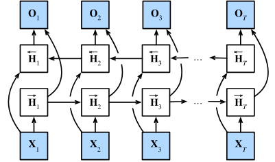


前向和反向隐状态的更新：
$$
\begin{aligned}
\overrightarrow{\mathbf{H}}_t &= \phi(\mathbf{X}_t \mathbf{W}_{xh}^{(f)} + \overrightarrow{\mathbf{H}}_{t-1} \mathbf{W}_{hh}^{(f)}  + \mathbf{b}_h^{(f)}),\\
\overleftarrow{\mathbf{H}}_t &= \phi(\mathbf{X}_t \mathbf{W}_{xh}^{(b)} + \overleftarrow{\mathbf{H}}_{t+1} \mathbf{W}_{hh}^{(b)}  + \mathbf{b}_h^{(b)})
\end{aligned}
$$

$t$：时间步

$\mathbf{X}_t \in \mathbb{R}^{n \times d}$（样本数$n$，每个示例中的输入数$d$）：给定的一个小批量的输入数

$\phi$：隐藏层激活函数

前向隐状态：$\overrightarrow{\mathbf{H}}_t  \in \mathbb{R}^{n \times h}$

反向隐状态：

$\overleftarrow{\mathbf{H}}_t  \in \mathbb{R}^{n \times h}$

$h$：隐藏单元的数目

$\mathbf{W}_{xh}^{(f)} \in \mathbb{R}^{d \times h}, \mathbf{W}_{hh}^{(f)} \in \mathbb{R}^{h \times h}, \mathbf{W}_{xh}^{(b)} \in \mathbb{R}^{d \times h}, \mathbf{W}_{hh}^{(b)} \in \mathbb{R}^{h \times h}$：权重

$\mathbf{b}_h^{(f)} \in \mathbb{R}^{1 \times h}, \mathbf{b}_h^{(b)} \in \mathbb{R}^{1 \times h}$：偏置

将前向隐状态$\overrightarrow{\mathbf{H}}_t$和反向隐状态$\overleftarrow{\mathbf{H}}_t$连接，获得需要送入输出层的隐状态$\mathbf{H}_t \in \mathbb{R}^{n \times 2h}$在具有多个隐藏层的深度双向循环神经网络中，该信息作为输入传递到下一个双向层

输出层计算得到的输出为$\mathbf{O}_t \in \mathbb{R}^{n \times q}$（$q$是输出单元的数目）：
$$
\mathbf{O}_t = \mathbf{H}_t \mathbf{W}_{hq} + \mathbf{b}_q
$$
$\mathbf{W}_{hq} \in \mathbb{R}^{2h \times q}$：权重

$\mathbf{b}_q \in \mathbb{R}^{1 \times q}$：偏置

这两个方向可以拥有不同数量的隐藏单元


### 机器翻译

机器翻译中，更倾向采用单词级词元化，但词表大小明显大于使用字符级词元化时的词表

- 未知词元(”<unk>“)：次数少于2的词元

- 填充词元(”<pad>“)：小批量时将序列填充到相同长度的词元
- 开始词元(”<bos>“)
- 结束词元(”<eos>“)

通过**截断**和**填充**实现一次处理一个小批量文本序列，使每个序列都具有相同长度(时间步数、词元数量)


### 编码器-解码器架构

为处理输入和输出是长度可变的序列，设计：

- **编码器：**接受长度可变的序列为输入，并转换为具有固定编码的状态
- **解码器：**将固定状态映射到长度可变的序列

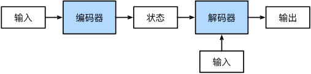

使用具有状态的神经网络来实现该架构


### 序列到序列学习(seq2seq)

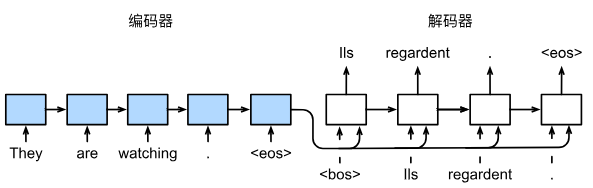

解码器是基于输入序列的编码信息和输出序列已经看见的或生成的词元来预测下一个词元

“<bos>”词元为序列开始词元；一旦输出“<eos>”词元，模型停止预测

编码器最终的隐状态在每一个时间步都作为解码器的输入序列的一部分

**编码器：**

通过选定函数$q$，将所有时间步的隐状态转换为上下文变量：
$$
\mathbf{c} =  q(\mathbf{h}_1, \ldots, \mathbf{h}_T)
$$
使用**嵌入层**来获得输入序列中每个词元的特征向量

```python
#嵌入层
#vocab_size：词表大小
#embed_size：特征向量维度
embedding = nn.Embedding(vocab_size, embed_size)
```

**解码器：**

输出序列的任意时间步$t^\prime$，来自上一时间步的输出$y_{t^\prime-1}$和上下文变量$\mathbf{c}$作为其输入，然后在当前时间步将它们和上一隐状态$\mathbf{s}_{t^\prime-1}$转换为隐状态$\mathbf{s}_{t^\prime}$

用函数$g$来表示解码器的隐藏层的变换：

$$
\mathbf{s}_{t^\prime} = g(y_{t^\prime-1}, \mathbf{c}, \mathbf{s}_{t^\prime-1})
$$
使用输出层和softmax操作来计算在时间步$t^\prime$时输出$y_{t^\prime}$的条件概率分布$P(y_{t^\prime} \mid y_1, \ldots, y_{t^\prime-1}, \mathbf{c})$

实现解码器后直接使用解码器最后一个时间步的隐状态来初始化解码器的隐状态，为包含经过编码的输入序列的信息，上下文变量在所有时间步与解码器的输入进行拼接；为预测输出词元的分布，在解码器最后一层使用全连接层来变换隐状态

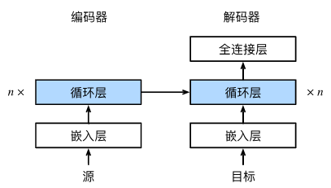

**损失函数：**通过零值化屏蔽不相关的项，将与填充词元对应的掩码设置为0

**强制教学：**将“<bos>”词元与原始输出序列拼接作为解码器的输入(原始的输出序列(词元的标签)输入解码器，或将来自上一个时间步的预测得到的词元作为解码器的当前输入)

**预测：**

每个解码器当前时间步的输入都来自于前一时间步的预测词元

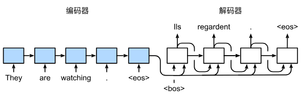

**预测序列的评估：**

**BLEU**评估：
$$
\exp\left(\min\left(0, 1 - \frac{\mathrm{len}_{\text{label}}}{\mathrm{len}_{\text{pred}}}\right)\right) \prod_{n=1}^k p_n^{1/2^n}
$$
$\mathrm{len}_{\text{label}}$：标签序列中的词元数

$\mathrm{len}_{\text{pred}}$：预测序列中的词元数

$k$：用于匹配的最长的$n$元语法

$p_n$：$n$元语法的精确度($$\frac{预测序列与标签序列中匹配的n元语法的数量}{预测序列中n元语法的数量的比率}$$)


### 束搜索

介于**穷举搜索**(精度)与**贪心搜索**(计算成本)之间

**束搜索**是贪心搜索的改进，有超参数**束宽**($k$)，每一**步**选取概率最高的$k$个词元

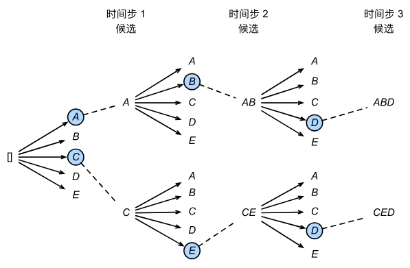

如图，基于6个候选输出序列(1.$A$；2.$C$；3.$A,B$；4.$C,E$；5.$A,B,D$;6.$C,E,D$)选择条件概率乘积最高的序列：

$$
 \frac{1}{L^\alpha} \log P(y_1, \ldots, y_{L}\mid \mathbf{c}) = \frac{1}{L^\alpha} \sum_{t'=1}^L \log P(y_{t'} \mid y_1, \ldots, y_{t'-1}, \mathbf{c})
$$
$L$：最终候选序列的长度

$\alpha$通常设置为$0.75$，由于较长的序列在求和中有更多项，所以分母中的$L^\alpha$用于惩罚长序列

束搜索的计算量为$\mathcal{O}(k\left|\mathcal{Y}\right|T')$


## 注意力机制

**非自主提示**称为**键**，**自主性提示**称为**查询**，给定任何查询，注意力机制通过**注意力汇聚**将选择引导至**感官输入**

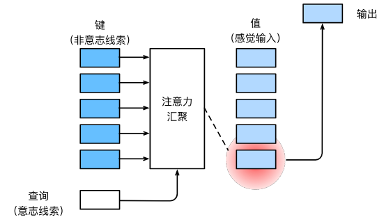

### Nadaraya-Watson核回归

**Nadaraya-Watson核回归：**
$$
f(x) = \sum_{i=1}^n \frac{K(x - x_i)}{\sum_{j=1}^n K(x - x_j)} y_i
$$
$K$是核

**注意力汇聚**公式：
$$
f(x) = \sum_{i=1}^n \alpha(x, x_i) y_i
$$
$x$是查询，$(x_i, y_i)$是键值对

注意力汇聚是$y_i$的加权平均，将查询$x$和键$x_i$之间的关系建模为**注意力权重**$\alpha(x, x_i)$，权重非负，且总和为1，如果一个键$x_i$越是接近给定的查询$x$，对该键的对应值$y_i$分配的注意力权重越大。该模型是**非参数的注意力汇聚**模型

非参数的Nadaraya-Watson核具有**一致性**：如果有足够数据，模型会收敛到最优结果

将**高斯核**($K(u) = \frac{1}{\sqrt{2\pi}} \exp(-\frac{u^2}{2})$)代入：
$$
\begin{aligned} f(x) &=\sum_{i=1}^n \alpha(x, x_i) y_i\\ &= \sum_{i=1}^n \frac{\exp\left(-\frac{1}{2}(x - x_i)^2\right)}{\sum_{j=1}^n \exp\left(-\frac{1}{2}(x - x_j)^2\right)} y_i \\&= \sum_{i=1}^n \mathrm{softmax}\left(-\frac{1}{2}(x - x_i)^2\right) y_i. \end{aligned}
$$
高斯核的指数部分可以视为**注意力评分函数**，简称**评分函数**

可将学习的参数集成到注意力汇聚中：
$$
\begin{aligned}f(x) &= \sum_{i=1}^n \alpha(x, x_i) y_i \\&= \sum_{i=1}^n \frac{\exp\left(-\frac{1}{2}((x - x_i)w)^2\right)}{\sum_{j=1}^n \exp\left(-\frac{1}{2}((x - x_j)w)^2\right)} y_i \\&= \sum_{i=1}^n \mathrm{softmax}\left(-\frac{1}{2}((x - x_i)w)^2\right) y_i.\end{aligned}
$$


### 注意力评分函数

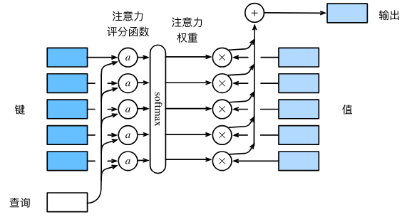

对查询$\mathbf{q} \in \mathbb{R}^q$和$m$个“键－值”对$(\mathbf{k}_1, \mathbf{v}_1), \ldots, (\mathbf{k}_m, \mathbf{v}_m)$其中$\mathbf{k}_i \in \mathbb{R}^k$，$\mathbf{v}_i \in \mathbb{R}^v$，注意力汇聚函数$f$表示为：
$$
f(\mathbf{q}, (\mathbf{k}_1, \mathbf{v}_1), \ldots, (\mathbf{k}_m, \mathbf{v}_m)) = \sum_{i=1}^m \alpha(\mathbf{q}, \mathbf{k}_i) \mathbf{v}_i \in \mathbb{R}^v
$$
查询$\mathbf{q}$和键$\mathbf{k}_i$的注意力权重（标量）是通过注意力评分函数$a$将两个向量映射成标量，再经过softmax运算得到的：
$$
\alpha(\mathbf{q}, \mathbf{k}_i) = \mathrm{softmax}(a(\mathbf{q}, \mathbf{k}_i)) = \frac{\exp(a(\mathbf{q}, \mathbf{k}_i))}{\sum_{j=1}^m \exp(a(\mathbf{q}, \mathbf{k}_j))} \in \mathbb{R}
$$
**掩蔽softmax操作：**

为高效处理数据集，某些序列填充了无意义的特殊词元，在softmax时将超出有效长度的位置掩蔽并设置为0

**加性注意力：**

当查询和键时不同长度的矢量时，可用加性注意力作为评分函数：
$$
a(\mathbf q, \mathbf k) = \mathbf w_v^\top \text{tanh}(\mathbf W_q\mathbf q + \mathbf W_k \mathbf k) \in \mathbb{R}
$$
查询$\mathbf{q} \in \mathbb{R}^q$、键$\mathbf{k} \in \mathbb{R}^k$、可学习的参数$\mathbf W_q\in\mathbb R^{h\times q}$、$\mathbf W_k\in\mathbb R^{h\times k}$、$\mathbf w_v\in\mathbb R^{h}$

将查询和键连结输入到多层感知机，感知机包含一个隐藏层，隐藏单元数为超参数$h$，以tanh为激活函数，禁用偏置顶

**缩放点积注意力：**

使用点积可得到效率更高的评分函数，要求查询和键具有相同长度$d$，如果键和查询满足0均值与单位方差，那么点积均值为0，方差为$d$，为保证方差与恒为1，则缩放点积注意力评分函数：
$$
a(\mathbf q, \mathbf k) = \mathbf{q}^\top \mathbf{k}  /\sqrt{d}
$$
从小批量角度考虑，对$n$个查询和$m$个键－值对计算注意力，其中查询和键的长度为$d$，值的长度为$v$，查询$\mathbf Q\in\mathbb R^{n\times d}$、键$\mathbf K\in\mathbb R^{m\times d}$、值$\mathbf V\in\mathbb R^{m\times v}$的缩放点积注意力：
$$
\mathrm{softmax}\left(\frac{\mathbf Q \mathbf K^\top }{\sqrt{d}}\right) \mathbf V \in \mathbb{R}^{n\times v}
$$


### Bahdanau注意力

编码器-解码器架构在生成词元时使用相同的上下文变量(虽然并非所有输入的词元都对生成的词元有用)，通过将上下文变量视为注意力集中的输出来实现

**模型：**上下文变量$c$在任何解码时间步$t'$会被$\mathbf{c}_{t'}$替换，设输入序列中有$T$个词元，解码时间步$t'$的上下文变量是注意力集中的输出：
$$
\mathbf{c}_{t'} = \sum_{t=1}^T \alpha(\mathbf{s}_{t' - 1}, \mathbf{h}_t) \mathbf{h}_t
$$
时间步$t' - 1$时的解码器隐状态$\mathbf{s}_{t' - 1}$是查询

编码器隐状态$\mathbf{h}_t$既是键，也是值

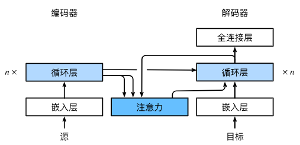


### 多头注意力

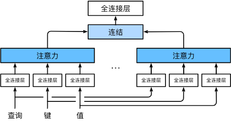

希望模型可以基于相同的注意力机制学习到不同的行为，来捕获各种范围的依赖关系，因此使注意力机制组合使用查询、键、值的不同**子空间表示**

**多头注意力**：独立学习$h$组不同的**线性投影**来变换查询、键、值，然后并行送入注意力汇聚中，最后将输出拼接，通过另一个线性投影变换以产生输出

每个注意力头$\mathbf{h}_i$（$i = 1, \ldots, h$）的计算：
$$
\mathbf{h}_i = f(\mathbf W_i^{(q)}\mathbf q, \mathbf W_i^{(k)}\mathbf k,\mathbf W_i^{(v)}\mathbf v) \in \mathbb R^{p_v}
$$
$\mathbf{q} \in \mathbb{R}^{d_q}$：查询

$\mathbf{k} \in \mathbb{R}^{d_k}$：键

$\mathbf{v} \in \mathbb{R}^{d_v}$：值

$\mathbf W_i^{(q)}\in\mathbb R^{p_q\times d_q}$、$\mathbf W_i^{(k)}\in\mathbb R^{p_k\times d_k}$、$\mathbf W_i^{(v)}\in\mathbb R^{p_v\times d_v}$：可学习的参数

$f$：注意力汇聚的函数

多头注意力输出所连接的线性转换的可学习参数为$\mathbf W_o\in\mathbb R^{p_o\times h p_v}$：
$$
\mathbf W_o \begin{bmatrix}\mathbf h_1\\\vdots\\\mathbf h_h\end{bmatrix} \in \mathbb{R}^{p_o}
$$


### 自注意力和位置编码

在注意力之下，将词元序列输入注意力池化中，使同一组词元同时充当查询、键、值，由于来自同一组输入，称为**自注意力**，也称**内部注意力**

由词元组成的输入序列$\mathbf{x}_1, \ldots, \mathbf{x}_n$(任意$\mathbf{x}_i \in \mathbb{R}^d$（$1 \leq i \leq n$）)，输出为一个长度相同的序列$\mathbf{y}_1, \ldots, \mathbf{y}_n$：
$$
\mathbf{y}_i = f(\mathbf{x}_i, (\mathbf{x}_1, \mathbf{x}_1), \ldots, (\mathbf{x}_n, \mathbf{x}_n)) \in \mathbb{R}^d
$$
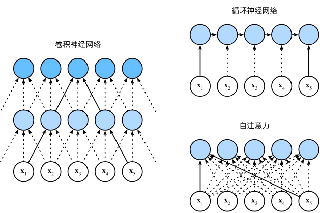

几个架构目标为将$n$个词元组成的序列映射为等长序列，输入词元或输出词元都由$d$维向量表示


自注意力因为并行计算放弃顺序操作，为使用顺序信息，在输入表示中添加**位置编码**注入绝对或相对位置信息，位置编码可通过学习或直接固定得到

输入表示$\mathbf{X} \in \mathbb{R}^{n \times d}$包含一个序列中$n$个词元的$d$维嵌入表示，位置编码使用相同形状的位置嵌入矩阵$\mathbf{P} \in \mathbb{R}^{n \times d}$输出$\mathbf{X} + \mathbf{P}$，矩阵第$i$行、第$2j$列和$2j+1$列上的元素为：
$$
\begin{aligned} p_{i, 2j} &= \sin\left(\frac{i}{10000^{2j/d}}\right),\\p_{i, 2j+1} &= \cos\left(\frac{i}{10000^{2j/d}}\right).\end{aligned}
$$
通过使用三角函数在编码维度上降低频率

**相对位置信息：**

令$\omega_j = 1/10000^{2j/d}$，对位置$i$处的位置编码进行线性投影可得偏移$\delta$位置($i + \delta$处)的位置编码：
$$
\begin{aligned}
&\begin{bmatrix} \cos(\delta \omega_j) & \sin(\delta \omega_j) \\  -\sin(\delta \omega_j) & \cos(\delta \omega_j) \\ \end{bmatrix}
\begin{bmatrix} p_{i, 2j} \\  p_{i, 2j+1} \\ \end{bmatrix}\\
=&\begin{bmatrix} \cos(\delta \omega_j) \sin(i \omega_j) + \sin(\delta \omega_j) \cos(i \omega_j) \\  -\sin(\delta \omega_j) \sin(i \omega_j) + \cos(\delta \omega_j) \cos(i \omega_j) \\ \end{bmatrix}\\
=&\begin{bmatrix} \sin\left((i+\delta) \omega_j\right) \\  \cos\left((i+\delta) \omega_j\right) \\ \end{bmatrix}\\
=& 
\begin{bmatrix} p_{i+\delta, 2j} \\  p_{i+\delta, 2j+1} \\ \end{bmatrix},
\end{aligned}
$$


### Transformer

编码器-解码器架构的实例，是基于自注意力的模块叠加而成，源(输入)序列和目标(输出)序列的嵌入表示加上位置编码，再分别输入到编码器和解码器中

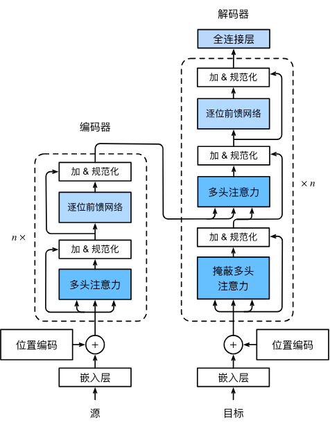

**基于位置的前馈网络：**对序列中的所有位置的表示进行变换时使用的是同一个多层感知机

**加法和规范化：**由残差连接和紧随其后的层规范化组成，层规范化和批量规范化都对数据进行重新中心化和缩放的调整，但层规范化是基于特征维度进行规范化，尽管批量规范化在计算机视觉中广泛应用，但在自然语言处理任务中层规范化通常效果更好

```python
#对每一个样本的n个特征进行规范化
ln = nn.LayerNorm(n)
#对批量中所有样本(每个样本n个特征)进行规范化
bn = nn.BatchNorm1d(n)
```

多头自注意力用于表示输入序列和输出序列，解码器须通过掩蔽机制来保留自回归属性


## 计算机视觉

### 图像增广

对训练图像进行一系列随机变化，生成相似但不同的训练样本，从而扩大训练集规模，减少模型对某些属性的依赖，增加泛化能力

```python
#将图像随机左右翻转
torchvision.transforms.RandomHorizontalFlip()

#将图像随机上下翻转
torchvision.transforms.RandomVerticalFlip()

#将图像随机裁剪，宽高都缩放到200像素
#scale:原始图像面积10%~100%的区域
#ratio:对原始区域的宽高比从0.5~2间取随机值
shape_aug = torchvision.transforms.RandomResizedCrop((200, 200), scale=(0.1, 1), ratio=(0.5, 2))

#随机改变亮度(brightness)、对比度(contrast)、饱和度(saturation)、色调(hue)
#随机值为原始图像的50%(1-0.5) ~ 150%(1+0.5)
color_aug = torchvision.transforms.ColorJitter(brightness=0.5, contrast=0.5, saturation=0.5, hue=0.5)

#将图像转换为深度学习框架所要求的格式(批量大小、通道数、高度、宽度)
torchvision.transforms.ToTensor()

#将多种图像增广方法结合
augs = torchvision.transforms.Compose([color_aug, shape_aug, torchvision.transforms.ToTensor()])
```


### 微调

对样本有限的情况，使用**迁移学习**

迁移学习中的常见技巧：**微调**

步骤：

1. **源数据集**上训练神经网络，即**源模型**
2. 创建行的神经网络，即**目标模型**，复制源模型上除输出层外的参数
3. 向目标模型添加输出层，输出为目标数据集中的类别数(随机初始化该层参数)
4. **目标数据集**上训练目标模型，输出层从头训练，其他层参数进行微调

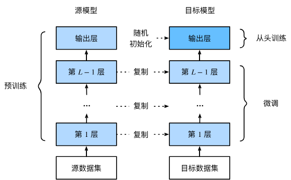

当目标数据集比源数据集小的多时，微调有助于提高泛化能力

微调参数使用较小的学习率进行微调，从头开始训练的输出层可使用较大的学习率


### 目标检测和边界框

**目标检测**或**目标识别**任务：图像中有多个目标，不仅想知道类别，还想知道在图像中的位置

**边界框：**用来描述对象的空间位置，是矩形的，由左上角以及右下角的$x$和$y$坐标决定，另一种表示为边界框中心$(x,y)$以及框的宽度和高度


### 锚框

目标检测算法采样大量区域，检测目标，并调整边界更准确的预测目标的**真实边界框**

一种采样方法：以每个像素为中心，生成对各缩放比和宽高比不同的边界框，即**锚框**

输入高$h$宽$w$的图像，锚框：缩放比$s_1,\ldots, s_n\in (0, 1]$，宽高比$r_1,\ldots, r_m > 0$，锚框宽$hs\sqrt{r}$，高$hs/\sqrt{r}$，为防止复杂性过高，只考虑包含$s_1$或$r_1$的组合：
$$
(s_1, r_1), (s_1, r_2), \ldots, (s_1, r_m), (s_2, r_1), (s_3, r_1), \ldots, (s_n, r_1)
$$
**杰卡德系数**用来衡量锚框和真实边界框之间的相似性。给定集合$\mathcal{A}$和$\mathcal{B}$，两者的杰卡德系数：
$$
J(\mathcal{A},\mathcal{B}) = \frac{\left|\mathcal{A} \cap \mathcal{B}\right|}{\left| \mathcal{A} \cup \mathcal{B}\right|}
$$
对于两个边界框，以包含的一组像素为集合，其杰卡德系数称为**交并比**(loU)：

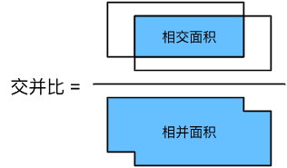

在训练集中，将每个锚框视为训练样本，需要每个锚框的类别、偏移量(真实边界相对于锚框)，预测时生成多个锚框，预测所有锚框的类别、偏移量，根据预测的偏移量来调整位置

目标检测训练集带有真实边界框的位置、类别，标记生成的锚框算法：

锚框是$A_1, A_2, \ldots, A_{n_a}$，真实边界框是$B_1, B_2, \ldots, B_{n_b}$，$n_a \geq n_b$，定义一个矩阵$\mathbf{X} \in \mathbb{R}^{n_a \times n_b}$，第$i$行、第$j$列的元素$x_{ij}$是锚框$A_i$和真实边界框$B_j$的IoU

1. 在矩阵$\mathbf{X}$中找到最大的元素(行：$i_1$、列：$j_1$)，真实边界框$B_{j_1}$分配给锚框$A_{i_1}$，丢弃${i_1}^\mathrm{th}$行和${j_1}^\mathrm{th}$列中的所有元素
2. 重复1.，直到$n_b$列所有元素都丢弃（此时已分配了$n_b$个锚框）
3. 遍历剩下$n_b-n_b$个锚框，在矩阵中为每个找到loU最大的边界框，当loU大于阈值时，将$B_j$分配给$A_i$

**标记类别和偏移量：**

若锚框$A$分配了真实边界框$B$：

- 将锚框$A$的类别标记为与$B$相同
- 锚框$A$的偏移量根据$B$和$A$中心坐标的相对位置以及两个框的相对大小进行标记

由于数据集中不同框的位置、大小不同，我们可以对相对位置和大小进行变换，时分布更均匀且易于拟合的偏移量

一种常见变换：

给定框$A$和$B$，中心坐标分别为$(x_a, y_a)$和$(x_b, y_b)$，宽度分别为$w_a$和$w_b$，高度分别为$h_a$和$h_b$，可以将$A$的偏移量标记为：
$$
\left( \frac{ \frac{x_b - x_a}{w_a} - \mu_x }{\sigma_x},
\frac{ \frac{y_b - y_a}{h_a} - \mu_y }{\sigma_y},
\frac{ \log \frac{w_b}{w_a} - \mu_w }{\sigma_w},
\frac{ \log \frac{h_b}{h_a} - \mu_h }{\sigma_h}\right)
$$
常量的默认值为 $\mu_x = \mu_y = \mu_w = \mu_h = 0, \sigma_x=\sigma_y=0.1$ ， $\sigma_w=\sigma_h=0.2$

没分配真实边界框的锚框，标记为**背景**，背景类的锚框称为**负类**锚框，其余为**正类**锚框

**预测好的边界框**则根据其中某个带有预测偏移量的锚框而生成，为简化输出(可能会输出许多相似的预测边界框)，使用**非极大值抑制(NMS)**：

对预测边框$B$，模型计算每个类别的预测概率，最大预测概率$p$(**置信度**)的类别为预测类别。同一图像中，所有预测的非背景边框按置信度降序排列为列表$L$

1. 取$L$中置信度最高的预测边界框$B_1$为基准，移除所有与$B_1$的loU超过预定阈值$\epsilon$
2. 重复1.，直到$L$中所有预测边界框都曾被用作为基准

此时，任意一对边界框的loU都小于阈值$\epsilon$(没有一对边界过于相似)


### 多尺度目标检测

为减少锚框的数量，可在图像中均匀采取小部分像素，以此为中心生成锚框。在不同尺度下，生成不同数量、大小的锚框

**特征图：**卷积图层的二维数组输出

在特征图上生成锚框，每个像素作为锚框的中心，这些中心根据相对空间位置在图像上均匀分布

**基于CNN的多尺度目标检测：**

假设有$c$张形状为$h \times w$的特征图，生成$hw$组锚框，每组都有$a$个中心相同的锚框

对锚框标记类、偏移量，目标检测模型预测输入图像上$hw$组锚框类别和偏移量，使不同组锚框具有不同中心

假设$c$张特征图是CNN向前传播的中间输出，由于每张特征图有$hw$个空间位置，那么相同的空间位置有$c$个单元。特征图对相同位置的$c$个单元的感受野相同：表征了同一感受野内的输入图像信息，可以将特征图在同一空间位置$c$个单元变换为使用此空间位置生成的$a$个锚框类别、偏移量

不同层的特征图拥有不同大小的感受野，用于检测不同大小的目标，利用深层神经网络在多个层次上对图像进行分层表示，实现多尺度目标检测


## 优化算法

优化算法的目标函数通常是基于训练数据集的损失函数(即减少训练误差)，但深度学习的目标为减少泛化误差(减小过拟合)

**经验风险：**训练数据集的平均损失

**风险：**整个数据群的预期损失

**局部最小值：**接近局部最优值时，梯度会接近或变为0，一定程度的噪声可能使参数跳出局部最小值(小批量随机梯度下降的有利特性之一)

**鞍点：**所有梯度消失但既不是全局也不是局部最小值的位置

**梯度消失：**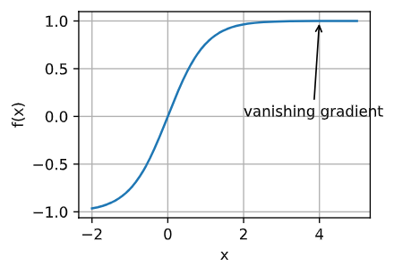

### 凸性

**凸集：**对于任何$a, b \in \mathcal{X}$，连接$a$和$b$的线段也位于$\mathcal{X}$中，则向量空间中的一个集合$\mathcal{X}$是凸的

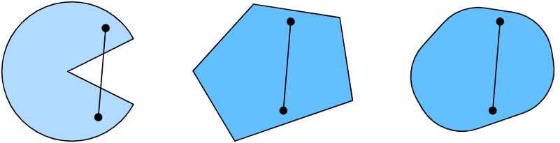

$\mathcal{X}$和$\mathcal{Y}$是凸集，那么$\mathcal {X} \cap \mathcal{Y}$也是凸集

凸集$\mathcal{X}_i$，它们的交集$\cap_{i} \mathcal{X}_i$是凸的，但是反向不正确

凸集的并集可能是非凸的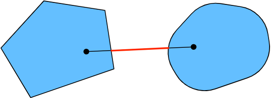

通常深度学习的问题是在凸集上定义的

**凸函数：**一个凸集$\mathcal{X}$，对于所有$x, x' \in \mathcal{X}$和所有$\lambda \in [0, 1]$，函数$f: \mathcal{X} \to \mathbb{R}$是凸的，可得到：
$$
\lambda f(x) + (1-\lambda) f(x') \geq f(\lambda x + (1-\lambda) x')
$$

- 局部最小值是全局最小值

- 凸函数的下水平集是凸的

  定义在凸集$\mathcal{X}$上的凸函数$f$，任意一个下水平集：
  $$
  \mathcal{S}_b := \{x | x \in \mathcal{X} \text{ and } f(x) \leq b\}
  $$

- 对于任意二次可微多维函数$f: \mathbb{R}^{n} \rightarrow \mathbb{R}$，它是凸的当且仅当它的Hessian$\nabla^2f\succeq 0$

- 解决**约束优化**问题：
  $$
  \begin{aligned} \mathop{\mathrm{minimize~}}_{\mathbf{x}} & f(\mathbf{x}) \\
      \text{ subject to } & c_i(\mathbf{x}) \leq 0 \text{ for all } i \in \{1, \ldots, N\}.
  \end{aligned}
  $$
  $f$是目标函数，$c_i$是约束函数

- **拉格朗日函数**：
  $$
  L(\mathbf{x}, \alpha_1, \ldots, \alpha_n) = f(\mathbf{x}) + \sum_{i=1}^n \alpha_i c_i(\mathbf{x}) \text{ where } \alpha_i \geq 0
  $$
  $\alpha_i$（$i=1,\ldots,n$）:**拉格朗日乘数**

  $L$的鞍点是原始束优化问题的最优解

- **惩罚：**除了满足$c_i(\mathbf{x}) \leq 0$之外，将$\alpha_i c_i(\mathbf{x})$添加到目标函数$f(x)$

- 凸集$\mathcal{X}$上的**投影：**
  $$
  \mathrm{Proj}_\mathcal{X}(\mathbf{x}) = \mathop{\mathrm{argmin}}_{\mathbf{x}' \in \mathcal{X}} \|\mathbf{x} - \mathbf{x}'\|
  $$
  是$\mathcal{X}$中离$\mathbf{X}$最近的点

**詹森不等式：**

是凸性定义的推广：凸函数的期望不小于期望的凸函数
$$
\sum_i \alpha_i f(x_i)  \geq f\left(\sum_i \alpha_i x_i\right) \text{ and } E_X[f(X)] \geq f\left(E_X[X]\right)
$$
$\alpha_i$是满足$\sum_i \alpha_i = 1$的非负实数，$X$是随机变量

可以用较简单的表达式约束一个较复杂的表达式


### 梯度下降

用$x \leftarrow x - \eta f'(x)$来迭代$x$，直到梯度$|f'(x)|$的幅度足够小或迭代次数达到某个值时

**学习率**$\eta$决定目标函数能否以及何时收敛到最小值

**多元梯度下降**：

$\mathbf{x} = [x_1, x_2, \ldots, x_d]^\top$，目标函数$f: \mathbb{R}^d \to \mathbb{R}$将向量映射成标量，梯度是由$d$个偏导数组成的向量：
$$
\nabla f(\mathbf{x}) = \bigg[\frac{\partial f(\mathbf{x})}{\partial x_1}, \frac{\partial f(\mathbf{x})}{\partial x_2}, \ldots, \frac{\partial f(\mathbf{x})}{\partial x_d}\bigg]^\top
$$
其梯度下降算法：$\mathbf{x} \leftarrow \mathbf{x} - \eta \nabla f(\mathbf{x})$

**自适应方法：**自动或不必选择学习率

**牛顿法：**

$f: \mathbb{R}^d \rightarrow \mathbb{R}$的泰勒展开式：
$$
f(\mathbf{x} + \boldsymbol{\epsilon}) = f(\mathbf{x}) + \boldsymbol{\epsilon}^\top \nabla f(\mathbf{x}) + \frac{1}{2} \boldsymbol{\epsilon}^\top \nabla^2 f(\mathbf{x}) \boldsymbol{\epsilon} + \mathcal{O}(\|\boldsymbol{\epsilon}\|^3)
$$
将$\mathbf{H} \stackrel{\mathrm{def}}{=} \nabla^2 f(\mathbf{x})$定义为$f$的Hessian($d \times d$矩阵)，$d$的值很小且问题简单时，$\mathbf{H}$容易计算

$f$的最小值满足$\nabla f = 0$，取$\boldsymbol{\epsilon}$导数并忽略高阶项：
$$
\nabla f(\mathbf{x}) + \mathbf{H} \boldsymbol{\epsilon} = 0 \text{ and hence }
\boldsymbol{\epsilon} = -\mathbf{H}^{-1} \nabla f(\mathbf{x})
$$
作为优化需要将Hessian矩阵$\mathbf{H}$求逆

在牛顿法中，最终要除以Hessian，如果二阶导数是负的，$f$可能趋于增加

**预处理：**

回避计算整个Hessian，只计算对角线顶：
$$
\mathbf{x} \leftarrow \mathbf{x} - \eta \mathrm{diag}(\mathbf{H})^{-1} \nabla f(\mathbf{x})
$$
防止单位等影响的参数化严重不匹配，相当于为每个变量选择不同的学习率

**梯度下降和线搜索：**

使用$\nabla f(\mathbf{x})$给出的方向，进行二分搜索，以确定哪个学习率$\eta$使$f(\mathbf{x} - \eta \nabla f(\mathbf{x}))$取最小值

虽然此算法收敛迅速，但实现方式昂贵


### 随机梯度下降

对$n$个样本的训练数据集，$f_i(\mathbf{x})$是关于索引$i$的训练样本的损失函数，$\mathbf{x}$是参数向量，目标函数：
$$
f(\mathbf{x}) = \frac{1}{n} \sum_{i = 1}^n f_i(\mathbf{x})
$$
$\mathbf{x}$的目标函数的梯度计算：
$$
\nabla f(\mathbf{x}) = \frac{1}{n} \sum_{i = 1}^n \nabla f_i(\mathbf{x})
$$
若使用梯度下降，计算代价$\mathcal{O}(n)$随$n$线性增长

随机梯度下降（SGD）对数据样本随机均匀采样一个索引$i$($i\in\{1,\ldots, n\}$)，并计算梯度$\nabla f_i(\mathbf{x})$以更新$\mathbf{x}$：
$$
\mathbf{x} \leftarrow \mathbf{x} - \eta \nabla f_i(\mathbf{x})
$$
$\eta$是学习率，随机梯度$\nabla f_i(\mathbf{x})$是对完整梯度$\nabla f(\mathbf{x})$的无偏估计：
$$
\mathbb{E}_i \nabla f_i(\mathbf{x}) = \frac{1}{n} \sum_{i = 1}^n \nabla f_i(\mathbf{x}) = \nabla f(\mathbf{x})
$$
平均而言，随机梯度是对梯度的良好估计

**动态学习率：**

用与时间相关的学习率$\eta(t)$取代$\eta$，一些基本策略：
$$
\begin{aligned}
    \eta(t) & = \eta_i \text{ if } t_i \leq t \leq t_{i+1}  && \text{分段常数} \\
    \eta(t) & = \eta_0 \cdot e^{-\lambda t} && \text{指数衰减} \\
    \eta(t) & = \eta_0 \cdot (\beta t + 1)^{-\alpha} && \text{多项式衰减}
\end{aligned}
$$


### 小批量随机梯度下降

当数据相似时，gd不是非常“数据高效”；由于CPU、GPU无法充分向量化，sgd不是非常“计算高效”

执行$\mathbf{w} \leftarrow \mathbf{w} - \eta_t \mathbf{g}_t$时，消耗巨大，其中$\mathbf{g}_t = \partial_{\mathbf{w}} f(\mathbf{x}_{t}, \mathbf{w})$

将梯度$\mathbf{g}_t$替换为一个小批量来提高计算效率：
$$
\mathbf{g}_t = \partial_{\mathbf{w}} \frac{1}{|\mathcal{B}_t|} \sum_{i \in \mathcal{B}_t} f(\mathbf{x}_{i}, \mathbf{w})
$$


### 动量法

使用$\mathbf{h}_{i, t-1} = \partial_{\mathbf{w}} f(\mathbf{x}_i, \mathbf{w}_{t-1})$作为样本$i$的随机梯度下降，使用时间$t-1$时更新的权重$t-1$：
$$
\mathbf{g}_{t, t-1} = \partial_{\mathbf{w}} \frac{1}{|\mathcal{B}_t|} \sum_{i \in \mathcal{B}_t} f(\mathbf{x}_{i}, \mathbf{w}_{t-1}) = \frac{1}{|\mathcal{B}_t|} \sum_{i \in \mathcal{B}_t} \mathbf{h}_{i, t-1}
$$
使用**泄露平均值**取代梯度计算，从方差减少中受益，甚至超过小批量上的平均值：
$$
\mathbf{v}_t = \beta \mathbf{v}_{t-1} + \mathbf{g}_{t, t-1}
$$
$\beta \in (0, 1)$将瞬时梯度替换为多个过去梯度的平均值。$\mathbf{v}$为动量，累加了过去的梯度

递归地将$\mathbf{v}_t$扩展到：
$$
\begin{aligned}
\mathbf{v}_t = \beta^2 \mathbf{v}_{t-2} + \beta \mathbf{g}_{t-1, t-2} + \mathbf{g}_{t, t-1}
= \ldots, = \sum_{\tau = 0}^{t-1} \beta^{\tau} \mathbf{g}_{t-\tau, t-\tau-1}.
\end{aligned}
$$
较大的$\beta$相当于长期平均值，较小的$\beta$只是对梯度法的微小修正，新的梯度替换不再向下降最陡的方向，而是指向过去梯度的加权平均值方向

**动量法：**
$$
\begin{aligned}
\mathbf{v}_t &\leftarrow \beta \mathbf{v}_{t-1} + \mathbf{g}_{t, t-1}, \\
\mathbf{x}_t &\leftarrow \mathbf{x}_{t-1} - \eta_t \mathbf{v}_t.
\end{aligned}
$$


### AdaGrad算法

处理有稀疏特征的情况

在训练过程中降低学习率，要么对常见特征的参数，降低太慢，要么对不常见特征，降低太快

通过记录看到特定特征的次数用作调整学习率，使用$\eta_i = \frac{\eta_0}{\sqrt{s(i, t) + c}}$作为学习率(而不是$\eta = \frac{\eta_0}{\sqrt{t + c}}$)，$s(i, t)$计下截至$t$时观察到功能$i$的次数

**AdaGrad算法**将粗略的计数器$s(i, t)$替换为先前观察所得梯度的平方之和$s(i, t+1) = s(i, t) + \left(\partial_i f(\mathbf{x})\right)^2$来调整学习率

- 不再需要决定梯度何时算足够大
- 会随梯度的大小自动变化

算法：
$$
\begin{aligned}
    \mathbf{g}_t & = \partial_{\mathbf{w}} l(y_t, f(\mathbf{x}_t, \mathbf{w})), \\
    \mathbf{s}_t & = \mathbf{s}_{t-1} + \mathbf{g}_t^2, \\
    \mathbf{w}_t & = \mathbf{w}_{t-1} - \frac{\eta}{\sqrt{\mathbf{s}_t + \epsilon}} \cdot \mathbf{g}_t.
\end{aligned}
$$
操作按坐标顺序应用，允许每个坐标有单独的学习率。$\eta$是学习率，$\epsilon$为维持数值稳定性的常数，确保不会除以$0$。初始化$\mathbf{s}_0 = \mathbf{0}$

~~~python
#torch中AdaGrad
trainer = torch.optim.Adagrad
~~~


### RMSProp算法

AdaGrad算法中由于缺乏规范化，$\mathbf{s}_t$持续增长，用动量法的方式泄露平均值，即$\mathbf{s}_t \leftarrow \gamma \mathbf{s}_{t-1} + (1-\gamma) \mathbf{g}_t^2$其中$\gamma > 0$

算法：
$$
\begin{aligned}
    \mathbf{s}_t & \leftarrow \gamma \mathbf{s}_{t-1} + (1 - \gamma) \mathbf{g}_t^2, \\
    \mathbf{x}_t & \leftarrow \mathbf{x}_{t-1} - \frac{\eta}{\sqrt{\mathbf{s}_t + \epsilon}} \odot \mathbf{g}_t.
\end{aligned}
$$
常数$\epsilon > 0$通常设置为$10^{-6}$，确保不会除0，或步长过大而受影响。学习率$\eta$由实验者调度。扩展$\mathbf{s}_t$定义得：
$$
\begin{aligned}
\mathbf{s}_t & = (1 - \gamma) \mathbf{g}_t^2 + \gamma \mathbf{s}_{t-1} \\
& = (1 - \gamma) \left(\mathbf{g}_t^2 + \gamma \mathbf{g}_{t-1}^2 + \gamma^2 \mathbf{g}_{t-2} + \ldots, \right)
\end{aligned}
$$

~~~python
#torch中RMSProp
trainer = torch.optim.RMSprop
~~~


### Adadelta

是AdaGrad的变体，AdadeIta减少了学习率适应坐标的数量，广义上称其为没有学习率，使用变化量本身作为未来变化的校准

使用两个状态变量：

- $\mathbf{s}_t$：存储梯度二阶导数的泄露平均值
- $\Delta\mathbf{x}_t$：存储模型本身参数变化二阶导数的泄露平均值


## keys

```python
#将x转为与y形状相同的张量
x.reshape(y.shape)

#索引可多维度使用
x = torch.tensor([[0.1, 0.3, 0.6], [0.3, 0.2, 0.5]])
x[[0, 1], [0, 2]] = tensor([0.1000, 0.5000])

#传参时忽略空间结构，用reshape进行调整

#递归创建目录path
#exist_ok:如果目录已经存在不会引发错误
os.makedirs(path, exist_ok=True)

#DataFrames的数据可直接通过“.”进行引用

#对张量值进行转换，将值限制在min与max范围内
#input:输入张量
#min:小于min的值替换为min
#max:大于max的值替换为max
x = torch.clamp(input ,min ,max)

#将a,b两个张量沿dim轴合并
x = torch.cat([a,b],dim)

#将a,b两个向量沿着新的维度(dim)连接
x = torch.stack((a ,b),dim)

#将模型切换到评估模式
#训练模式下，Dropout层会随机丢弃神经元来防止过拟合，评估模式下会禁用随机丢弃来确保所有神经元都参与计算
#训练模式下，Batch Normalization层会统计当前数据的均值与方差并更新其内部统计，评估模式下会使用训练好的均值与方差
net.eval()

#将特征图扁平化：多维的特征转换为特征向量
nn.Flatten()

#用于将list中元素随机打乱
random.shuffle(list)

#将x转换为独热编码
from torch.nn import functional as F
F.one_hot(x, amount)

*args 是用来传递任意数量的非关键字参数，参数被收集成一个元组
**kwargs 是用来传递任意数量的关键字参数，参数被收集成一个字典

#改变张量维度顺序
#dims：张量维度顺序
X.permute(*dims)

#对布尔掩码mask进行按位取反
~mask

#用于沿指定维度重复元素
#x:待处理张量
#repeats:重复次数
#dim:指定维度
torch.repeat_interleave(x, repeats, dim)

#在x的dim维度插入新维度
x.unsqueeze(dim)
#移除x的dim维度
x.squeeze(dim)
```

