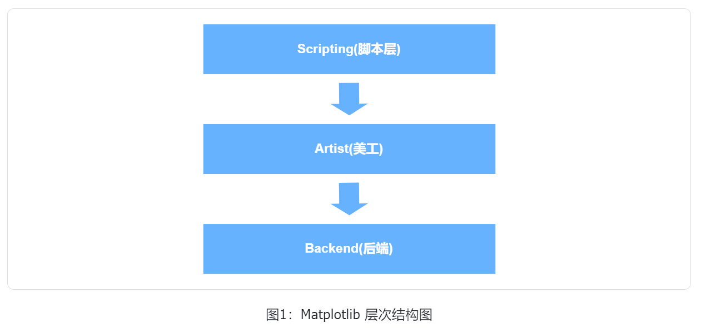
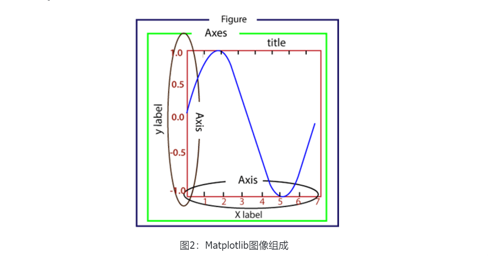

# Pylot

## 层次结构

脚本层、美工层、后端层

- 脚本层：最顶层，大部分代码运行在该层，生成图形与坐标系
- 美工层：提供绘制元素的各种功能，如：绘制标题、轴标签、坐标刻度
- 后端层：底层，FigureCanvas(图层画布类)，Renderer(绘图操作类)，提供用来处理鼠标和键盘事件的方法

## 图像组成

- Figure:指整个图形(画布)，包含所有元素：标题、轴线……
- Axes:绘制2D图像实际区域(轴区域、绘图区)
- Artist:在画布上看到的所有元素都属于Artist对象，如文本对象(title、xlabel、ylabel)、Line2D对象等

