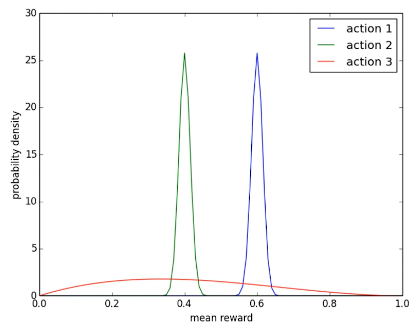

# RL-基础

## 1.初探

### 1.1两种机器学习类型

- 预测：
  - 有监督学习：根据数据预测输出
  - 无监督学习：生成数据实例
- 决策：
  - 强化学习：在动态环境中采取行动
    - 转变到新状态
    - 获得即使奖励
    - 随时间推移最大化累积奖励

### 1.2强化学习定义

通过从交互学习来实现目标的计算方法

三方面：

- 感知：感知环境的状态
- 行动：采取行动来影响状态或者达到目标
- 目标：随时间推移最大化奖励

### 1.3交互过程

在每一步$t$：

- 智能体：
  - 获得观察$O_t$
  - 获得奖励$R_t$
  - 执行行动$A_t$
- 环境：
  - 获得行动$A_t$
  - 给出观察$O_{t+1}$
  - 给出奖励$R_{t+1}$
- $t$在环境这一步增加

### 1.4系统要素

#### 1.4.1历史

观察、行动和奖励的序列
$$
H_t=O_1,R_1,A_1,O_2,R_2,A_2,\ldots,O_{t-1},R_{t-1},A_{t-1},O_t,R_t
$$
智能体选择行动，环境选择观察和奖励

#### 1.4.2状态

用于确定接下来发生的事情(是关于历史的函数)
$$
S_t=f(H_t)
$$

#### 1.4.3策略（Policy）

是从状态到行动的映射

- **确定性策略（Deterministic Policy）**
  $$
  a=\pi (s)
  $$

- **随机策略（Stochastic Policy）**
  $$
  \pi (a|s)=P(A_t=a|S_t=s)
  $$

#### 1.4.4奖励（Reward）

一个定义强化学习目标的**标量**

#### 1.4.5价值函数（Value Function）

状态价值为标量，用于定义对长期来说什么是好

价值函数是对于未来积累奖励的预测，评定给定策略下状态的好坏
$$
v_{\pi}(s)=\mathbb{E}_{\pi}[R_{t+1}+\gamma R_{t+2}+\gamma ^2 R_{t+3}+\ldots|S_t=s ]
$$

#### 1.4.6模型（Model）

环境的模型用于模拟环境的行为

- 预测下一个状态
- 预测下一个（立即）奖励

### 1.5智能体分类

- 基于模型的强化学习
  - 策略价值函数
  - 环境模型
- 模型无关的强化学习
  - 策略价值函数
  - 没有环境模型
- 基于价值
  - 没有策略（隐含）
  - 价值函数
- 基于策略
  - 策略
  - 没有价值函数
- Actor-Critic
  - 策略
  - 价值函数

### 2.探索与利用

#### 2.1探索与利用

序列决策任务中的一个基本问题

基于目前策略获取已知最优收益还是尝试不同决策

- Exploitation：执行能获得已知最优收益的决策
- Exploration：尝试更多可能的决策，不一定是最优收益

#### 2.2策略探索的原则

- 朴素方法（Naive Exploration）
  - 添加策略噪声$\epsilon - greedy$

- 积极初始化（Optimistic Initialization）
  - 没有探索的策略初始化高一些（后续更容易被优先选择）
- 基于不确定性的度量（Uncertainty Measurement）
  - 尝试具有不确定收益的策略，可能带来更高收益

- 概率匹配（Probability Matching）
  - 基于概率选择最佳策略

- 状态搜索（State Searching）
  - 探索后续状态可能带来更高收益的策略

#### 2.3多臂老虎机（multi-arm bandit）

可以看作式无状态（state-less）强化学习

动作集合：$a^i \in \mathcal{A}, i = 1, \dots, K$

收益（反馈）函数分布：$\mathcal{R}(r \mid a^i) = \mathbb{P}(r \mid a^i)$
$$
\begin{aligned}
&\langle \mathcal{A}, \mathcal{R} \rangle \\
\mathcal{A}&:动作集合 \\
\mathcal{R}&:收益(反馈)函数分布
\end{aligned}
$$
最大化累积时间收益：
$$
max\sum_{t=1}^{T}r_t,r_t\sim\mathcal R(\cdot \mid a)
$$

#### 2.4收益估计

期望收益和采样次数的关系：
$$
Q_n(a^i)=\frac{r_1+r_2+\dots+r_{n-1}}{n-1}
$$
缺点：每次更新的空间复杂度是$O(n)$

增量实现：
$$
\begin{aligned}
Q_{n+1}(a^i) &= \frac{1}{n}\sum_{i=1}^{n}r_i \\
 &= \frac{1}{n}\bigg(r_n+(n-1)\frac{\sum_{i=1}^{n-1}r_i}{n-1}\bigg)  \\
 &= \frac 1 n r_n+\frac{n-1}nQ_n\\
 &=Q_n+\frac 1 n(r_n-Q_n)\\
 r_n-Q_n&:\Delta_n^i(误差项)
\end{aligned}
$$
空间复杂度$O(1)$

#### 2.5算法：多臂老虎机

初始化：
$$
\begin{aligned}
Q(a^i)&=c^i\qquad(每个arm初始化一个具体的值)\\
N(a^i)&=0\qquad(初始次数为0)\\
i&=1,\dots,n
\end{aligned}
$$
主循环：$t=1:T$

1. 利用策略$\pi$选取某个动作$a$
2. 获取收益：$r_t=Bandit(a)$
3. 更新计数器：$N(a)=N(a)+1$
4. 更新估值：$Q(a)=Q(a)+\frac 1 {N(a)}[r_t-Q(a)]$

#### 2.6Regret函数

决策的期望收益：$Q(a_i)=\mathbb E_{r\sim \mathbb P(r\mid a_i)}[r\mid a^i]$

最优收益：$Q^{\star}=\underset {a^i\in\mathcal A}{max}Q(a^i)$

决策与最优决策的收益差：$R(a^i)=Q^\star -Q(a^i)$

Total Regret函数：$\sigma_R=\mathbb E_{a\sim\pi}[\sum_{t=1}^T R(a_t^i)]$

等价性：$min\;\sigma_R=max\;\sigma_R=\mathbb E_{a\sim\pi}[\sum_{t=1}^T Q(a_t^i)]$

- 一直探索新策略：$\sigma_R\propto T\cdot R$，total regret将线性递增，无法收敛
- 一直不探索新策略：$\sigma_R\propto T\cdot R$，total regret将线性递增

**下界（Lai & Robbins）**

使用$\Delta_a=Q^\star-Q(a)$和反馈函数分布相似性：$D_{KL}(\mathcal R(r\mid a)\mid\mid \mathcal R^\star(r\mid a))$描述
$$
\lim_{T\rightarrow\infty}\sigma_R \geq \log T\sum_{a\mid \Delta_a>0}\frac{\Delta_a}{D_{KL}(\mathcal R(r\mid a)\mid\mid \mathcal R^\star(r\mid a))}
$$

#### 2.7策略

##### 贪心策略

$$
\begin{aligned}
Q(a^i)&=\frac 1 {N(a^i)}\sum_{t=1}^T r_t\cdot1(a_t=a^i)\\
\downarrow\\
a^\star&=\underset {a^i}{argmax}\;Q(a^i)\\
\sigma &\propto T\cdot [Q(a^i)-Q^\star]
\end{aligned}
$$

线性增长的Total regret

##### $\epsilon$-greedy策略

$$
a_t=
\begin{cases}
arg \underset a\max \hat Q(a)\quad  采样概率:1-\epsilon\\
U(0,\mid\mathcal A\mid)\qquad\quad 采样概率:\epsilon
\end{cases}
$$

常量$\epsilon$保证total regret 满足：
$$
\sigma_R\geq\frac{\epsilon}{\mid \mathcal A\mid}\sum_{a\in \mathcal A}\Delta_a
$$
Total regret仍然是线性递增的，增长率比贪心策略小

##### 衰减贪心策略

$\epsilon$-greedy的变种，$\epsilon$随时间衰减

理论上对数渐进收敛

一种可能的衰减方式：
$$
\begin{aligned}
c&\geq0\\
d&=\underset{a\mid\Delta_a>0}\min\Delta_a\\
\epsilon_t&=\min \left\{ {1,\frac{a\mid\mathcal A\mid}{d^2 t}} \right\}
\end{aligned}
$$
很难找到合适的衰竭规划

#### 2.8积极初始化

给$Q(a^i)$一个较高的初始化值

增量式蒙特卡洛估计更新$Q(a^i)$：
$$
Q(a)=Q(a)+\frac 1 {N(a)}[r_t-Q(a)]
$$
有偏估计，随采样增加，偏差带来的影响会逐渐减小

但仍可能陷入局部最优（$\epsilon=0$）

#### 2.9显示考虑动作的价值分布

- 考虑动作的价值分布，平衡探索和利用来选择
- - 显式鼓励不确定性
  - 直接根据分布采样来选择

#### 2.10基于不确定性测度(UCB)

也称**UCB**：**上置信界法（Upper confidence Bounds）**

不确定性越大的$Q(a^i)$，越具有探索价值

- $N(a)$大，$U(a)$小
- $N(a)$小，$U(a)$大

策略$\pi$：$arg\underset{a\in\mathcal A}\max\hat Q(a)+\hat U(a)$

**UCB**：**上置信界法**

Hoeffding不等式：
$$
\mathbb P[\mathbb E[x]>\hat x_t+u]\leq e^{-2tu^2}\; for x\in [0,1]
$$

- 为每个动作收益估值估计一个上置信界：$\hat U(a)$

- 有：$Q_t(a)\leq\hat Q_t(a)+\hat U_t(a)$以概率$p$不成立（逃逸概率）

- 根据以下原则挑选进行决策：
  $$
  \begin{aligned}
  &a=arg \underset{a\in\mathcal A}\max\hat Q_t(a)+\hat U_t(a)\\
  &e^{-2N_t(a)U_t(a)^2}=p\\
  &\hat U_t(a)=\sqrt{-\frac{\log p}{2N_t(a)}}
  \end{aligned}
  $$

- 收敛性：
  $$
  \lim_{t\rightarrow\infty}\sigma_R\leq8\log t\sum_{a\mid\Delta_a>0}\Delta_a
  $$

#### 2.11Thompson Sampling方法

根据每个动作成为最优的概率来选择动作
$$
p(a)=\int\mathrm{II}[\mathbb E_{p(Q(a))}[Q(a;\theta)]=\underset{a'\in \mathcal A}\max\mathbb E_{p(Q(a'))}(Q(a';\theta))]d\theta
$$
实现：根据当前每个动作$a_i$的价值概率分布$p(Q(ai))$来采样到其价值$Q(ai)$，选择价值最大的动作

