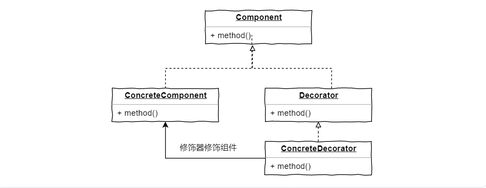

# 可视化云服务设计

## 装饰器模式

框架上，Sanic的实现利用装饰器设计模式(Decorator Pattern)。

**装饰器模式：**不改变现有对象结构的前提下，允许为其添加新功能。将功能活动性的挂载在对象上，实现对现有对象的包装(与对象继承有别)

**实现：**让装饰器实现类与被装饰器类实现同一接口，在装饰器构造方法中传入被装饰类对象，然后在实现对象原有功能上添加新功能，即保证被修饰对象和装饰后的对象是同一类型，从而实现多次装饰

**适用场景：**

- 功能扩展：为初始类扩展功能，为其添加额外的职责
- 动态添加撤销功能：为对象添加功能并支持动态撤销功能

## Sanic

是基于python的web服务器和装饰框架，旨在提供支持异步高并发请求的web服务

### 特点

- 支持高并发请求，解决I/O阻塞问题
- 内置高速服务器
- 易于构建扩展：提供大量第三方组件来补充附加功能